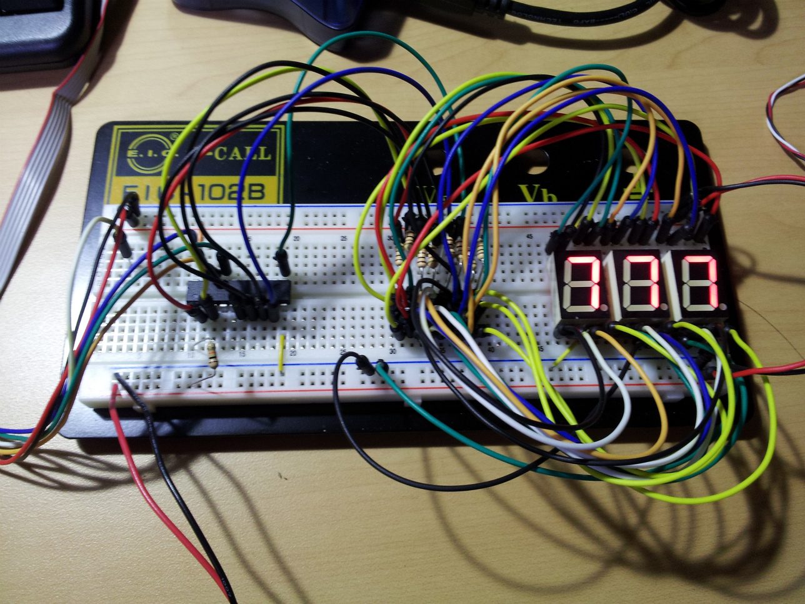
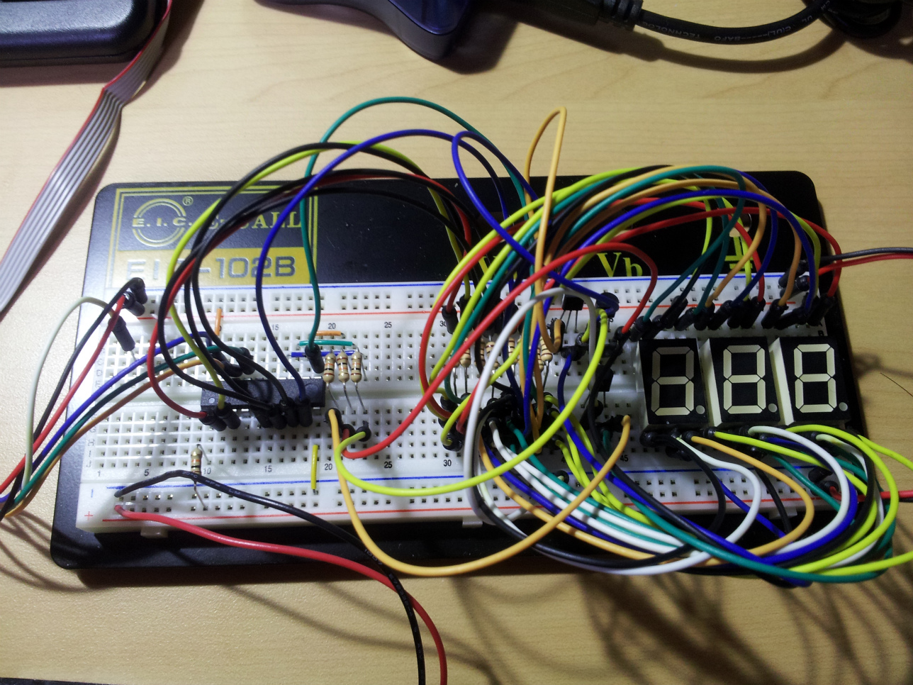

今回はこの前時間の都合でできなかった 7 セグ LED のダイナミック点灯制御を行ってみました。

ダイナミック点灯とは簡単に言うと LED を制御するピンの本数を少なくできるというもの。
1 個の 7 セグ LED をで数字を表示するには 7 個のピンを制御する必要があり、3 個の 7 セグになれば 21 個と結構な数になります。これを少なくするために 7 セグ LED の各発光場所ごとにまとめてしまいます。

だたこれだと 3 つの 7 セグ LED とも同じ数字が表示されますが、表示させる LED を高速で切り替えることによって解決しようという考え。 これは電光掲示板なんかでも使われる技術で案外身近にあったりするみたいです。

早速 3 個の 7 セグ LED の各発光場所ごとにまとめて前回同様 AVR の D ポート 0 ～ 6 に接続、数字を表示させてみます。



同じ信号がそれぞれの 7 セグ LED に送られているので当然すべて同じ表示 光らせる 7 セグ LED を切り替えるために、各 7 セグ LED とグランドの間にトランジスタを入れて各トランジスタのベースに AVR の B ポート 0 ～ 2 を接続します。



だいぶ配線がゴチャって来ました(^\_^;) 最後に適当に数字をカウントするプログラムを書いて AVR に書き込んでおしまい。 切り替えの間隔を 200ms にしたのがこちら

<iframe width="560" height="315" src="https://www.youtube.com/embed/ZToqD2haru8" frameborder="0" allow="accelerometer; autoplay; encrypted-media; gyroscope; picture-in-picture" allowfullscreen></iframe>

間隔を 5ms まで小さくしてみます。

<iframe width="560" height="315" src="https://www.youtube.com/embed/JFKys1de2Ig" frameborder="0" allow="accelerometer; autoplay; encrypted-media; gyroscope; picture-in-picture" allowfullscreen></iframe>

5ms まで下げると人間の目では切り替えを認識できないですね。
7 セグを使うことはほぼないと思いますがとりあえずお勉強ということで。

最後に AVR に書き込んたコードでも載せておきます。

```c
#include <avr/io.h>
#include <util/delay.h>

void LED_output(char num){
    switch (num){
        case 0:
        PORTD = 0b00111111;
        break;
        case 1:
        PORTD = 0b00000110;
        break;
        case 2:
        PORTD = 0b01011011;
        break;
        case 3:
        PORTD = 0b01001111;
        break;
        case 4:
        PORTD = 0b01100110;
        break;
        case 5:
        PORTD = 0b01101101;
        break;
        case 6:
        PORTD = 0b11111101;
        break;
        case 7:
        PORTD = 0b00000111;
        break;
        case 8:
        PORTD = 0b01111111;
        break;
        case 9:
        PORTD = 0b01101111;
        break;
    }
}

int main(void)
{
    DDRD = 0b111111111;
    DDRB = 0b111111111;

    PORTD = 0b00000000;
    PORTB = 0b00000000;

    unsigned char num = 0;
    char dig = 1;
    char delay_interval = 5;

    while(1) {
        // devide num
        unsigned char dig1 = num % 10;
        unsigned char dig2 = (num/10)%10;
        unsigned char dig3 = (num/100)%10;

        for(int i=0; i<200; i++){
            switch (dig) {
                case 1:
                PORTB = 0b00000001;
                LED_output(dig1);
                break;
                case 2:
                PORTB = 0b00000010;
                LED_output(dig2);
                break;
                case 3:
                PORTB = 0b00000100;
                LED_output(dig3);
            }

            _delay_ms(delay_interval);
            dig++;
            if(dig==4) dig = 1;
        }

    num++;
    }

    return 0;
}
```
