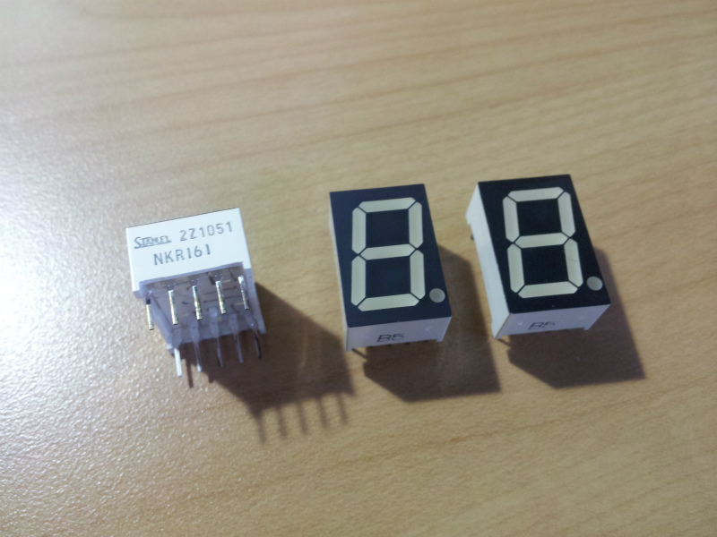
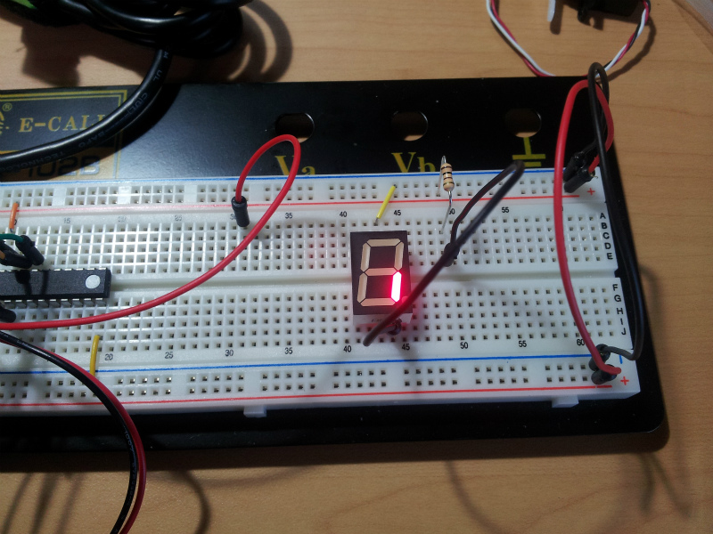

本日、PC パーツなどを片付けていたんですが、ふとボロいダンボールを覗いてみると、そこにはかなり昔の電子工作キットが。

保存が悪いものは使えなさそうでしたが、袋に入っていたおかげで状態がいい 7 セグメント LED を見つけました。父親に聞いてみると 30 年ほど前のものらしい。

先輩にあたる部品に敬意を表していざ google で検索。

[こちら](http://www.stanley-components.com/jp/description_of_part_number/led_numeric_display.cfm)のメーカー HP によると、この 7 セグの品番 NKR161 は N が 7 セグ、K がカソードコモン、R が赤色を意味してるらしい。

さっそく、動作するかチェック

おぉ無事点灯！！ちょっとした感動モンです(^o^
似たような品番のデータシートとピン配置が同じで助かりました。

せっかく動作したので数字を表示させるプログラムを AVR に書き込んでみました。

<iframe width="560" height="315" src="https://www.youtube.com/embed/cU71WPmaD4s" frameborder="0" allow="accelerometer; autoplay; encrypted-media; gyroscope; picture-in-picture" allowfullscreen></iframe>

ほんとうは 7 セグ LED が 3 個あったのでダイナミック制御を試してみたかったんですが、これからボードに行くので時間が足りませんでした。

また帰ってきてから続きをやりたいと思います。
