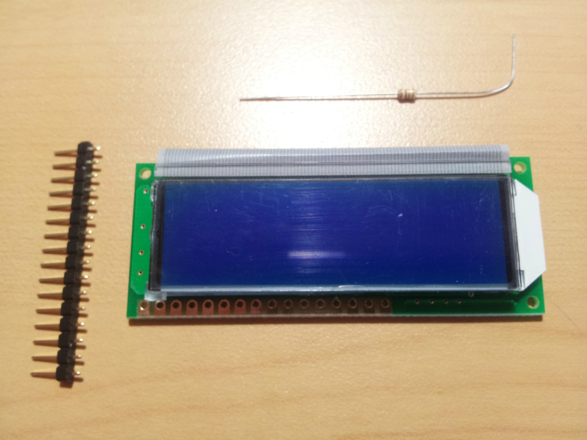
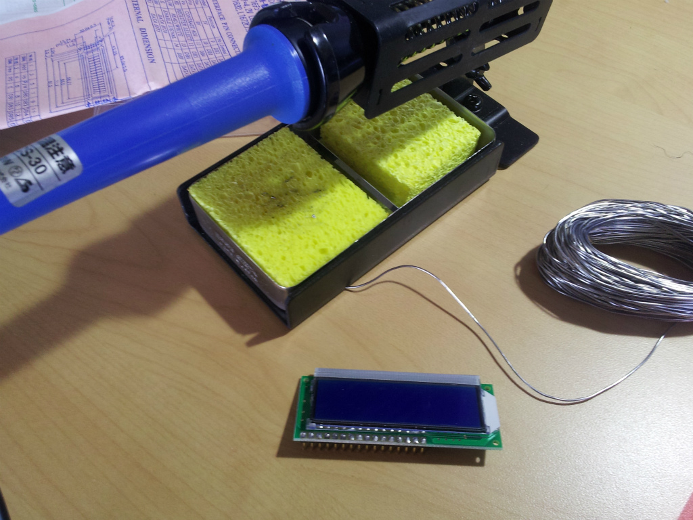
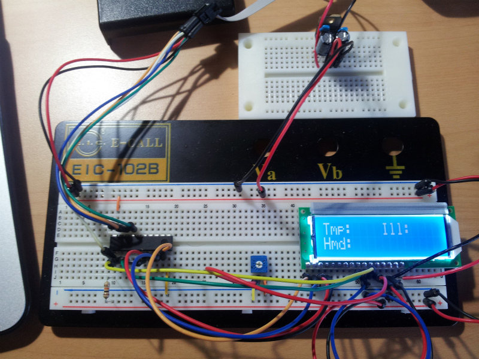

前に 7 セグ LED の表示を行いましたが、今回は LCD の表示を行ってみます。

使用する主な部品、環境は以下のとおり

- LCD SD1602VBWB-XA
- AVR attiny2313
- atmel studio6.1



このままではブレッドボード上で使うときに面倒なのでピンヘッダをハンダ付けします。ちゃちゃっとハンダ付けをして LCD の準備は完了。



あとはブレッドボード上で LCD に電源、AVR をつなげます。

今回は AVR の出力にはポート D を利用しました。

```
PD0:RS
PD1:E
PD2:DB4
PD3:DB5
PD4:DB6
PD5:DB7
```

このように AVR と LCD 接続。
コントラストとバックライトの電圧には半固定抵抗を使うと調節時に便利です。

キャラ型の LCD は 4bit モードで制御できるのでつなげるピンが少なくて楽ですね。

これでハードの準備は完了。
あとはソフトの準備をしていきます。

今回 LCD を AVR で動作させるにあたって勉強も兼ねて制御関数を少し自分で作ってみて動作はしたんですが、結局のところ自作関数では機能が少ないので公開されているライブラリを利用しました。

やっぱり公開されているものは作りこみもすごいですね(^\_^;)

今回利用させてもらったのはこちら

http://www.vector.co.jp/soft/dos/hardware/se476452.html

ダウンロードしたらライブラリフォルダに入っている 7 個のファイルをすべて atmel studio のプロジェクトにドラッグ&ドロップ

次に lcdConfig.h を開いて
13 行目をコメント

68 行目以降を AVR と LCD を繋げたように変更

```c
/* レジスタ選択 */
#define PIN_LCD_RS_PORT LCD_PORTD.P0
#define PIN_LCD_RS_DDR LCD_DDRD.P0
#define PIN_LCD_RS_PIN LCD_PIND.P0

/* Read/Write 選択 */
#define PIN_LCD_RW_PORT LCD_PORTC.P5
#define PIN_LCD_RW_DDR LCD_DDRC.P5
#define PIN_LCD_RW_PIN LCD_PINC.P5

/* Enable 信号 */
#define PIN_LCD_E_PORT LCD_PORTD.P1
#define PIN_LCD_E_DDR LCD_DDRD.P1
#define PIN_LCD_E_PIN LCD_PIND.P1

/* DB4 */
#define PIN_LCD_DB4_PORT LCD_PORTD.P2
#define PIN_LCD_DB4_DDR LCD_DDRD.P2
#define PIN_LCD_DB4_PIN LCD_PIND.P2

/* DB5 */
#define PIN_LCD_DB5_PORT LCD_PORTD.P3
#define PIN_LCD_DB5_DDR LCD_DDRD.P3
#define PIN_LCD_DB5_PIN LCD_PIND.P3

/* DB6 */
#define PIN_LCD_DB6_PORT LCD_PORTD.P4
#define PIN_LCD_DB6_DDR LCD_DDRD.P4
#define PIN_LCD_DB6_PIN LCD_PIND.P4

/* DB7 */
#define PIN_LCD_DB7_PORT LCD_PORTD.P5
#define PIN_LCD_DB7_DDR LCD_DDRD.P5
#define PIN_LCD_DB7_PIN LCD_PIND.P5
```

lcdLibPrv.h の 7，8 行目を以下のように変更

```c
#include "./lcdlib.h"
#include "./lcdConfig.h"
```

最後にプロジェクトの main 関数に以下のように書きました。

あとはいつもどおりビルドして AVR に書き込めば完了です。



あとなぜか C++でプロジェクトを作るとビルド時にエラーが出ました。c++のソースファイルから c で書かれたヘッダファイル上の関数を呼び出すのってなにか問題あるのかな？

カウンターのプログラムを書き込んで動作している様子です。

<iframe width="560" height="315" src="https://www.youtube.com/embed/LUw6jYE4sR4" frameborder="0" allow="accelerometer; autoplay; encrypted-media; gyroscope; picture-in-picture" allowfullscreen></iframe>

写真にも写ってるように電子工作してる時にはよく 3 端子レギュレータで作った 5V 電源使ってるけど USB にも 5V が通ってるんだから USB から電源作れそうな気がする。
