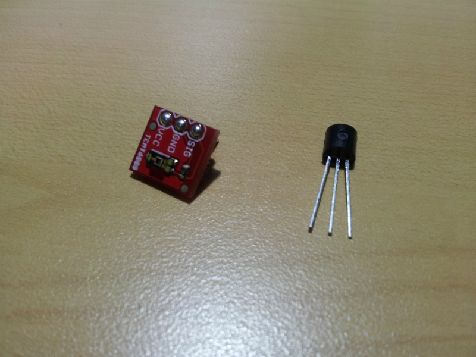
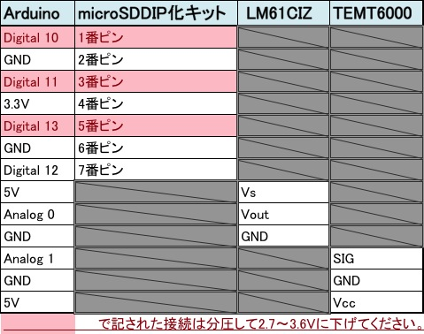
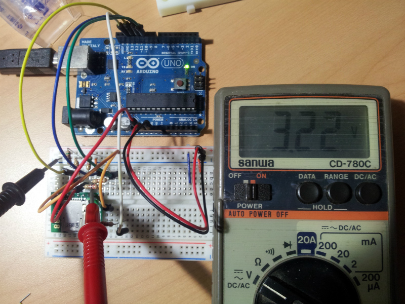
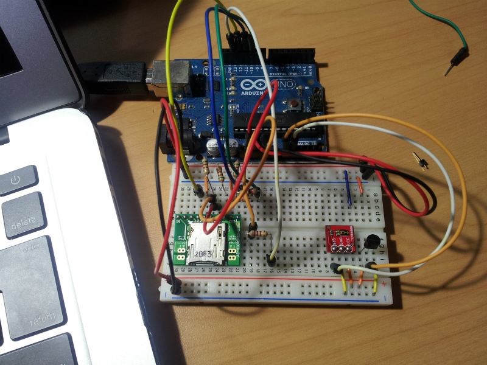
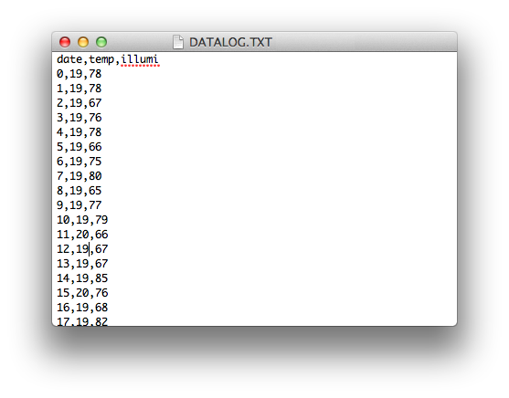

## はじめに

父親が小屋の気温や照度のデータが取りたいと言っていたのでデータロガーを作ってみました。 温度と照度を10分間隔でmicroSDにcsv形式で保存する仕様です。

今回使うセンサは以下の2つ

* 温度センサ [LM61CIZ](http://akizukidenshi.com/catalog/g/gI-02726/) 下図右
* 明るさセンサ [TEMT6000](http://www.switch-science.com/products/detail.php?product_id=37) 下図左



microSDとの接続には秋月で売っている [マイクロＳＤカードスロットＤＩＰ化キット](http://akizukidenshi.com/catalog/g/gK-05488)を使いました。ブレッドボードで使う場合にはピンヘッダをハンダ付けすると便利です。

## 接続表



まずmicroSDを繋げている時に問題が･･･ arduinoの出力電圧が5Vに対しmicroSDの動作電圧は2.7～3.6V 手元にあった270Ωと510Ωで分圧することで`5*(510/(510+270))≒3.2V`



良い感じに減圧出来ました。 最後に2つのセンサを取り付けます。 TEMT6000は上から出力電圧、GND、5V LM61CIZは文字が書いてある面から見て左から5V、出力電圧、GND詳しくは各データシートを参照してください。各端子繋いであげるとこれでハードは出来上がりです。



あとはarduinoにプログラムを書き込むだけ。 今回のプログラムでmicroSD関連は公式のライブラリもあったんですが、公式ライブラリをより使いやすく改良された方がいたので[こちらのサイト](http://tyk-systems.com/DataLogger/DataLogger.html)のものを使わせて頂きました。実際にmicroSDに書き込まれたログデータがこちら



arduinoに書き込んだスケッチは以下のとおりです。

```c
/*
* using DIP kit
* 2013-4-7
*log temp illumi
*/

#include<SD.h>

const int chipSelect = 10;

int ans , temp , tv ;
float VDD=5.0,R0=1,R1=10;
int lux;
long date=0;

// Subroutine for writing data in SD card,
void PrintToFile(String dataIn){
  File dataFile = SD.open("datalog.txt", FILE_WRITE);  // define the filename,
  if (dataFile) {                                      //if the file in the SD card was open to wrihte,
    dataFile.println(dataIn);                          // write data into the file,
    dataFile.close();                                  // close the file,
    Serial.println(dataIn);                           // print to the serial port too,
  }else {                                              // if the file isn't open, pop up an error message,
    Serial.println("error opening file");
  }
}

void setup(){
  Serial.print("SD read write test start...\n");

  //analogReference(INTERNAL);                         //use internal voltage(1.1 V) as the analog input reference, アナログ入力の最大電力を1.1 Vに設定
  Serial.begin(9600);
  pinMode(10, OUTPUT);
  Serial.print("Initializing SD card...");          //check the Serial communication
  pinMode(chipSelect, OUTPUT);                       //Define chipselect terminal 8 as output,
  if (!SD.begin(chipSelect)) {                       // check the SD card is available or not,
    Serial.println("Card failed, or not present");  // in the case of SD card error,
  }else{
  Serial.println("Card initialized.");              //in the case of SD card is available,
  }

  PrintToFile("date,temp,illumi");
}

void loop(){

  //calculating temp
  ans = analogRead(0);
  tv  = map(ans,0,1023,0,5000); //convert voltage sensor
  temp = map(tv,300,1600,-30,100); //convert temp voltage

  //calculating illumi
  int indata=analogRead(1);
  float ar=(indata*VDD/1024)/R1;
  lux=(20.0/0.01)*ar;

  //calculating date
  date = (millis()/1000/60); //insert elapsed time (minute)

  String dataString = "";
  dataString += date;
  dataString += ",";
  dataString += temp;
  dataString += ",";
  dataString += lux;

  PrintToFile(dataString);

  delay(1000*60*10); // run every 10 minutes
}
```

今回はmicroSDに書き込むデータロガーですがネットワークと接続してcosmなどのサービスを利用するとスマホと組み合わせたりできて、より面白いような気がします。長期休みも終わり学校が始まったので更新の間隔も広まりそうですが、ちょくちょく何か面白いものを作って行きたいですね。

## Reference

* <a target="_blank" href="https://www.amazon.co.jp/gp/product/B008GRTSV6/ref=as_li_tl?ie=UTF8&camp=247&creative=1211&creativeASIN=B008GRTSV6&linkCode=as2&tag=haruyuki04-22&linkId=826cb16dad367b86f5e2b4c8dfc912b9">Arduino Uno Rev3 ATmega328 マイコンボード A000066</a>
