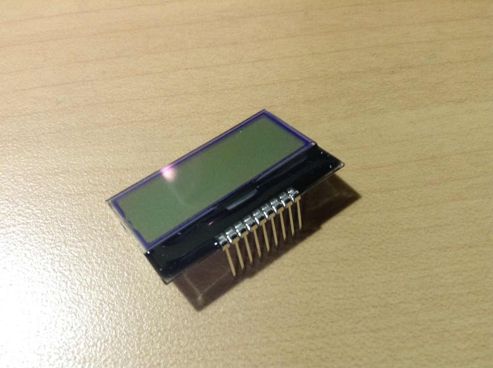
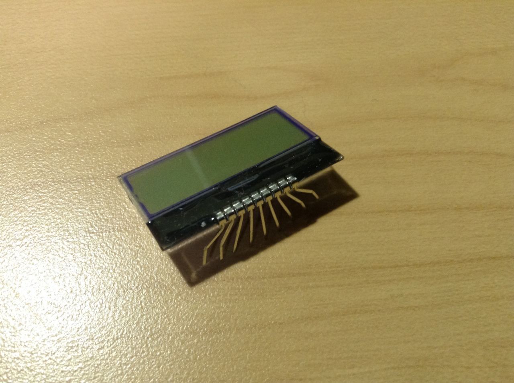
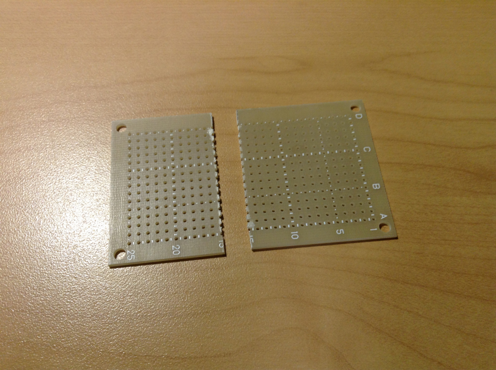
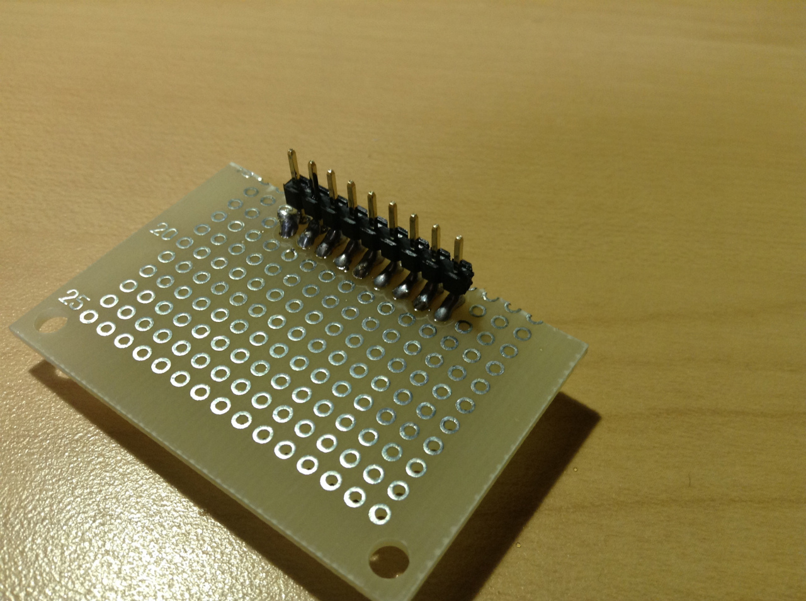
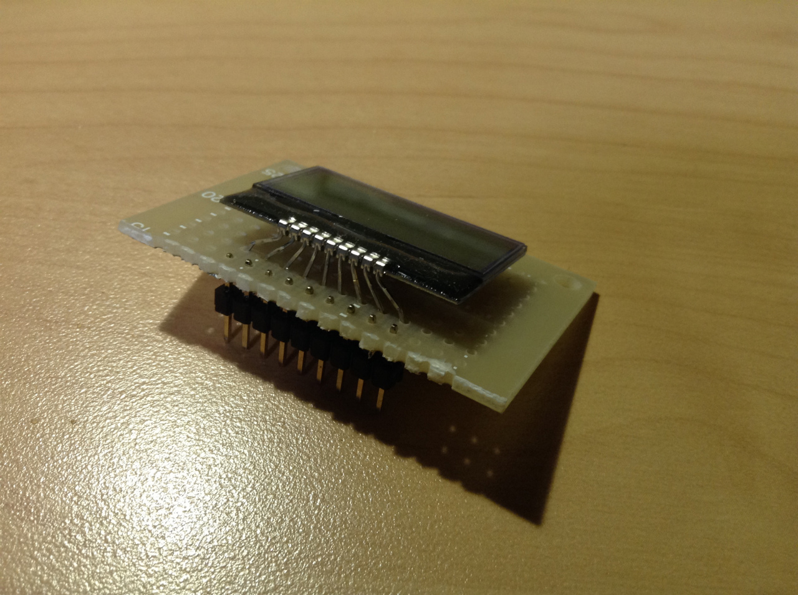
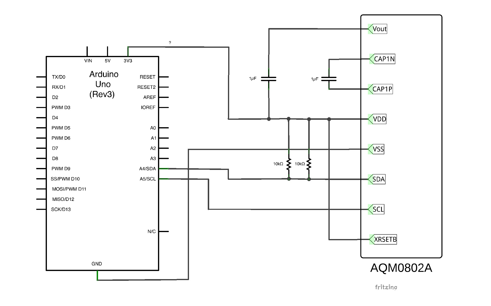
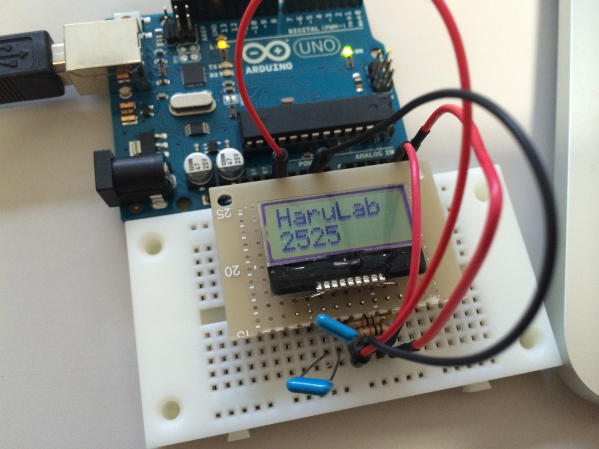
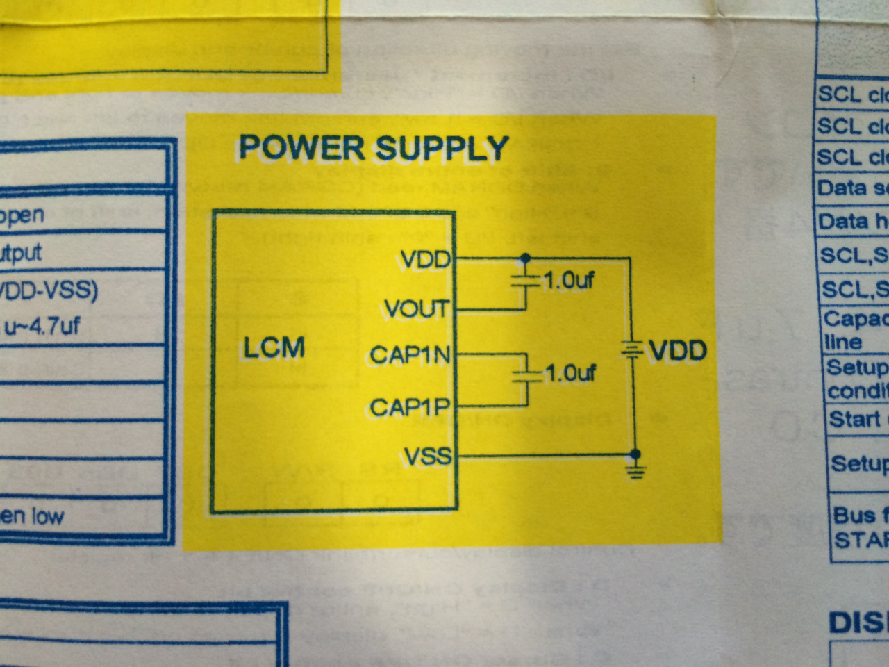

学校の実験で使うため秋月で手軽な LCD を購入することに。

そこで見つけたのがこちら



[AQM0802A-RN-GBW](https://akizukidenshi.com/catalog/g/gP-06669/)

I2C 通信を使った 8\*2 の手軽な LCD です。
なんといってもお値段が 320 円というのが魅力。

今回はこれを Arduino を使って動作させてみようと思います。
あとこれを使うにあたって、つまずいたところもあったので簡単にまとめておきます。

## 1. 準備物

制御に用いる Arduino

<a target="_blank" href="https://www.amazon.co.jp/gp/product/B008GRTSV6/ref=as_li_tl?ie=UTF8&camp=247&creative=1211&creativeASIN=B008GRTSV6&linkCode=as2&tag=haruyuki04-22&linkId=826cb16dad367b86f5e2b4c8dfc912b9">Arduino Uno Rev3 ATmega328 マイコンボード A000066</a>

加えて、このモジュールを使用するために必要な電子部品

- 10kΩ 抵抗\*2
- 1μF コンデンサ\*2

必要物はこれだけですが、AQM0802A には付属していないので用意する必要があります。

## 2. ピッチ変換 (ブレッドボードで使う方のみ)

ブレッドボード上でテストしようと思ったのもつかの間、このモジュールのピッチは 1.5mm とブレッドボードのピッチ幅よりも小さいので以下のリンクのようなピッチ変換済のもの、またはピッチ変換基板を用意してあげると便利です。

- https://akizukidenshi.com/catalog/g/gK-06795/
- https://akizukidenshi.com/catalog/g/gP-06794/



図のように頑張って足を広げてもブレボにはまらなかったため



ユニバーサル基板をカットして





こんな感じに的当にハンダ付けしました。

## 3. Arduino との接続

接続表を作ってみましたので、それを見てください



## 4. プログラムの書き込み

この LCD は I2C 通信を使っているため通常の LCD ライブラリでは動作しません。

AQM0802A が簡単に使えるライブラリが制作、公開されていましたのでこちらを使わせてもらうことにしました。(ありがとうございます!!)

https://ore-kb.net/archives/195

ライブラリの導入についてはリンク先サイトでも書かれていますが、
zip ファイルを解凍して出てきたフォルダ「arduino_ST7032-master」を「ST7032」にリネームし、arduino の「libraries」フォルダにコピーするだけ。

自分の場合は mac 環境なので書類 →Arduino→library の中にコピーすれはお k

ただ上のリンク先の簡単な使い方ではなぜか動作せず、lcd の bigin 関数を入れてやれば問題なく動きました。

ソースは以下もので動くはずです。

```c
#include <Wire.h>
#include <ST7032.h>

ST7032 lcd;

void setup(){
    lcd.begin(8, 2);
    lcd.setContrast(30);
    lcd.print("HaruLab");
}

void loop(){
    lcd.setCursor(0, 1);
    lcd.print("2525");
}
```

あとはこれを Arduino に書き込んであげれば終了。



うまく行けばこのように動作するはず。

## おまけ. 引っかかった問題点

今回初めて I2C 通信の LCD を使い、リファレンスもあまり読まないままに的当にテストしていました。抵抗だけ用意して Arduino と LCD をつなげていたため当然動作するはずもなくハンダ付けの際に IC 焼いちゃったかな? 位で考えてました(笑)

ただ、ふと研究室で AQM0802A のデータシートを見た時...



明らかに電源供給でコンデンサを使っているがわかりますよね w

手を動かす前にデータシートはちゃんと見るべきですね。

反省です w

## Reference

- <a target="_blank" href="https://www.amazon.co.jp/gp/product/B008GRTSV6/ref=as_li_tl?ie=UTF8&camp=247&creative=1211&creativeASIN=B008GRTSV6&linkCode=as2&tag=haruyuki04-22&linkId=826cb16dad367b86f5e2b4c8dfc912b9">Arduino Uno Rev3 ATmega328 マイコンボード A000066</a>
