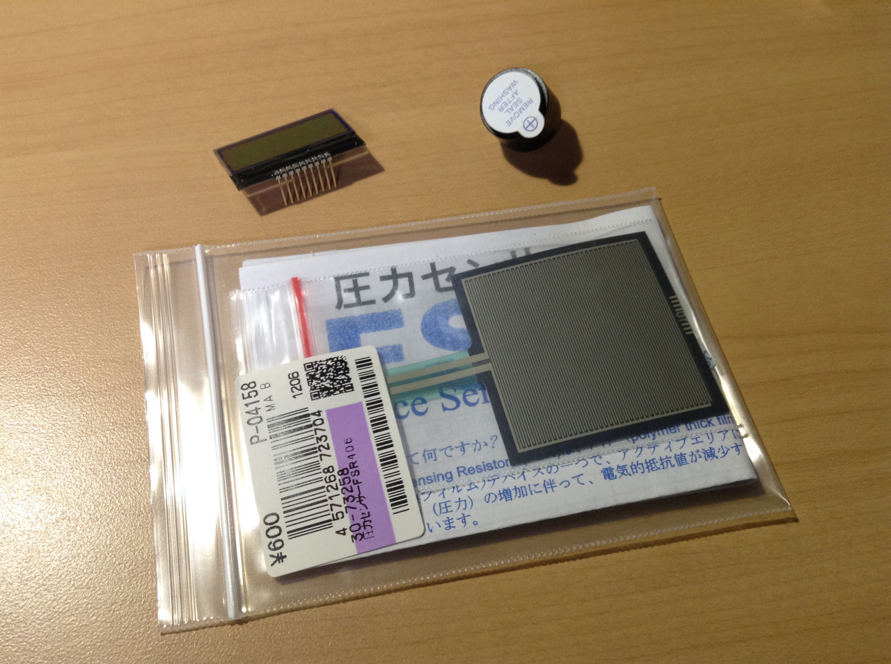
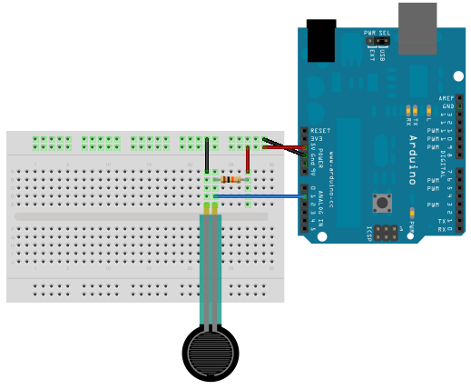
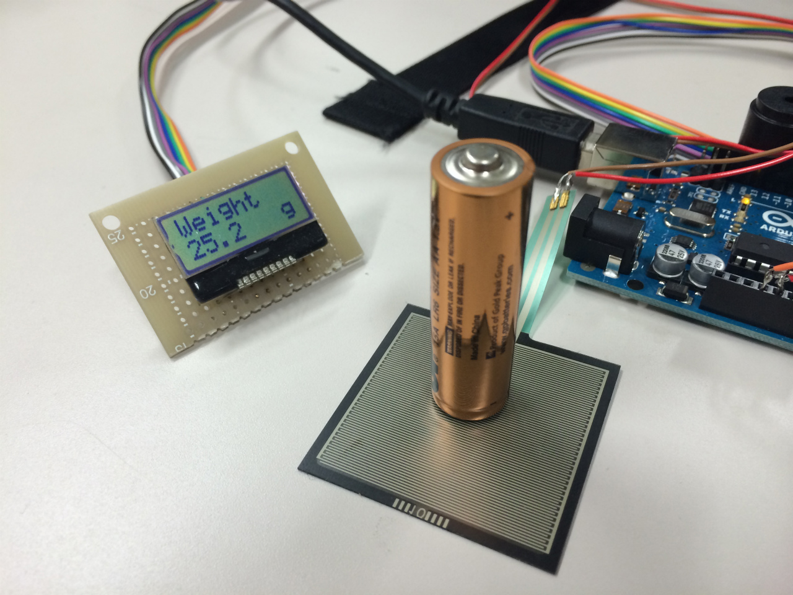

## はじめに

今回はあるものづくりをする過程で重量計算をする必要が出てきたので Arduino と圧力センサーを使って簡単なものを作ってみることにしました。

要件は以下のようなものです。

- 精度はあまり求めずおおまかな重量測定
- ある一定の重量を超えた時にブザーを鳴らす

また重量は通常では 20kg 以下を想定しています。

## 1. 準備物

- <a target="_blank" href="https://www.amazon.co.jp/gp/product/B008GRTSV6/ref=as_li_tl?ie=UTF8&camp=247&creative=1211&creativeASIN=B008GRTSV6&linkCode=as2&tag=haruyuki04-22&linkId=826cb16dad367b86f5e2b4c8dfc912b9">Arduino Uno Rev3 ATmega328 マイコンボード A000066</a>
- 圧力センサ FSR-406
- 電子ブザー HDB06LFPN
- 抵抗 (今回は 10kΩ を使用)



主な準備物は上の 3 つ。

Arduino 以外は全ていつもお世話になっている秋月電子さんで購入しました。

## 2. 接続

Arduino との接続も分圧を利用するだけなので非常にシンプル。



## 3. 重量表示

表示に関してはシリアル通信を使って PC モニタで見てももちろんいいんですが、[以前作った I2C 通信の LCD](https://blog.icchi.me/test-aqm0802a-with-arduino)があったので今回はそれを使いたいと思います。

LCD モジュールの接続は上の接続例にそのまま以前の接続を追加してください。

## 4. プログラム

測定した電圧を重量に近似する計算部分は以下のサイト様のものを使わせていただきました。ありがとうございます。

https://www.eleki-jack.com/FC/2011/10/arduinofsr2.html

あとはそれを使ってプログラムを Arduino に書き込むだけ。

書き込んだソースはこちら

```c
/*
use follwing device
-LCD(AQM0802A)
-FSR406
*/

#include <Wire.h>
#include <ST7032.h>

const int hone_pin = 11;
const int sensor_pin = 1;
float data = 0;
float weight = 0;
float R1 = 10.0; // register R1
float lim = 20000;
ST7032 lcd;

float calweight(float data);
void setup() {
    pinMode(hone_pin, OUTPUT);
    lcd.begin(8, 2);
    lcd.setContrast(30); // コントラスト設定
    lcd.print("Weight");
    lcd.setCursor(7, 1);
    lcd.print("g");
}

void loop() {
    data = analogRead(sensor_pin);
    weight = calweight(data);
    if(weight<0.5) weight = 0.0;  lcd.setCursor(0, 1);  lcd.print(" ");  lcd.setCursor(0, 1);  lcd.print(weight, 1);  if(weight>lim) digitalWrite(hone_pin, HIGH);
    else digitalWrite(hone_pin, LOW);
    delay(250);
}

float calweight(float data){
    float g;
    float rf;

    rf=R1*data/(1024.0-data);
    g = 880.79/rf - 0.05;// + 47.962;
    // fg= 1273.1/rf + 393.44

    return g;
}
```

## 終わりに

実際に測定している画像がこちら



これでひとまず完成です。
プログラムは的当に作ったものなのでバグ等あったらすみません(笑)

あと圧力センサの特性として結果が安定するまでに多少時間がかかります。
例えば 10 の圧力を加えた際に 9 まではすぐに反応するがなかなか 10 まではいってくれません。

より精度を求めるならば実際の電子体重計で使われているひずみゲージ式ロードセルを使うのが一番だと思います。 自分はじめは使ってみようと思ったのですが用意する手間と歪みによる電気特性の変化を調べるのが面倒ということもあって今回は手軽な圧力センサを選びました。

圧力センサはほんとに手軽なので精度を要しないちょっとした工作には向いているのではないかと思います。
