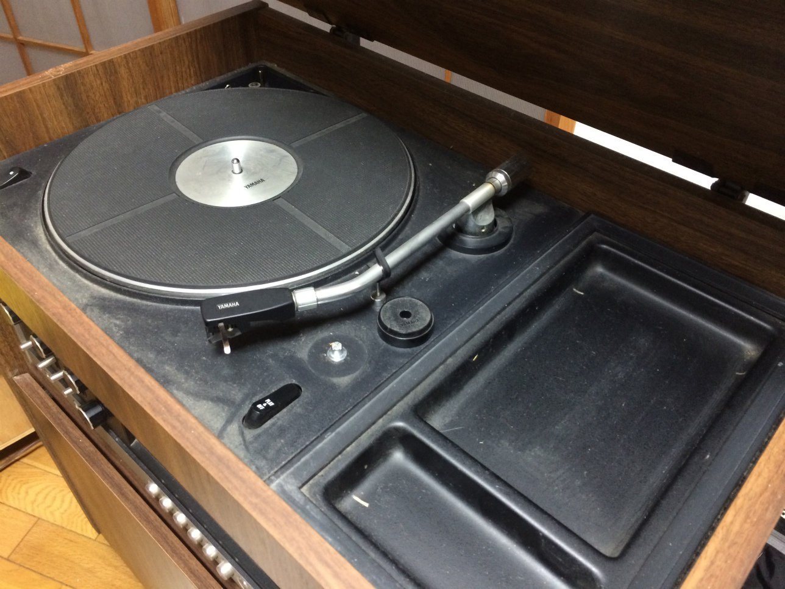
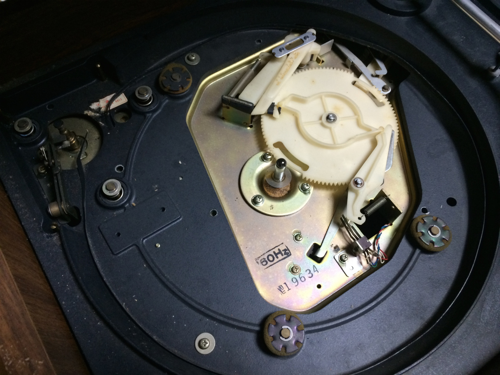
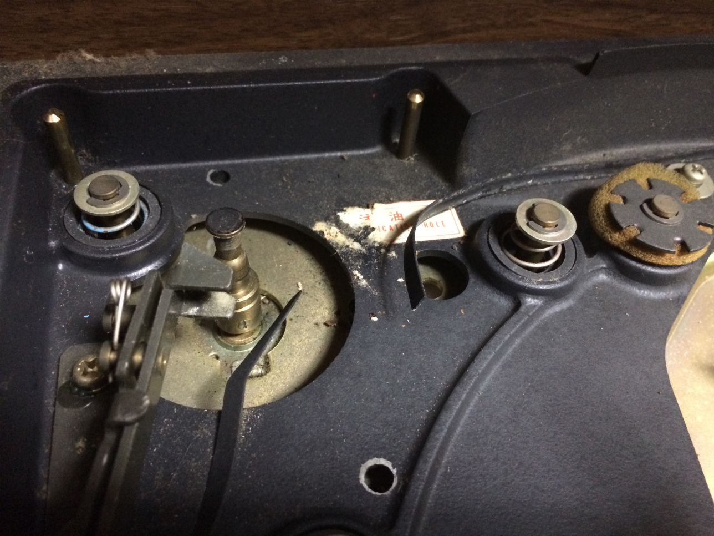
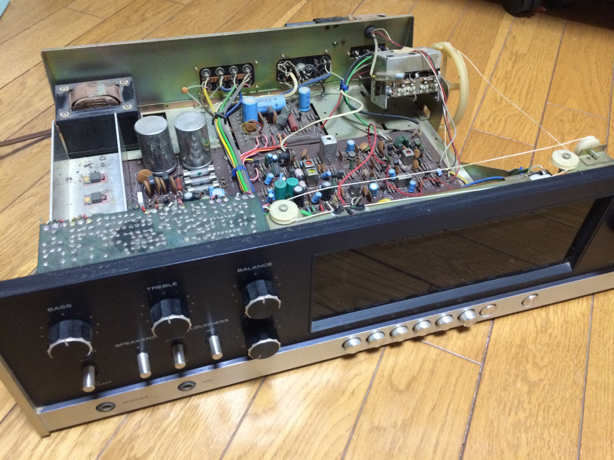
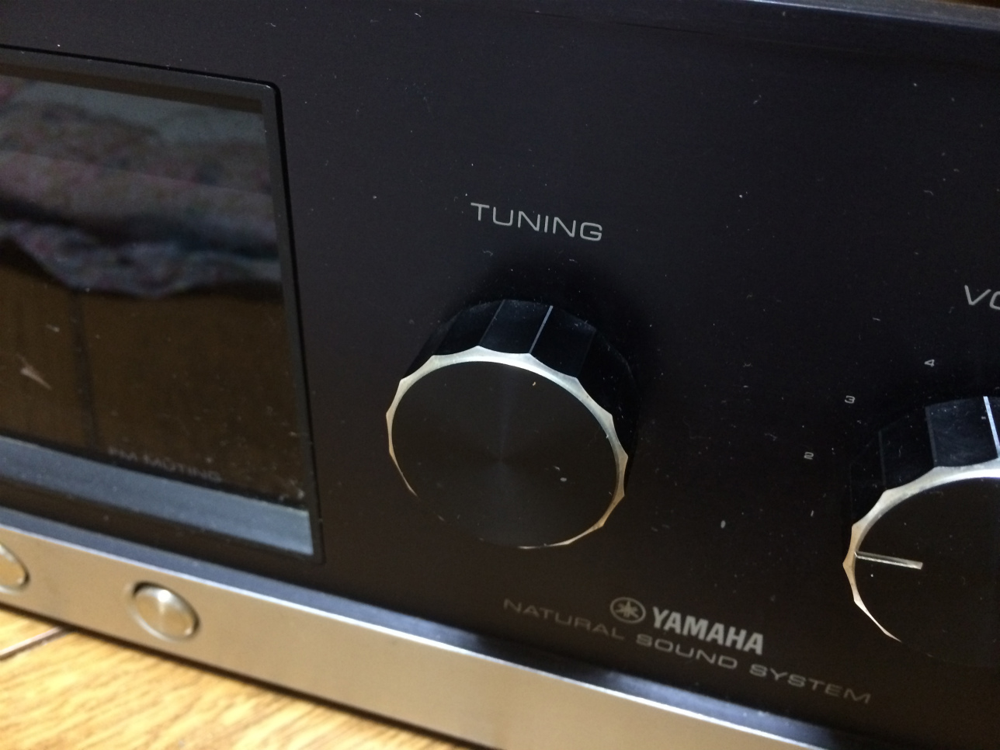
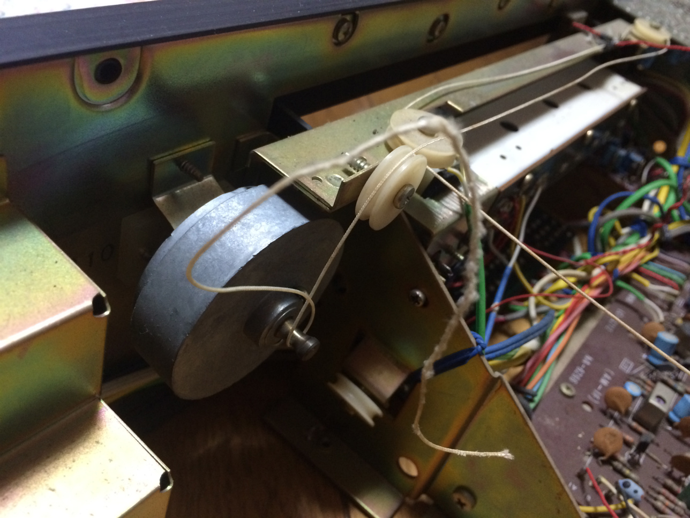

この前、ばあちゃんが誕生日を迎えるので何かしてあげたいと思っていた矢先、ふとばあちゃんが 「久々にレコードが聞きたいな」と言っているのを耳にしました

これだと思い壊れたレコードプレーヤーを直すことに。とりあえずホコリまみれレコードプレーヤーを引っ張っり出してきました。

これがその YAMAHA 製レコードプレーヤー。めっちゃ重かった...

50 年くらい前に買ったものらしいのですが、なかり頑丈な作りで想像よりもかなりしっかりしてます。

50 年前となると僕よりも 2 倍以上年上の大先輩。すごく歴史を感じます。

ばあちゃんによるとターンテーブル(レコードを載せて回る台)が動かないのに加え、ダイアルを回しても反応がないらしい。

電源を入れるとディスプレイが光るので回路は生きてる。あと確かにターンテーブルは回らないが何かの動作音は聞こえます。

とりあえず簡単にばらしてみました

上の部分を引っこ抜くと

よく見ると

これだ...完全にベルトっぽいのが切れてました。

調べてみると大抵のレコードプレーヤーは軸部分の回転をベルトを介してターンテーブルを回しているようで、この手の故障が一番多いんだそうです。

ベルトを接着剤を使って補修したところで、ダイアル部分の修理へ。

ただ...実はこのダイアル壊したの僕なんですよね...

小さい時に何かと機械類を触るのが大好きだったんですが、当然こういった大きな機械には興味津々なわけでダイアルと回しまくっているうちにダイアルが空回りしてしまうようになったという...(汗)

約 20 年の月日を経て自分で壊したものを自分で直す時が来るなんて...

と少し時の流れの早さと自分の成長にしんみりしたところで回路部分を本体から外します。

これが 50 年前の回路か、と思いふける間もなく
構造のシンプルさに感動しました。

なんとダイアルの先は糸で回路部分のダイアルと直結しているだけでした。ディスプレイのゲージもその動作に連動するように棒が動くようになっているだけ。

切れた糸を新品のタコ糸に交換してあげると無事ちゃんと直りました!

今回の修理で特に驚いたのが昔の製品のシンプルさと頑丈さです。
今よりもひとつの製品を長く大切に使っていたってことが製品を見て伝わってきました。

昔の人は良い物作るなと関心しまくりです。

そういう点は今の人々も見らなうべきだと思います。個人的には新しいものも大好きですが、長く使い愛着のわいた製品はもっと好きになるわけで。

あとレコードが直ったことを言うとばあちゃんはものすごい喜んでくれました。満足いく誕生日プレゼントになったようで良かったです。
