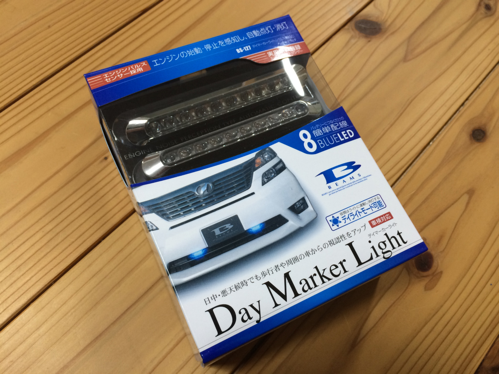
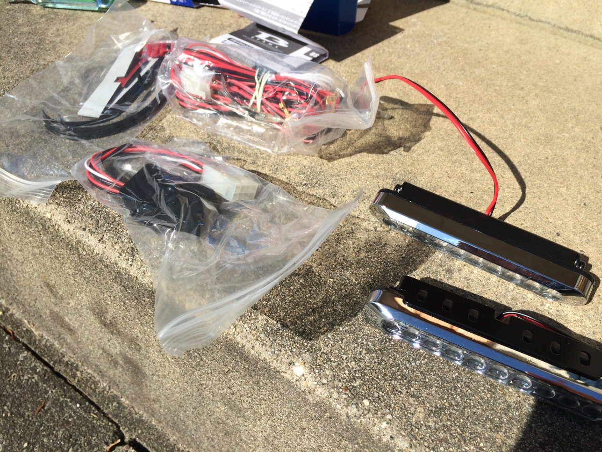
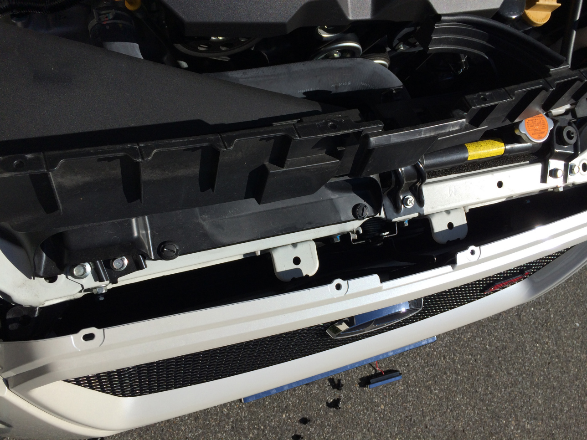
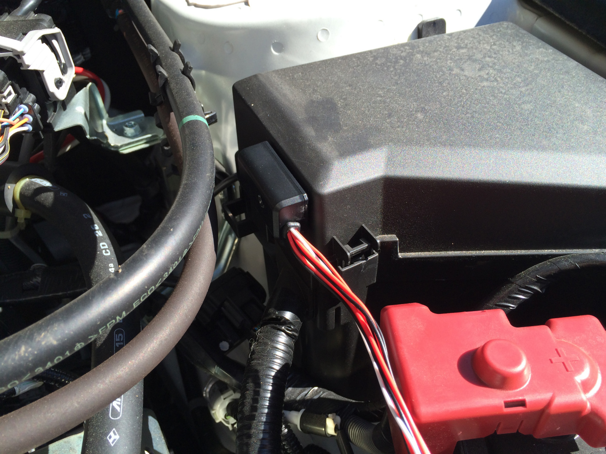
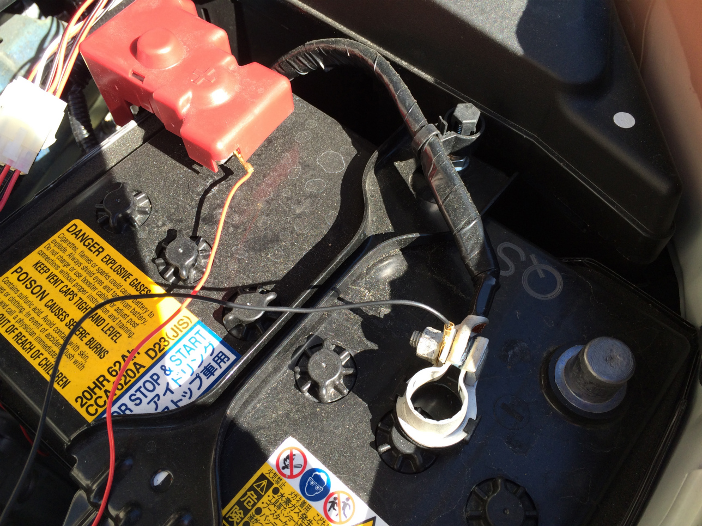
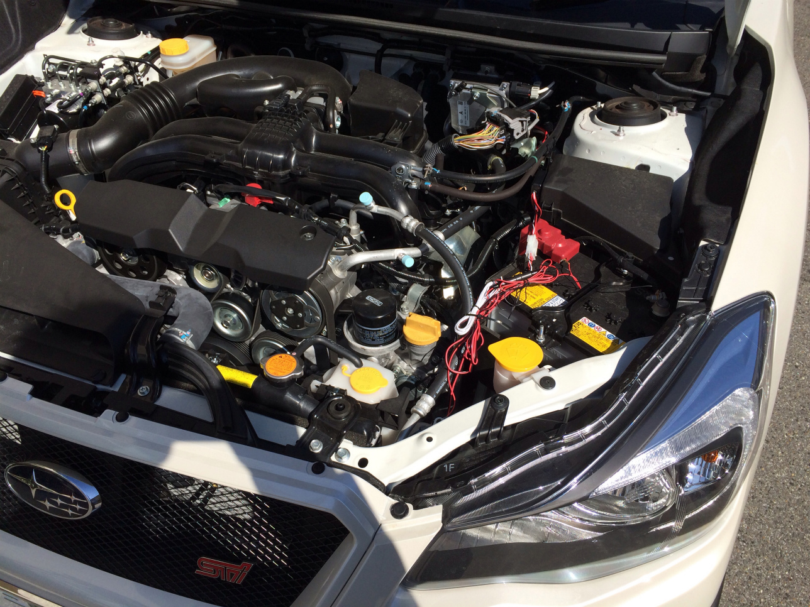
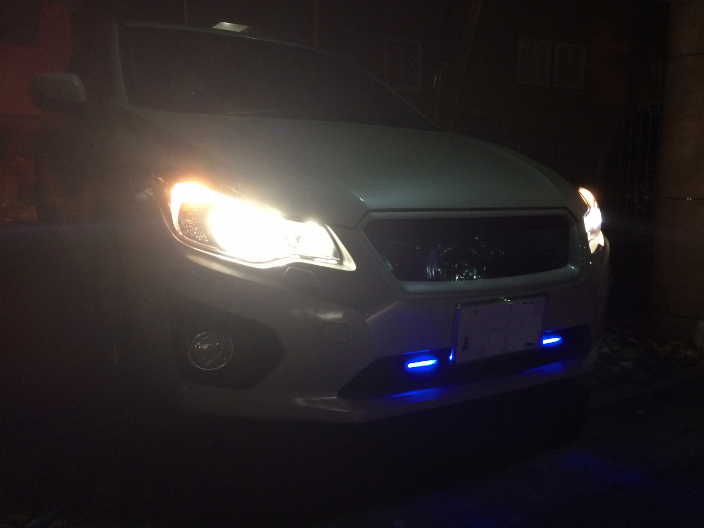

郵便局の車に付いている青いライトに前々から興味があったので
インプレッサ スポーツに付けてみました。

事故率低下の効果もあるんだとか。

今回買ったのは amazno で評価も高く値段も比較的安かったこちら

<a target="_blank" href="https://www.amazon.co.jp/gp/product/B0071W1PB8/ref=as_li_tl?ie=UTF8&camp=247&creative=1211&creativeASIN=B0071W1PB8&linkCode=as2&tag=haruyuki04-22&linkId=1c9397da7df1df015dd6945c0da056d2">MIRAREED(ミラリード) ディマーカーライト パルス感知式 ブルー</a>

値段も約 3 千円弱とお手頃価格。
取り付けもドライバー 1 本で済み、非常に簡単!

パッケージの中身は

- デイライト本体
- パルス感知センサー
- 取り付けステー
- 配線コード
- 粘着シール等

実際に取りけていきます。

バンパー裏にある黒いカバーが邪魔なので固定しているピン?のようなものを取り外し

センサーをヒューズボックスの側面に貼り付け

トレーをフロントの好きな位置に固定し、そこにライトを取り付けます。配線を簡単にまとめ

このタイプはバッテリーから直接電源を取るタイプなのでそのまま取り付け。ただ直付けは若干暗電流が気になります。

作業自体は 1 時間もかからない位で終了

こんな的当な配線でいいのだろうかと心配になります(汗)

実際に点灯している時の画像がこちら

値段の割には見た目もスッキリして結構気に入ってます。
自作 PC でもそうですが光物は楽しいですね。

取り付けから 1 ヶ月ほど立ちますが無事問題なく動作しています。
