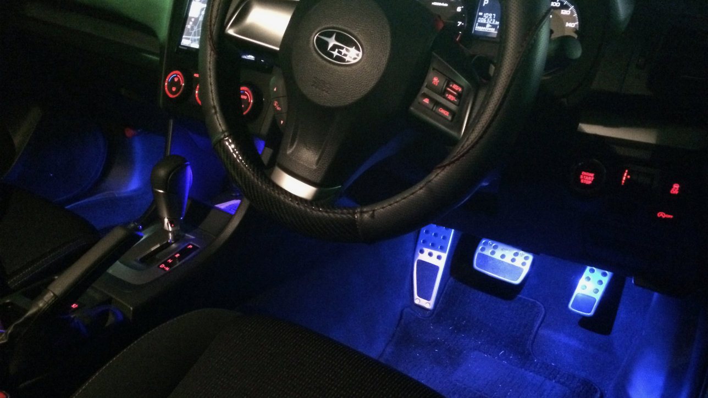

## はじめに

インプレッサ スポーツには標準でフットランプが装備されていますが、乗車後最大 30 秒までしか点灯できない仕様になっています。

友達の車に乗った際に運転時に点灯しているフットランプの印象が思いの外よかったので今回インプレッサにも取り付けてみることに。 その工程を簡単にまとめてみました。

## 準備物

amazon さんでいくつか必要なものを購入。これまで内装系をいじったことはなかったので、配線も含めて一から購入しました。

購入した次の日に到着、さすがです!!

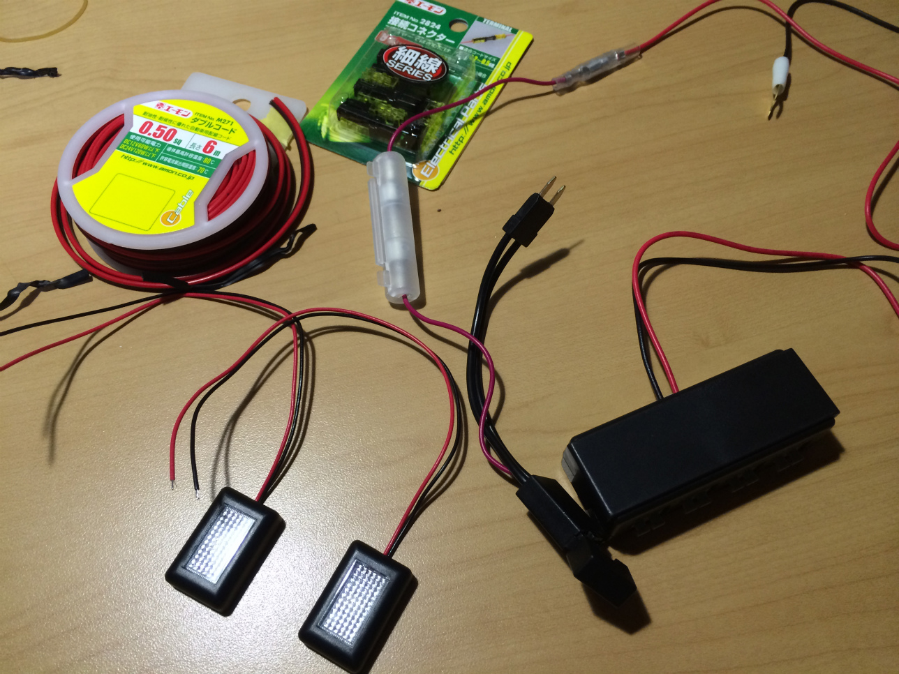

今回購入したのは以下の 5 点

- <a target="_blank" href="https://www.amazon.co.jp/gp/product/B00366IQOM/ref=as_li_tl?ie=UTF8&camp=247&creative=1211&creativeASIN=B00366IQOM&linkCode=as2&tag=haruyuki04-22&linkId=e8fce22b851ca710f61505aaa1e0f8e3">エーモン フラット LED 青 1824</a>
- <a target="_blank" href="https://www.amazon.co.jp/gp/product/B0094B2COI/ref=as_li_tl?ie=UTF8&camp=247&creative=1211&creativeASIN=B0094B2COI&linkCode=as2&tag=haruyuki04-22&linkId=22ccf339dd9362917b000577aaf5d282">エーモン 接続コネクター 4 セット(8 個入) 2824</a>
- <a target="_blank" href="https://www.amazon.co.jp/gp/product/B07PSL1H4J/ref=as_li_tl?ie=UTF8&camp=247&creative=1211&creativeASIN=B07PSL1H4J&linkCode=as2&tag=haruyuki04-22&linkId=e47b9c4e6f048bc2579b46fe1800dd66">【Amazon.co.jp 限定】エーモン ダブルコード(赤/黒) 0.50sq 6m (M271)</a>
- <a target="_blank" href="https://www.amazon.co.jp/gp/product/B0049DRZZC/ref=as_li_tl?ie=UTF8&camp=247&creative=1211&creativeASIN=B0049DRZZC&linkCode=as2&tag=haruyuki04-22&linkId=fc0c7e6512155972107ef496f25031a6">エーモン フリータイプヒューズ電源(ミニ平型) DC12V・60W/DC24V・120W 2835</a>
- <a target="_blank" href="https://www.amazon.co.jp/gp/product/B07NWG2YY8/ref=as_li_tl?ie=UTF8&camp=247&creative=1211&creativeASIN=B07NWG2YY8&linkCode=as2&tag=haruyuki04-22&linkId=a00ba4da25ccab0d841f58dbd0f640bd">【Amazon.co.jp 限定】エーモン プラス・マイナス分岐ターミナル ワンタッチ接続 (2831)</a>

## 取り付け

### 電源の確保

インプレッサスポーツには運転席右下にコイントレーがついていますが、それを外すと、写真のようにヒューズ BOX が見えます。

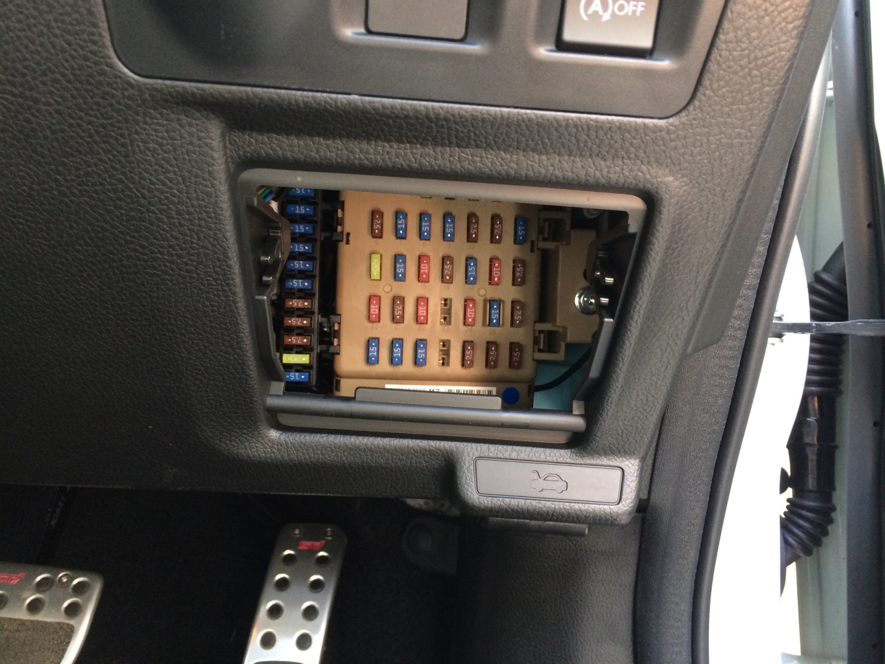

ヘッドライト点灯とフットランプを連動したかったのでヒューズは、以下の図のように No.14 リアコンビランプから取りました。意外と硬いので取り付けにはラジオペンチなど挟む工具があると捗ります。

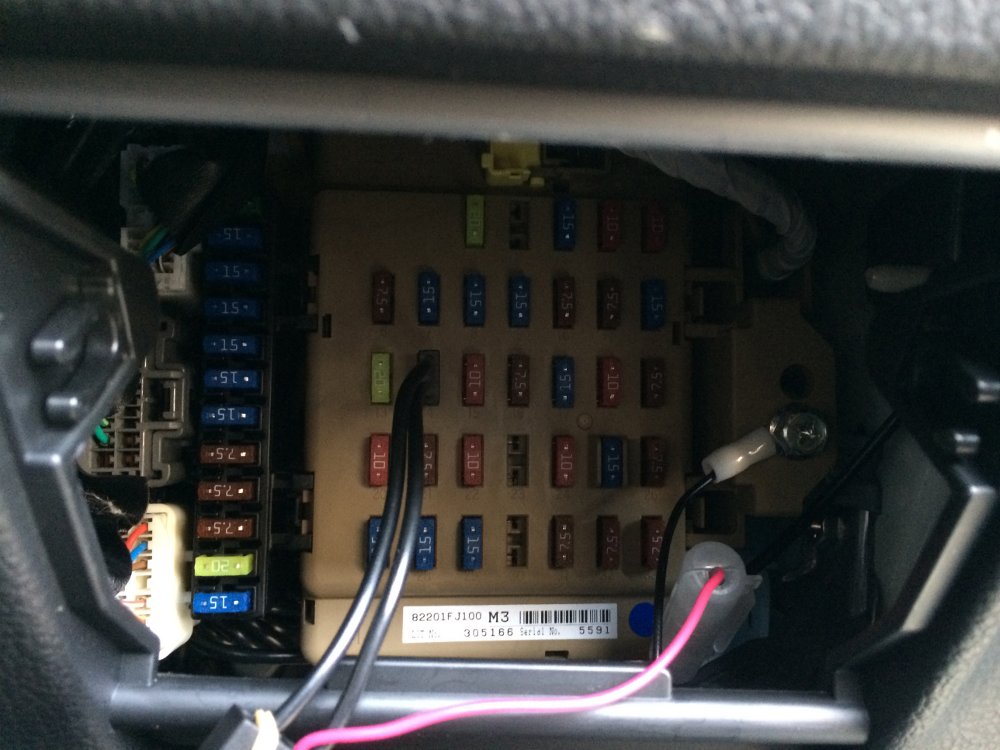

### 配線

運転席側のランプはヒューズの位置が近いので問題無いですが、助手席側にはうまいこと電線を持ってくる必要があります。

配線を通す専用工具も売っているのですが高いので、外に転がっていた虫網で的当に作りました。

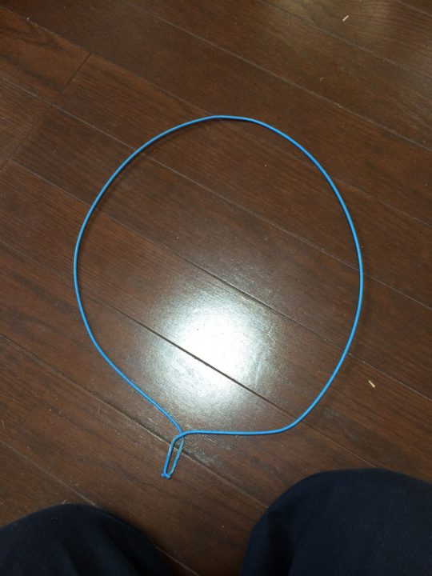

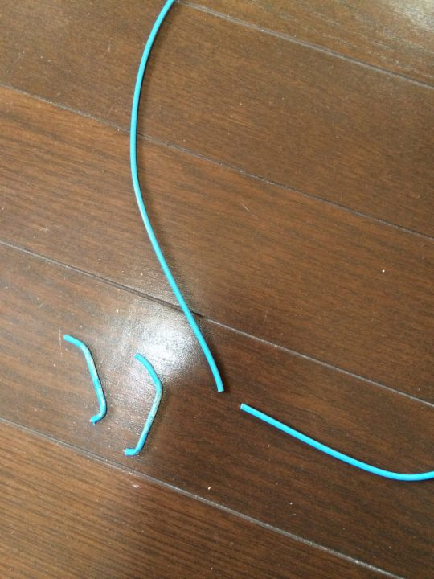

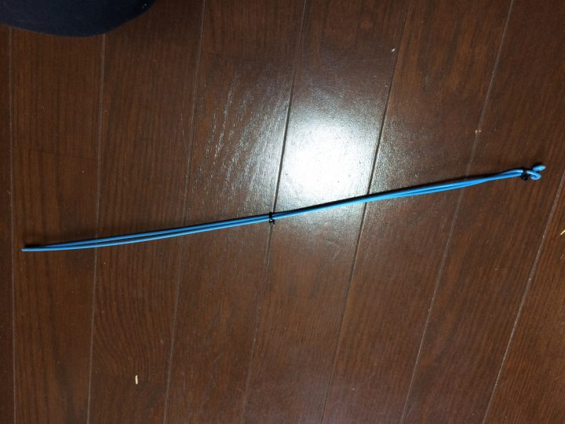

こんなかんじで挟める細い棒であれば何でもいいです。

↓

あとはこれをペダル左側の穴に電線を挟んで通します。

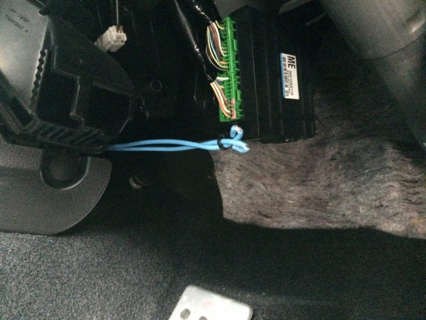

うまいこと行けば助手席側から見えるはずです。

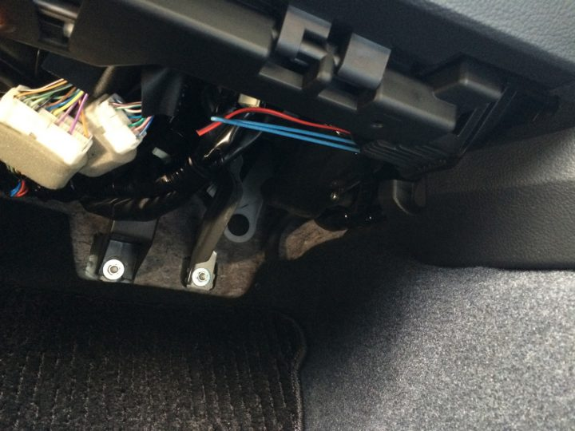

あとはこれに接続用のコネクタを使って LED と繋げます。

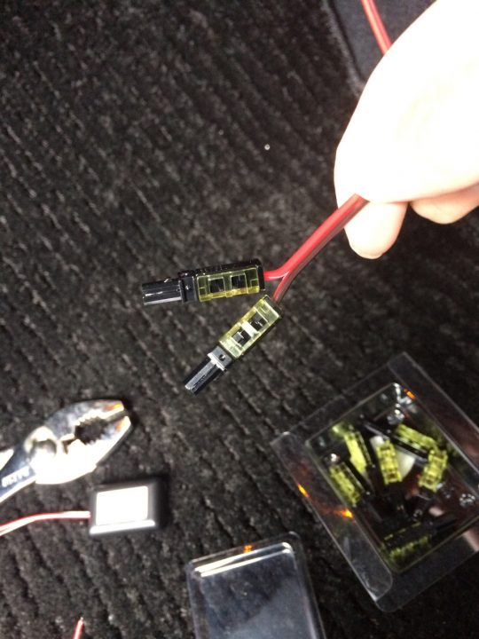

最後に適当な位置に LED を貼り付ければ完成です!!

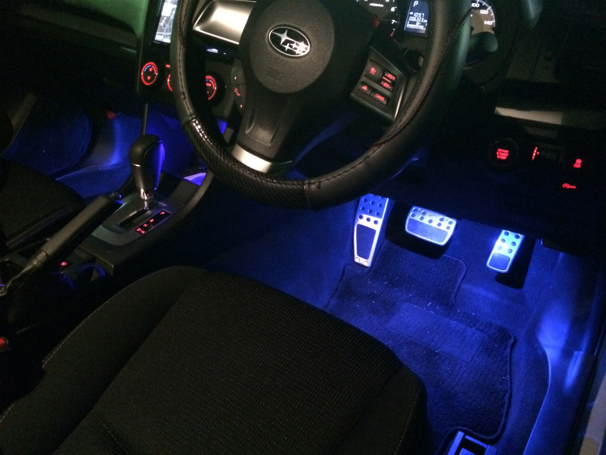

ただ、LED1 個タイプの物を使ったのに予想以上に光量が多くやんちゃな感じになってしまいました(^\_^;) また暇があれば可変抵抗でも挟んで調節できるようにしておこう。
