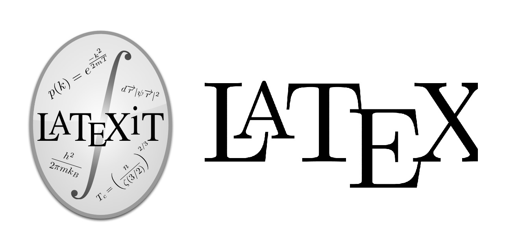

**追記.**<br/>
**2016年12月に内容を更新しました**

これまでMacで数式を書くときはGrapherから画像を作っていたのですが、複数行の数式となるとさすがに面倒なので今回LaTeXiTを使ってみることに。 当然TeXなので数式を作成にも融通が利いて便利です。

## 1. TeX環境の導入

今回導入するMacにはまだTeXを入れていなかったので一からTeX環境を作ります。

## インストール環境

* Mac OS 10.12- Sierra

参考ページが404になっていたので、適当にググってもらえればみみつかるはず。

## 2. LaTexiT最新版をダウンロード

MacTexに同封されているLaTeXiTは最新版でない可能性があります. そのため公式サイトからLaTexiTを入手してください。

<https://pierre.chachatelier.fr/latexit/latexit-downloads.php>

## 3. LaTeXiTを日本語対応させる

この状態でも日本語が含まれていない数式では問題ありませんが、含まれているものの場合エラーが出てしまいます。 以下のようにLaTeXiTの設定を変更してください。

LaTeX、dvipdfのパスは以下のように設定。

```
LaTeX: /usr/local/texlive/2015basic/bin/×86_64-darwin/platex
dvipdf: /usr/local/texlive/2015basic/bin/×86_64-darwin//dvipdfmx
```

上記パスの太字部分はインストールしたTexに合わせて変更してください。

not two-byte family... エラーに対応するため, 日本語部分に2バイトに直すコマンドを使います。

```
\textmc{入力したい日本語}
\text{入力したい日本語}　※\textmcは明朝フォント指定
```

これで日本語が数式内にある状態でもコンパイルが通るようになりました。

ただし、日本度を多用する場合は\textを使うのも面倒なので
環境設定からテンプレートでjsarticleクラスを使うほうが良いかもしれません。

## Tips

Grapherで数式を作った後に右クリックでTeXのコードをコピー出来ます。TeXのコード忘れた時に便利です。

## 終わりに

使ってみた感想ですが、やっぱりTeXに慣れていればGrapherを使うよりも圧倒的に早く記述できますね。これでPages、Keynoteにガンガン綺麗な数式を盛り込めます。

## P.S.

Twitter上でご助言をいただき、数式のコードを修正しました。
場合分けを利用する時はcasesを使うとコードもだいぶスッキリします。

TeXに関しては素人なのでこういった知らない部分を教えていただけると非常に助かりますね。エラーが出ないとついこれでいいやとなってしまうので(^_^;)
