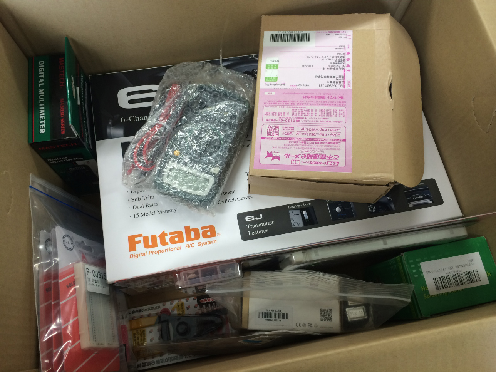
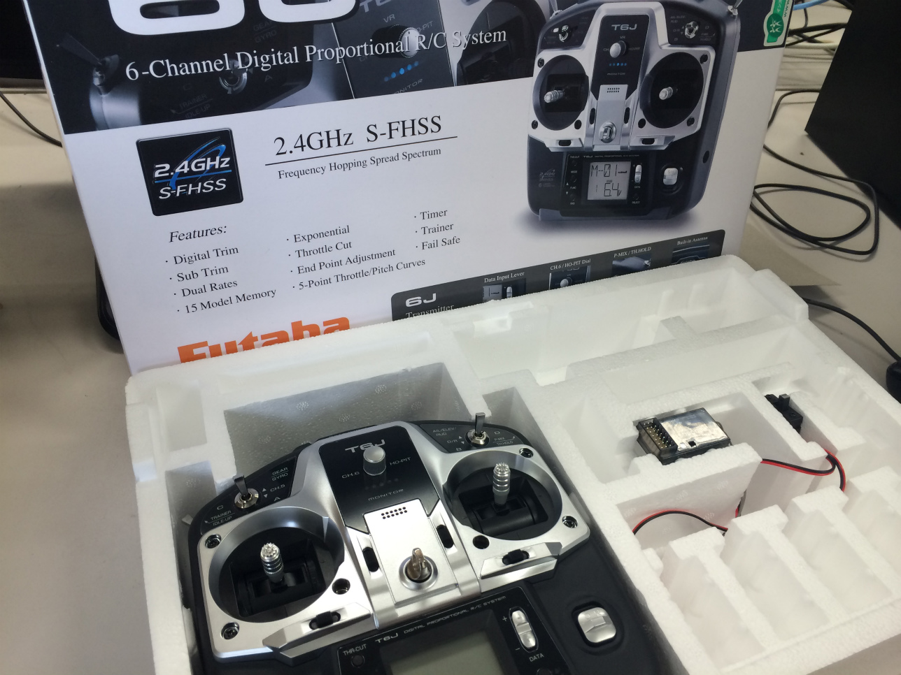
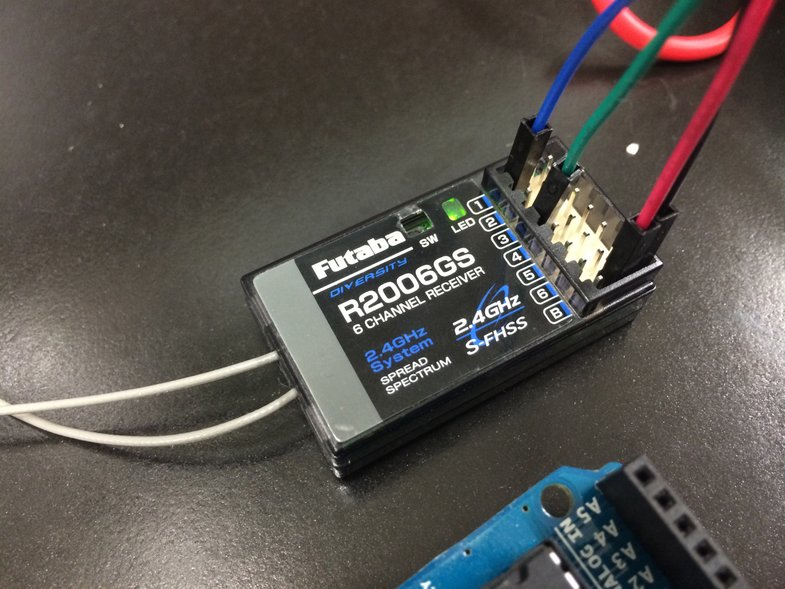
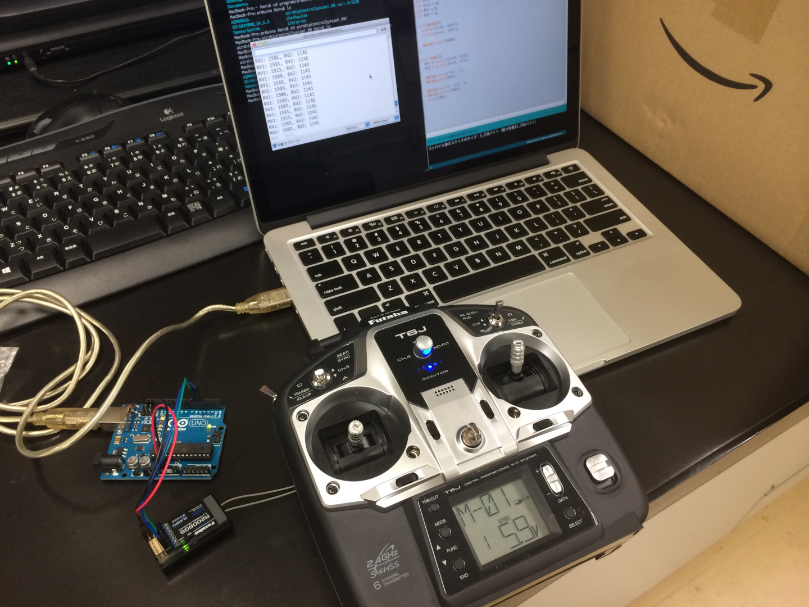

## はじめに

2 ヶ月ほど前に化学系の学科の先生から飛行船を作るからその制御をやってもらえないかと頼まれたことからこの飛行船プロジェクト?は始まりました。

これまで AR.Drone の制御に手を加えたりはしていましたが、ただ浮くだけの飛行船を一から制御なんて完全にはじめての経験。でも面白そうなのでとりあえず的当にやってみることに。

飛行船となると航空力学?とかかなり頭のいる話になるのかと思いきや、調べてみると案外規模の小さい飛行船ではそこまで気にしなくてもいいともわかってきました。

最近になって注文していた部品も届いたものの、本来の研究の方でなかなか時間も取れずにいましたが最近少し進展があったのでまとめることに。

届いた部品一式。

## プロポ T6J

送信機は自前で作ろうかと思いましたが、競技に出るには正規のコントローラーを使う必要があるということでプロポを買ってもらいました。

今回使った T6J は双葉さんから発売されている 6CH の優れもの。飛行船の制御にはハイスペックすぎる気もしますが(笑)。スペックが高すぎてはじめはずっとこれの説明書を読んでました。

## プロポからの信号を受信

前置きが長くなりましたが、今回は制御の第一歩。
リモコンからの信号の解析。

プロポ T6J から送られる信号を受信機 R2006GS で受信し、
その受信機からの信号を Arduino で読み取ってみました。

R2006GS の仕様書がネットで手に入らなかったので的当にテスターを使い端子を調べながら、下の写真のように接続。
受信機の 1~6 は CH、B が電源 (右から GND,VCC) です。

コントローラーとの対応は以下の表にまとめました。

計測にあたっては Arduino の pulseIn 関数で PWM 信号を数値がするのが手軽そうでした。
計測のためのコードは以下のサイトを参照。

<https://robokosaku.blog115.fc2.com/blog-entry-1093.html>

ありがとうございます!

## 実際の動作

実際計測してみると各 CH から 1100~1900 のパルス数が出ています。リモコンからしっかりした値が計測できたので、今度は PWM を作ったモーター制御部分を実装すればシステム部分は大方出来てくるのではないでしょうか。

最後に計測の動画を載せておきます。

<iframe width="560" height="315" src="https://www.youtube.com/embed/hoIRlxp7KFw" frameborder="0" allow="accelerometer; autoplay; encrypted-media; gyroscope; picture-in-picture" allowfullscreen></iframe>

## Reference

- <a target="_blank" href="https://www.amazon.co.jp/gp/product/B008GRTSV6/ref=as_li_tl?ie=UTF8&camp=247&creative=1211&creativeASIN=B008GRTSV6&linkCode=as2&tag=haruyuki04-22&linkId=826cb16dad367b86f5e2b4c8dfc912b9">Arduino Uno Rev3 ATmega328 マイコンボード A000066</a>
- <a target="_blank" href="https://www.amazon.co.jp/gp/product/B017BIX7CQ/ref=as_li_tl?ie=UTF8&camp=247&creative=1211&creativeASIN=B017BIX7CQ&linkCode=as2&tag=haruyuki04-22&linkId=e241532592592f1b9192963410a26b4b">フタバ 10J (10ch-2.4GHz T-FHSS AIR モデル) ドローン用 TR セット(フルスプリング仕様)</a>
