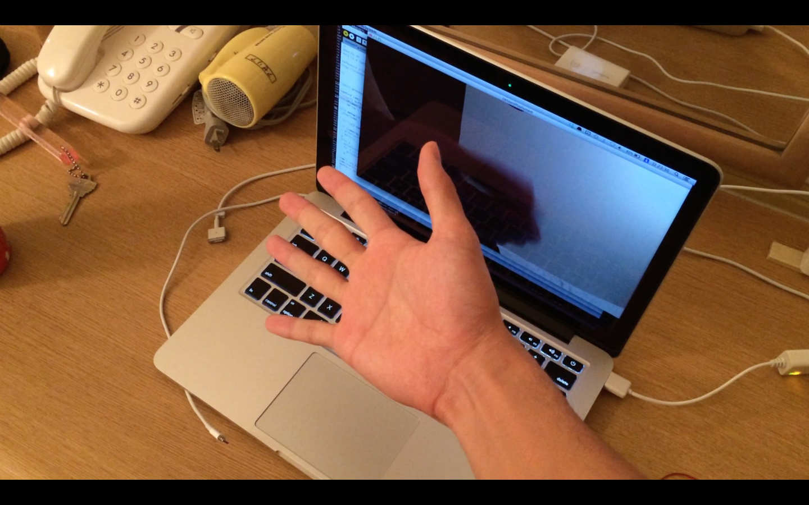

## はじめに

所属しているバレーボール部顧問の先生にバレーに使えるものを作って欲しいとお願いされていました。

以前チームが試合に負けて悔しかったのをきっかけに
Processingで映像を数秒遅らせて再生するプログラムを作ってみました。

## 実装 with Processing

Processingだと異なるマルチプラットフォームでも簡単に動かすことができるので便利です。

実装方法はいたって簡単。

PCに付いているライブカメラをpicture型のオブジェクトに読み込み、カメラの画像データをPImage型の用意したブッファーに溜め混んで古いものから再生するだけです。

### コード

```c
import processing.video.*;

final int delaytime = 2;

Capture cam;
PImage[] buffer;
int nFrames = (60/4)*delaytime;
int iWrite = 0, iRead = 1;

void setup(){
  size(1280, 720);

  String[] cameras = Capture.list();

  if (cameras.length == 0) {
    println("There are no cameras available for capture.");
    exit();
  }
  else {
    println("Available cameras:");
    for (int i = 0; i < cameras.length; i++) {
      println(cameras[i]);
    }

  cam = new Capture(this, cameras[0]);
  cam.start();
  buffer = new PImage[nFrames];
  }
}

void draw() {
  if(cam.available()) {
    cam.read();
    buffer[iWrite] = cam.get();
    if(buffer[iRead] != null){
      image(buffer[iRead], 0, 0);
    }
    iWrite++;
    iRead++;
    if(iRead >= nFrames-1){
      iRead = 0;
    }
    if(iWrite >= nFrames-1){
      iWrite = 0;
    }
  }
}
```


## 実際の動作

実際に2秒程度遅延させている様子です。

<iframe width="560" height="315" src="https://www.youtube.com/embed/vKEI9IJYoiI" frameborder="0" allow="accelerometer; autoplay; encrypted-media; gyroscope; picture-in-picture" allowfullscreen></iframe>

## 終わりに

MacBook Pro retina(外部グラフィックなし)で動作させてみましたが、10秒程度の遅延でも問題なくヌルヌル再生できました。フォームチェックなどバレー以外にも様々なスポーツで使う機会があるのでは無いかと思います。
ただこういった遅延システムの製品を買うと数万するらしいです…
ハード、ソフト、方法は様々ですがもう少し安くならないと予算の少ない部活などで手を出すには少々ハードルが高い気がします。
