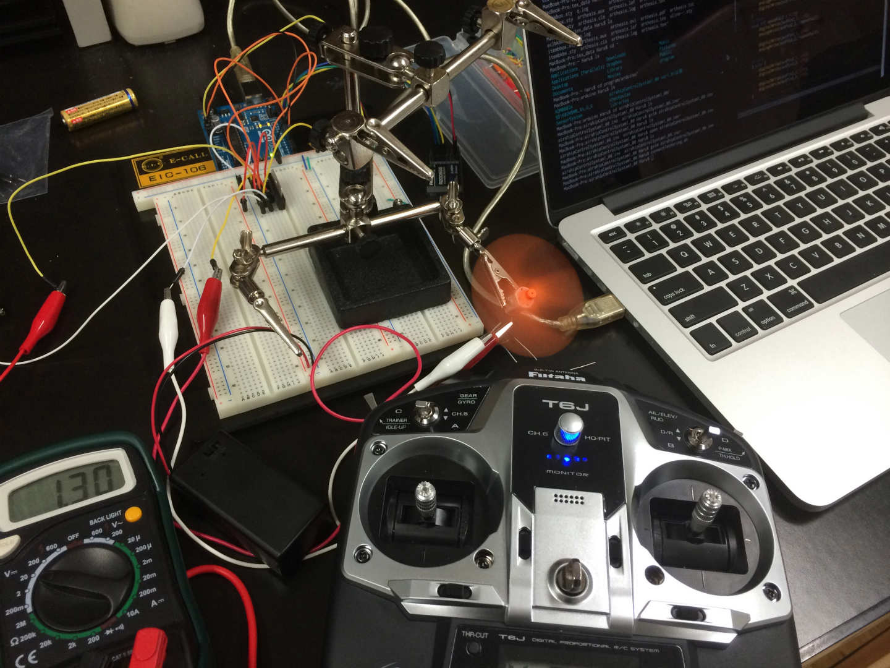

## プロポ信号からPWM制御

[前回まで](http://blog.icchi.me/recieve-signal-from-propo-with-arduino-part1)はプロポからの信号をArduinoを使って読み取ることまでは行いましたが、
今回はその信号をもとにモータードライバを使ってDCモーターのPWM制御を行いました。

PWMの出力にあたっては以下のサイトを参照しました。
ありがとうございます。

http://monoist.atmarkit.co.jp/mn/articles/1401/07/news003_2.html

### コード

今回書いたコードは以下のとおり

```c
/*
controlDCmotorPWM.ino
2014.05.29
Control DC motor with PWM using propotional system and Arduino
ver1.00
Haru
*/


//set pin num
//--------------------------------------------
// input
const int rcv = 4; // up/down

// output
const int outPin1_1 = 3;
const int outPin1_2 = 5;
//--------------------------------------------

// init
//--------------------------------------------
int pulseNum = 0;
int speedVal = 0;
//--------------------------------------------


void setup(){

    //setup pin mode
    //--------------------------------------------
    pinMode(rcv, INPUT);

    pinMode(outPin1_1, OUTPUT); // outPin1: DC motor
    pinMode(outPin1_2, OUTPUT);
    //--------------------------------------------

    // test pulse
    Serial.begin(9600);
}


void loop(){

    pulseNum = pulseIn(rcv, HIGH); //recieve pulse
    int speedVal = map(pulseNum, 2000, 1000, -255, 255);
    // convert pulseNum(1100~1900) to speedVal(-255~255
    speedVal = constrain(speedVal, -255, 255); // constrain speedVal

    //control
    //--------------------------------------------
    if( speedVal > 20){
        analogWrite(outPin1_1, speedVal);
        digitalWrite(outPin1_2, LOW);
    }

    else if( speedVal < -20){
        digitalWrite(outPin1_1, LOW);
        analogWrite(outPin1_2, -speedVal);
    } else {
        digitalWrite(outPin1_1, LOW);
        digitalWrite(outPin1_2, LOW);
    }
    //--------------------------------------------


    // sirial monitor
    Serial.print("pulseNum: ");
    Serial.print(pulseNum);

    Serial.print(" | speedVal: ");
    Serial.println(speedVal);
}
```

処理の流れを簡単に説明すると

プロポから受け取った1100~1900までの信号をPWM出力できる-255~255にmap関数を使って変換。

※ただし、プロポからの信号に若干の誤差が含まれるためまれに-255~255の範囲を超えた出力をしてしまう時があり、そうなるとDCモーターにかかる電圧が急激に変動したりするのでconstrain関数を使い最小値と最大値がそれぞれ範囲内に収まるように調節します。

あとは出力に設定したピンでanalogwrite関数を使いPWM出力をしてあげればプロポのレバーの強弱に合わせてDCモーターの強弱も強弱します。

※ここでも、PWMが負の値の時にif文の中身でマイナスを付けて打ち消さないと動作不良の原因になるので注意してください。

今回の作業でだいぶ飛行船の制御に近づいたように感じます。
ただモーターが回るだけでもプロポから操作するだけで結構楽しいです(笑)

## 実際の動作

最後に実際に動かしている動画を載せておきます。

<iframe width="560" height="315" src="https://www.youtube.com/embed/3Zr3OdBh_T8" frameborder="0" allow="accelerometer; autoplay; encrypted-media; gyroscope; picture-in-picture" allowfullscreen></iframe>

## Reference

* <a target="_blank" href="https://www.amazon.co.jp/gp/product/B008GRTSV6/ref=as_li_tl?ie=UTF8&camp=247&creative=1211&creativeASIN=B008GRTSV6&linkCode=as2&tag=haruyuki04-22&linkId=826cb16dad367b86f5e2b4c8dfc912b9">Arduino Uno Rev3 ATmega328 マイコンボード A000066</a>
* <a target="_blank" href="https://www.amazon.co.jp/gp/product/B017BIX7CQ/ref=as_li_tl?ie=UTF8&camp=247&creative=1211&creativeASIN=B017BIX7CQ&linkCode=as2&tag=haruyuki04-22&linkId=e241532592592f1b9192963410a26b4b">フタバ 10J (10ch-2.4GHz T-FHSS AIRモデル) ドローン用TRセット(フルスプリング仕様)</a>
