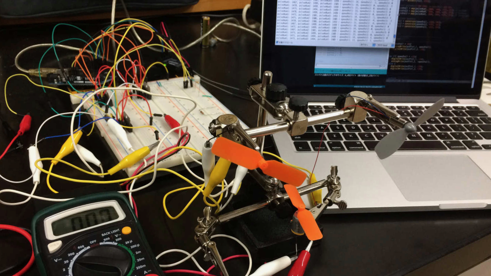
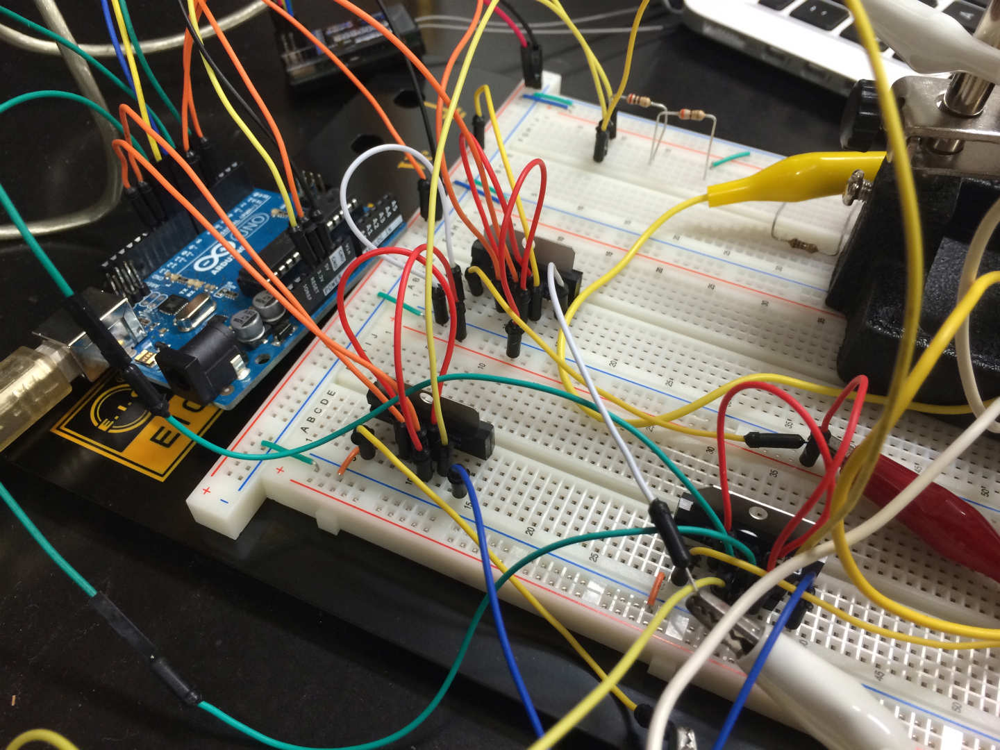

## 3個のモータを制御する

前回まででは1つのDCモーターをプロポからの信号でPWM制御するというものでしたが、今回は実際の飛行船の制御に使う3つのDCモーターの制御に入りたいと思います。

回路はこんな感じ。



前回の内容を3つ分に増やしただけですね。 ソフトの方もそんな感じです。

## コード

実際に書き込んだコードがこちら

```c
/*
2014.06.03
Airship Control System (ACS)
ver1.00
Haru
*/


//set pin num (3ch)
//--------------------------------------------
// to input
const int rcv1 = 4; // up/down
const int rcv2 = 7; // go/back
const int rcv3 = 8; // left/right

// to output
const int outPin1_1 = 3;
const int outPin1_2 = 5;
const int outPin2_1 = 6;
const int outPin2_2 = 9;
const int outPin3_1 = 10;
const int outPin3_2 = 11;
//--------------------------------------------

// init
//--------------------------------------------
int pulseNum1 = 0;
int pulseNum2 = 0;
int pulseNum3 = 0;

int speedVal1 = 0;
int speedVal2 = 0;
int speedVal3 = 0;
//--------------------------------------------


void setup(){

	//setup pin mode
	//--------------------------------------------
	pinMode(rcv1, INPUT);
	pinMode(rcv2, INPUT);
	pinMode(rcv3, INPUT);

	pinMode(outPin1_1, OUTPUT); // outPin1: back motor
	pinMode(outPin1_2, OUTPUT);
	pinMode(outPin2_1, OUTPUT); // outPin2: left motor
	pinMode(outPin2_2, OUTPUT);
	pinMode(outPin3_1, OUTPUT); // outPin3: right morot
	pinMode(outPin3_2, OUTPUT);
	//--------------------------------------------

	// test pulse
	Serial.begin(9600);
}


void loop(){

	//recieve pulse
	pulseNum1 = pulseIn(rcv1, HIGH);
	pulseNum2 = pulseIn(rcv2, HIGH);
	pulseNum3 = pulseIn(rcv3, HIGH);

	// convert pulseNum(1100~1900) to speedVal(-255~255)
	int speedVal1 = map(pulseNum1, 2000, 1000, -255, 255); // up/down
	int speedVal2 = map(pulseNum2, 2000, 1000, -255, 255); // go/back
	int speedVal3 = map(pulseNum3, 2000, 1000, -255, 255); // left/right

	// constrain speedVal
	speedVal1 = constrain(speedVal1, -255, 255);
	speedVal2 = constrain(speedVal2, -255, 255);
	speedVal3 = constrain(speedVal3, -255, 255);


	//control
	//--------------------------------------------
	// up/down
	//--------------------------------------------
	if( speedVal1 > 20){
		analogWrite(outPin1_1, speedVal1);
		digitalWrite(outPin1_2, LOW);
	}

	else if( speedVal1 < -20){
		digitalWrite(outPin1_1, LOW);
		analogWrite(outPin1_2, -speedVal1);
	} else {
		digitalWrite(outPin1_1, LOW);
		digitalWrite(outPin1_2, LOW);
	}
	//--------------------------------------------

	// go/back
	//--------------------------------------------
	// go
	if( speedVal2 > 20){
		digitalWrite(outPin2_1, LOW);
		analogWrite(outPin2_2, speedVal2);

		digitalWrite(outPin3_1, LOW);
		analogWrite(outPin3_2, speedVal2);

			}
	// back
	else if( speedVal2 < -20){
		analogWrite(outPin2_1, -speedVal2);
		digitalWrite(outPin2_2, LOW);

		analogWrite(outPin3_1, -speedVal2);
		digitalWrite(outPin3_2, LOW);

	// stop
	}
	//--------------------------------------------

	// left/right
	//--------------------------------------------
	// left
	else if( speedVal3 > 20){
		analogWrite(outPin2_1, speedVal3);
		digitalWrite(outPin2_2, LOW);

		digitalWrite(outPin3_1, LOW);
		analogWrite(outPin3_2, speedVal3);
	}

	// right
	else if( speedVal3 < -20){
		digitalWrite(outPin2_1, LOW);
		analogWrite(outPin2_2, -speedVal3);

		analogWrite(outPin3_1, -speedVal3);
		digitalWrite(outPin3_2, LOW);
	// stop
	} else {
		digitalWrite(outPin2_1, LOW);
		digitalWrite(outPin2_2, LOW);

		digitalWrite(outPin3_1, LOW);
		digitalWrite(outPin3_2, LOW);

		digitalWrite(outPin2_1, LOW);
		digitalWrite(outPin2_2, LOW);

		digitalWrite(outPin3_1, LOW);
		digitalWrite(outPin3_2, LOW);

	}
	//--------------------------------------------
	//--------------------------------------------


	// sirial monitor
	Serial.print("pulseNum1: ");
	Serial.print(pulseNum1);

	Serial.print(", pulseNum2: ");
	Serial.print(pulseNum2);

	Serial.print(", pulseNum3: ");
	Serial.print(pulseNum3);

	Serial.print(" | speedVal1: ");
	Serial.print(speedVal1);

	Serial.print(", speedVal2: ");
	Serial.print(speedVal2);

	Serial.print(", speedVal3: ");
	Serial.println(speedVal3);

}
```

これといって前回と大きな違いはありません。

今回の部分で飛行船の制御システムはほぼ完成したので、
あとはこの回路を小型化して飛行船に下腹部に取り付ければひとまず完成といったところ。

完成がイメージできるようになってきたので、
ますます飛行船を飛ばしてみたいという思いが強くなります。

## 実際の動作

最後に実際に動いている動画を載せておきます。

<iframe width="560" height="315" src="https://www.youtube.com/embed/Bn-2NPi-ZlY" frameborder="0" allow="accelerometer; autoplay; encrypted-media; gyroscope; picture-in-picture" allowfullscreen></iframe>

## Reference

* <a target="_blank" href="https://www.amazon.co.jp/gp/product/B008GRTSV6/ref=as_li_tl?ie=UTF8&camp=247&creative=1211&creativeASIN=B008GRTSV6&linkCode=as2&tag=haruyuki04-22&linkId=826cb16dad367b86f5e2b4c8dfc912b9">Arduino Uno Rev3 ATmega328 マイコンボード A000066</a>
* <a target="_blank" href="https://www.amazon.co.jp/gp/product/B017BIX7CQ/ref=as_li_tl?ie=UTF8&camp=247&creative=1211&creativeASIN=B017BIX7CQ&linkCode=as2&tag=haruyuki04-22&linkId=e241532592592f1b9192963410a26b4b">フタバ 10J (10ch-2.4GHz T-FHSS AIRモデル) ドローン用TRセット(フルスプリング仕様)</a>
