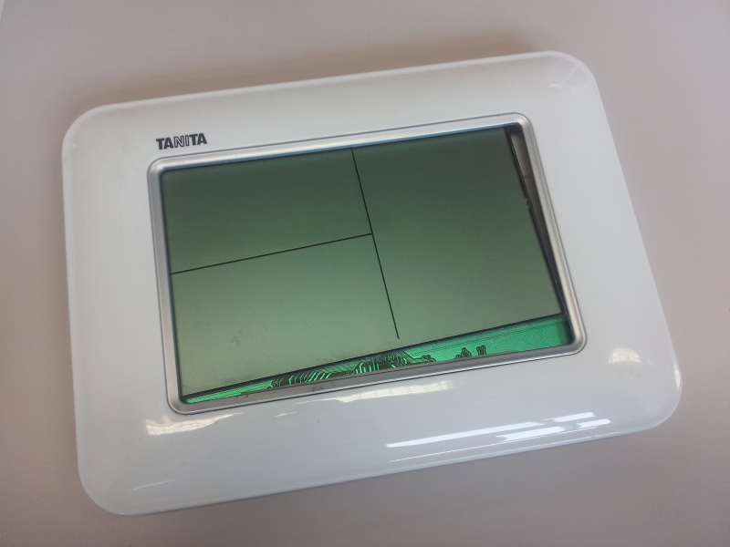
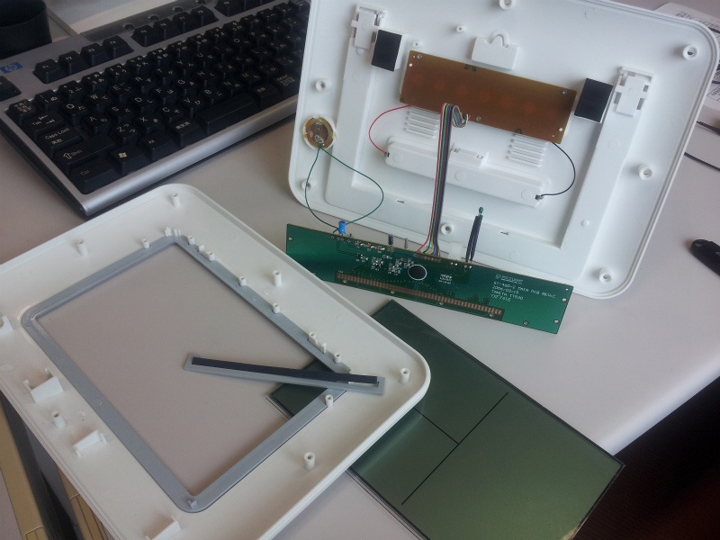
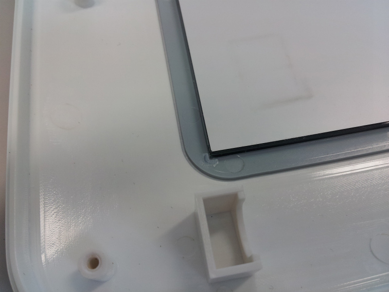
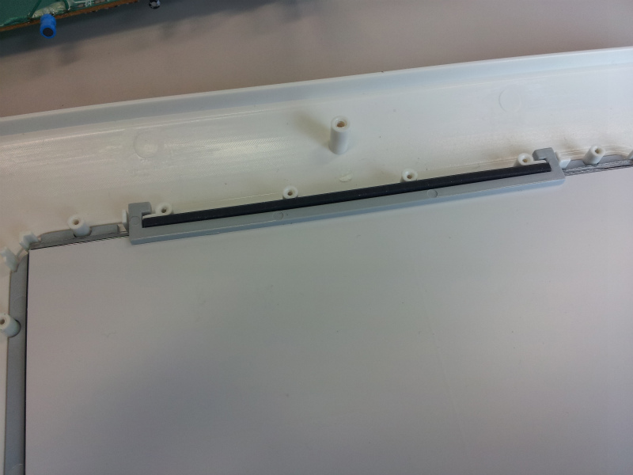
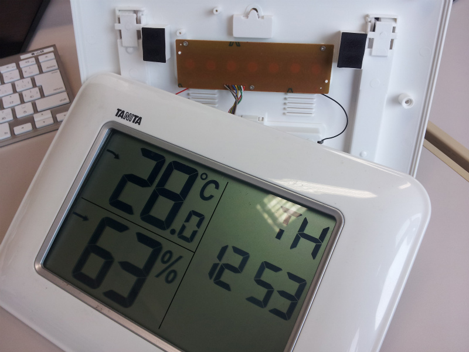
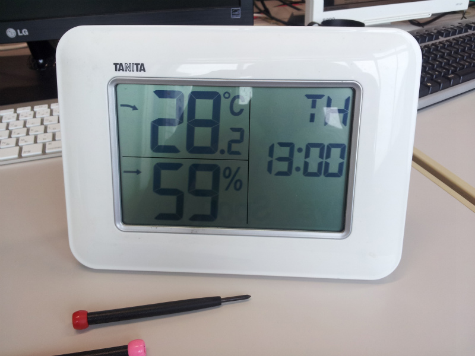

この前、部活顧問の先生の部屋で壊れた TANITA 製温湿度計が置いてあったので貰って来ました。

話によると落としたら壊れたらしく、これなら簡単に直せそうな気がしました。

実際、部品は自体に大きな損傷は無さそうです。

こういうときはとりあえずバラす。

基板にも問題無さそうで、恐らく接触不良と判断。どうやら液晶を固定するプラスチックの部分が折れてしまっていたようです。

ただいまいちゴムのような部品の使い方がわからなかったのですが、
どうやら導電ゴムのようで液晶と基板を繋げながら固定していたようです。

部品を本来あった場所に取り付け、折れた部分は接着剤で修復。

電池を電源を入れてあげると無事に表示されました。

最後に元通りに組み立てて修理完了。

案外簡単に直ったので良かったです。このまま研究室用にもらっちゃおうかと思いましたが、ちゃんと顧問の先生にお届けしました。
