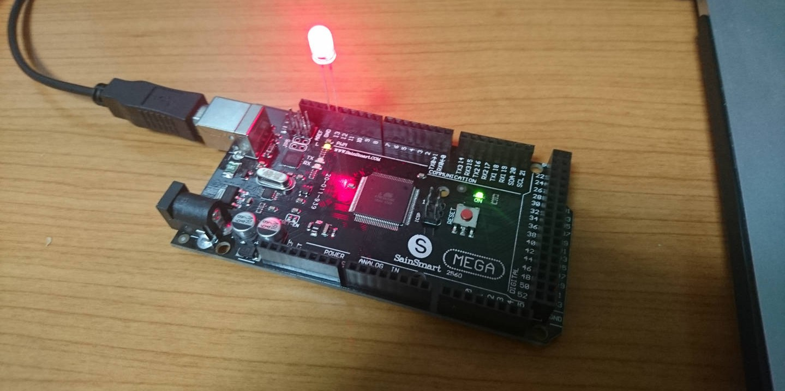
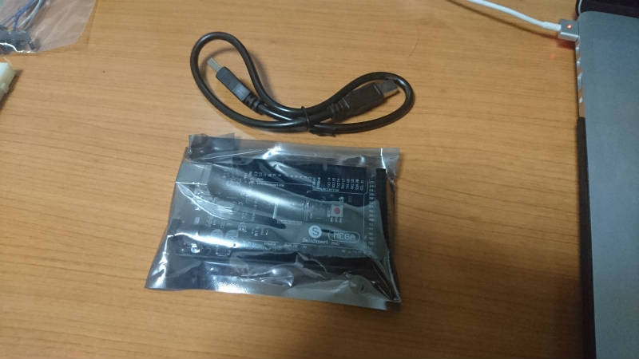
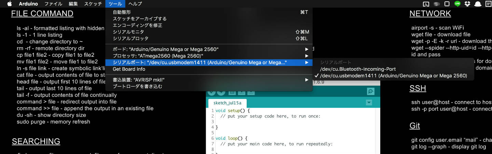
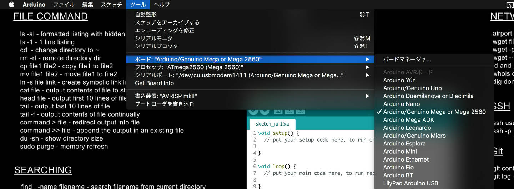
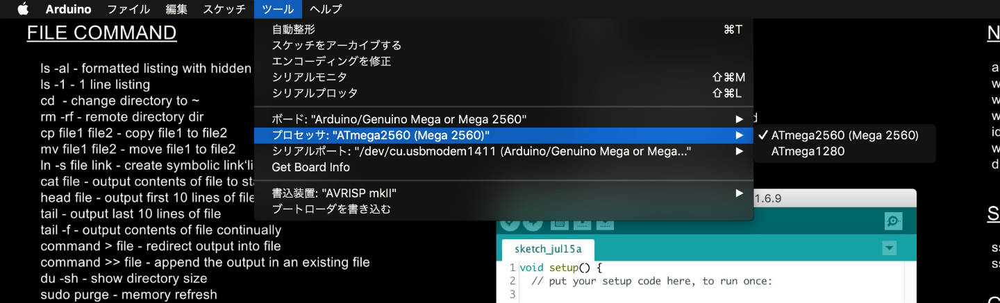

おうちはっくに向けてラズパイやらArduinoやらを適当に買い揃えていますicchiです.

SainSmart製のArduino megaの互換ボードをamazonで購入し, 動作チェックを兼ねてLチカしてみました. 使うにあたってIDE設定の変更もしたのでそれをメモしておきます.

## 実際の動作

<iframe width="560" height="315" src="https://www.youtube.com/embed/0PRSH5ESbRo" frameborder="0" allow="accelerometer; autoplay; encrypted-media; gyroscope; picture-in-picture" allowfullscreen></iframe>

## 準備

使ったものは以下の2つだけ

* [サインスマート（SainSmart） MEGA2560 互換ボード R3](http://www.amazon.co.jp/%E3%82%B5%E3%82%A4%E3%83%B3%E3%82%B9%E3%83%9E%E3%83%BC%E3%83%88%EF%BC%88SainSmart%EF%BC%89-101-52-102-MEGA2560-%E4%BA%92%E6%8F%9B%E3%83%9C%E3%83%BC%E3%83%89-R3/dp/B00CF2REXC%3Fpsc%3D1%26SubscriptionId%3DAKIAIRLTYCBPDAPE5LIQ%26tag%3Dharuyuki04-22%26linkCode%3Dxm2%26camp%3D2025%26creative%3D165953%26creativeASIN%3DB00CF2REXC)
* 赤色LED 5mm

今回初めて, Arduinoは純正品ではなくAmazonで売っている互換品のものを購入しました. 理由は単純に安いから. 純正品のArduino mega 2560 R3が約6000円なのに対してSainSmart製の互換ボードはその半分ほどの値段で購入できます. 海外サイトならもっとやすく購入できるでしょう.

こちらのサイトで紹介されている同製品は少しハンダ付けが荒いように感じますが, 今回届いたものは綺麗な製品でした. 運が良かったのか品質が改善されたのか...

あと本体に加えて接続用のUSBケーブルも付いてきました.



## IDEの設定変更

コードの書き込みは公式のArduino IDEを利用.

メニューバーのツールから以下の項目を画像のように設定.







## 回路

面倒だったので赤色LEDを本体に直刺し. 13pinにLEDの+を, GNDに-をセット.


## プログラム

以下のLチカするコードを書き込み.

```c
void setup() {
  pinMode(13, OUTPUT);
}

void loop() {
  digitalWrite(13, HIGH);   // set the LED on
  delay(1000);              // wait for a second
  digitalWrite(13, LOW);    // set the LED off
  delay(1000);              // wait for a second
}
```
