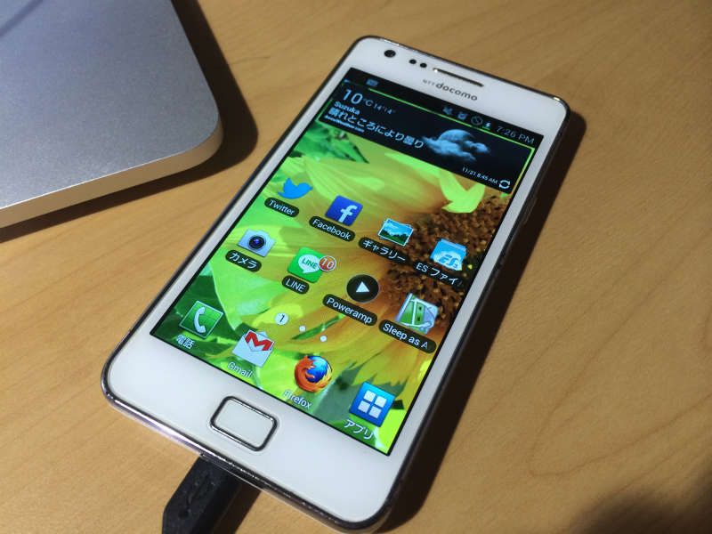
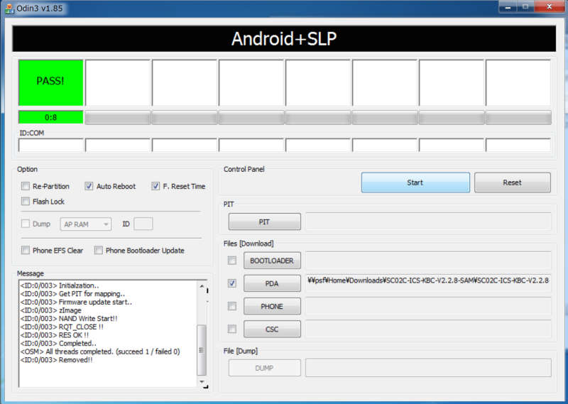
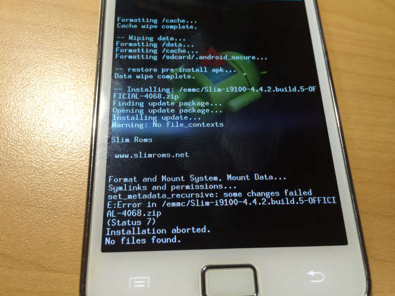
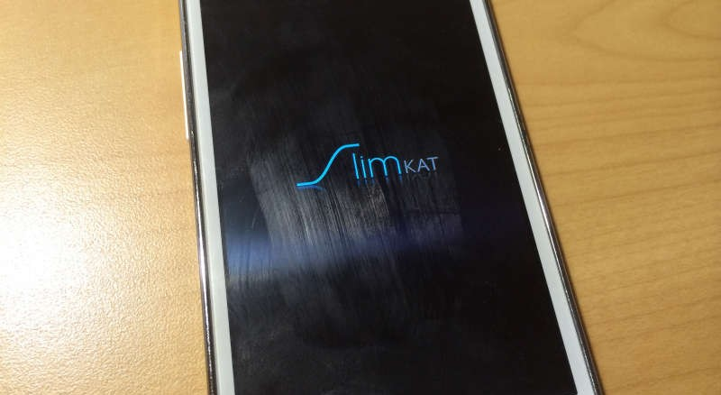

最近 Android でしか使えないアプリと発見したため、急遽机の中から Galaxy S2(SC-02)を引っ張り出してきました。



しかし iPhone に乗り換えてから長い間使っていなかったため OS とかもえらく古い感じ。 せっかくの Android! この機会に 2014.09.18 時点では最新の Android 4.4 KitKat を入れてみることにしました。

うまくいかなかった部分もあったので導入の手順をまとめておこうと思います。

## 1. 下準備

まずインストールするカスタム ROM を選択します。
カスタム ROM にもいくつか種類がありますが有名所の

- CyanogenMod
  - (Nightly→Snapshot→Stable の順でカスタム ROM の安定度が増します)
  - https://download.cyanogenmod.org/?device=i9100
- slimKat
  - https://slimroms.net/index.php/downloads/dlsearch/viewcategory/1058-i9100

あたりでいいのではないかと思います。 どちらもいい感じですが slimkat は比較的シンプルで扱い易いといった印象。

今回は個人的に好みな slimKat を選びました。
上のリンクから 2014.09.18 現在で最新版のをダウンロード。

<https://slimroms.net/index.php/downloads/dlsearch/viewdownload/1058-i9100/10774-slim-i9100-4-4-2-build-5-official-4068>

カスタム ROM だけでは Google Play などの重要なアプリが入っていないためアプリのまとめたれたもの(GAPPS)を以下からダウンロードします。

<https://slimroms.net/index.php/downloads/dlsearch/viewcategory/1150-addons4-4>

状況に応じて mini、normal、full の中から選んでください。
今回はあまりアプリはいらないので以下の mini 版を選択。

<https://slimroms.net/index.php/downloads/dlsearch/viewdownload/1150-addons4-4/13394-slim-mini-gapps-4-4-4-build-7-x-187>

またルート化したい場合は以下から SuperSU をダウンロード。

<https://download.chainfire.eu/372/SuperSU/UPDATE-SuperSU-v1.86.zip>

これらの zip ファイルを microSD のルードでもフォルダ内でも適当な場所にコピーします。 あとは microSD を Galaxy S2 の中に入れておいてください。

これで下準備は完了です。

## 2. CWM の書き込み

カスタム ROM をインストールするためには CWM(ClockworkMod)と呼ばれるリカバリーソフトを導入する必要があります。雰囲気でいうなら PC の BIOS みたいなものです。

書き込むためのソフトは Odin を公式からダウンロード。

<https://odindownload.com>

また CWM はいろいろありますが以下のものを利用。

https://forum.xda-developers.com/galaxy-s2/orig-development/kernel-clockworkmod-recovery-6-0-2-9-t1118693

公式サイトにも記載してあるように

1. Odin を起動
2. Galaxy S2 を[ボリュームダウン]、[ホーム]、[電源]ボダンを同時に押してダウンロードモードで起動
3. Galaxy S2 を PC 接続
4. Odin の画面で PDA の欄から先ほどダウンロードした GT-I9100_JB_ClockworkMod-Recovery_6.0.2.9.tar を選択
5. Odin の Start を押す

うまくいけばこんな感じに黄色から緑色に変化すると思います。



あとは勝手に再起動が始まり CWM が起動します。

今後電源が切れた状態で CWM を起動する際は
[ボリュームアップ]、[ホーム]、[電源]ボタンを同時に長押ししてください。

## 3. カスタム ROM のインストール

※スマホのバックアップが必要な方は以下のフォーマット作業に入る前にここで絶対にバックアップをとっておいてください。

今回選んだ CWM ではボリュームボタンが上下、電源ボタンが決定に対応します。

CWM が起動したら以下の順番でスマホの中身を消しておいてください。

1. wipe data/factory reset
2. wipe cache partition
3. mount and strage → format /system

次に install zip → choose zip from external sdcard でカスタム ROM、GAPPS、SuperSU(ルート化が必要な方のみ)の順でインストールしてください。

**※ここで**



```
set_metadata_recursive: some changes failed
E:Error in /...
(Status 7)
...
```

なんかのエラーが出てしまった方は一度違うカスタム ROM をインストールして見てください。

**P.S.**

**CWM が KitKat に対応していなかったことが原因のようです。  詳しい対応策は最下部の追記を御覧ください**

私の場合は候補にあった CyanogenMod をインストールした後フォーマットしたら slimkat のインストールが出来ました。

以上でインストールに関する作業は終了です。

reboot system now を押せば



こんなロゴが出て起動すると思います。

## 終わりに

今回インストールして思ったのがカスタム ROM の豊富さです。
さすがオープンソースなだけあって海外で非常に幅広く開発が進められています。

こういった自由な開発ができるというのはエンジニアの端くれとして非常にありがたいですね。もちろん技術的な意味でも効果は大きいと思います。

使ってみた感想ですが 3 年以上昔のデバイスである Galaxy S2 上で最新 OS がぬるぬる動いてくれました。ちょっとした感動です。

Android が余っている。放置してあるという方は遊び半分で最近 OS を入れてみるのもいいかもしれません。OS が変わるだけで新しいデバイスも持ったような感覚になれて結構楽しいです w

## P.S. (2014.12.28)

上で紹介したカスタム ROM インストール時に発生するエラーですが CWM が KitKat に対応していないことが原因のようです。
対応策として gadget geeks さんのコメントを引用します。

1. Odin 使って、GT-I9100_JB_ClockworkMod-Recovery_6.0.2.9.tar を導入
2. 上記で導入した CWM を使って、KitKat 対応の CWM を導入
   - http://forum.xda-developers.com/galaxy-s2/development-derivatives/cwm-clockworkmod-recovery-kit-kat-4-4-t2628412
3. カスタム ROM 導入

gadget geeks さん、情報提供ありがとうございました。
