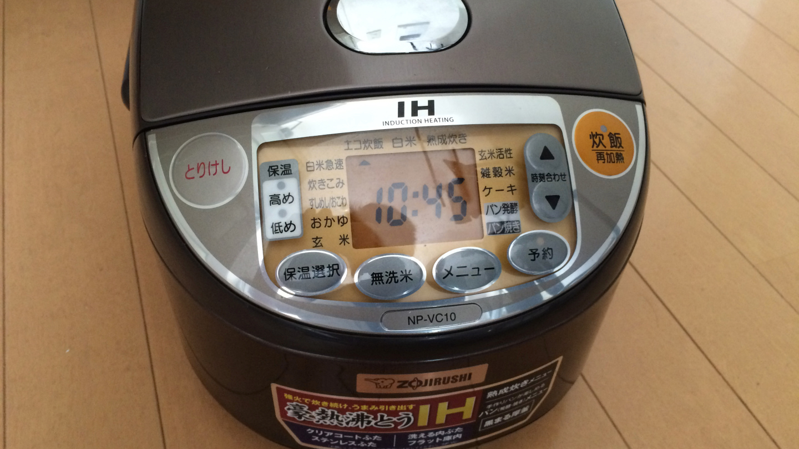
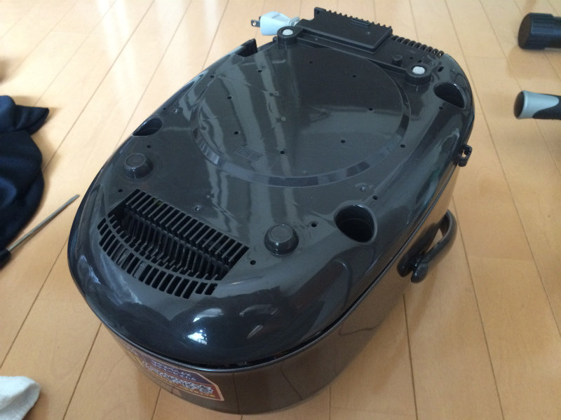
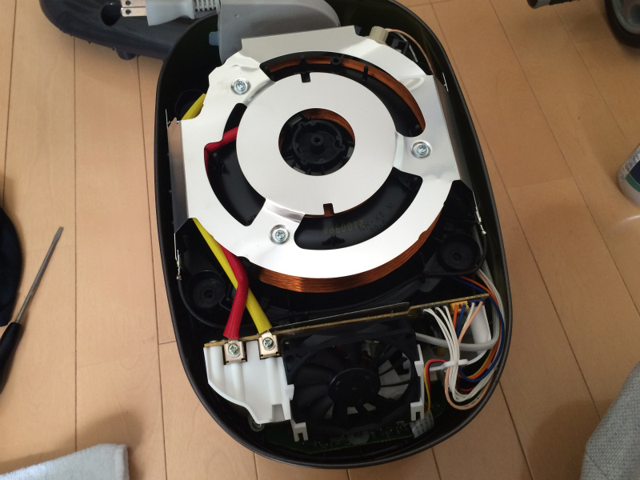
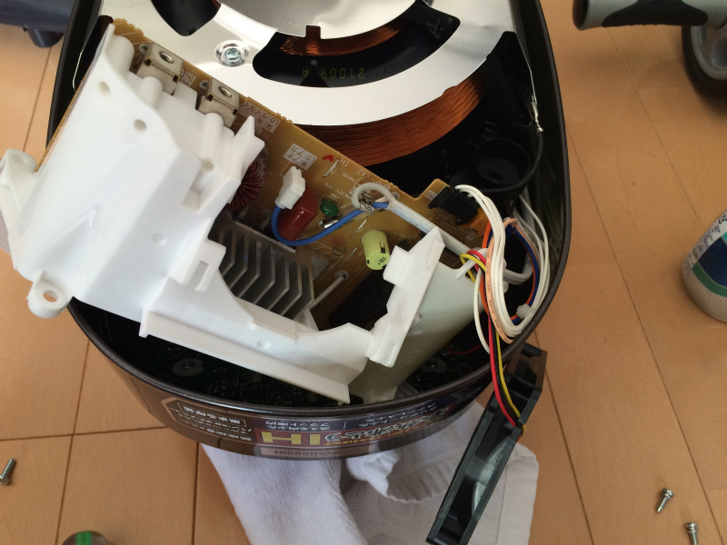
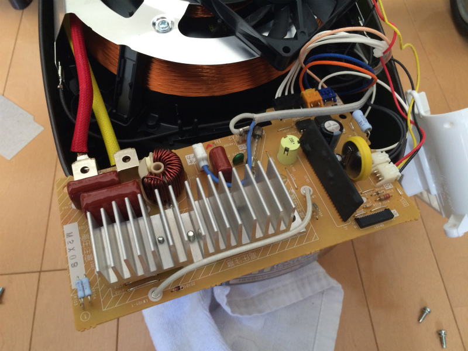
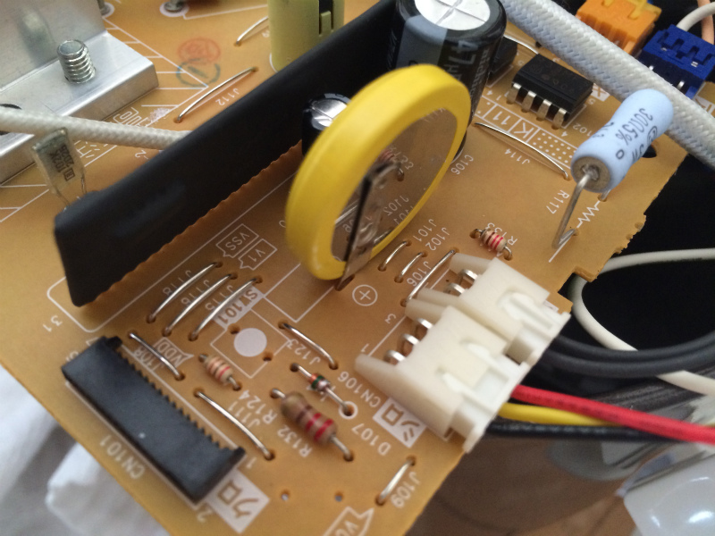

## はじめに

少し前の話ですが、朝起きたら炊飯器が壊れてました。

これまで問題なく使えていたので突然の出来事。

<iframe width="560" height="315" src="https://www.youtube.com/embed/LK0PITtpJfw" frameborder="0" allow="accelerometer; autoplay; encrypted-media; gyroscope; picture-in-picture" allowfullscreen></iframe>

炊飯器の時計がストップウォッチのごとく高速で進んでいます。(動画を早送してるわけではありません笑) この状態で炊飯ボタンを押しても10秒過ぎないうちに炊飯完了になってしまい、ご飯が炊けません。

サポートに電話しようにも祝日だったため電話できず、自分で直すことに。

とりあえず電源を完全に落としたいのですが、コンセントを抜いても内部電源があるのか電源が落ちません。調べた所象印のこの機種にはスイッチ等でのリセットは実装されていないようです。

じゃあバラすしかない...

## 分解

バラします。

ここで厄介なことに、底カバーを止めている4つのネジの内1つが星形。いい感じのサイズのマイナスドライバーでなんとか回せました。

カバーを外すと釜を温める部分が見えてきます。目的の基板は少し奥の方に入ってます。なので手前の白いカバーを外していきます。

白いカバーごと基板を取り出します。この茶色の基板が主に電源を電源あたりを扱っていると思われます。その下に緑色の液晶を制御する基板がありますが、今回の修理には関係ありませんでした。

カバーを外します。

## 回路の修復と初期化

電流が大きいのか放熱板もしっかりしています。

この辺りで1本束から外れた線が見つかり、回路と干渉しているようでした。適当に直します。

あとついにボタン電池が見えてきました。

しっかりくっついていますが、一度外します。

数十秒放置したところでまた取り付け。

## 修理後

すると...

<iframe width="560" height="315" src="https://www.youtube.com/embed/KOEjn1c5-oQ" frameborder="0" allow="accelerometer; autoplay; encrypted-media; gyroscope; picture-in-picture" allowfullscreen></iframe>

無事動作しました。

## 終わりに

余談ですが、調べてみると、修理した場合は送料込みで1万ほどかかってくるようです。今回の作業はだいたい1時間かかってないくらいなので時給1万円と思えばかなりラッキーでした。

あと今回はじめて炊飯器の中身を見ましたが意外と構造が図りやすく電源部分の回路はシンプル。そこまで複雑な作りでもなさそうなのでなぜ突然壊れたのかは不明ですが...ともあれ象印さんにはぜひ本体スイッチでのリセットを実装して欲しいですね。
