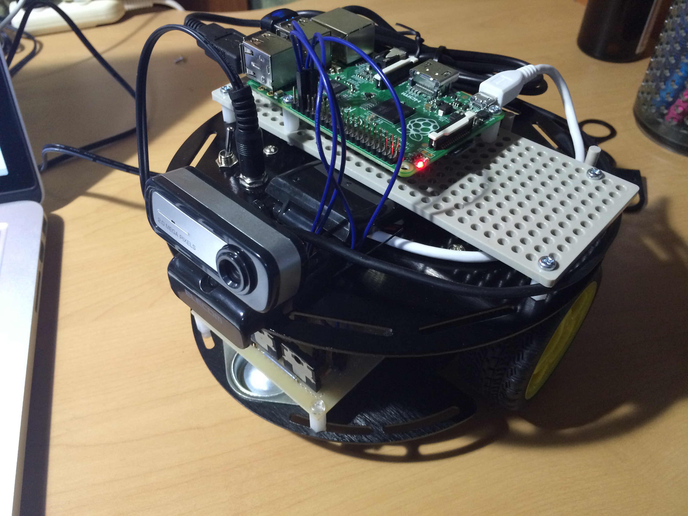
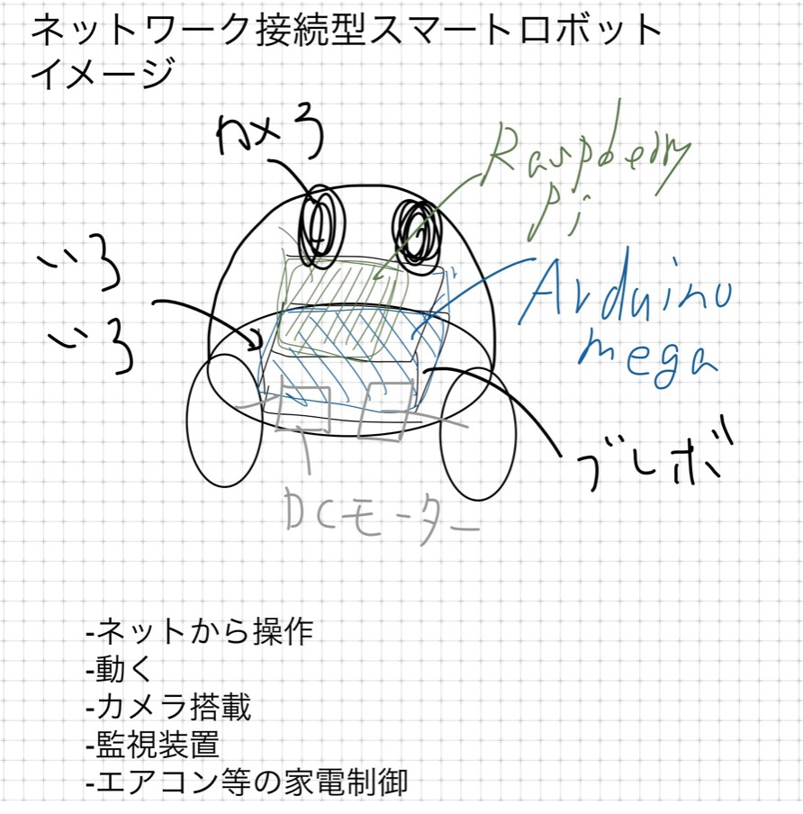

最近「[おうちハック](https://kadecot.net/ouch-hack/)」という言葉を耳にした.

> おうちをより便利に使うために、ガジェットやサービスを組み合わせたり、工夫や努力を注ぎ込んだおうちハックすること

- 湯村さんという方が代表として活動しているらしい.
  - https://yumulog.hatenablog.com/entry/2016/05/28/222056
- ぼへみあさんの活動内容もすごい
  - https://bohemia.hatenablog.com/entry/2015/12/01/163521

これらの活動をみた瞬間, 電流が走りました.

僕がこれまでやってきたことや, これからやってみたかったことそのものじゃん! と.

(ちなみにスマートなロボットが作りたいと, こんなものを構想して作ってました)

これからおうちハック関連で何かものづくりできたならと考えています.

今イメージしてるのは家の家電を一括で管理できるユニットです. 上のロボットでもその機能は実装してましたが, 作ってみて思ったのが動く必要ないし,デカくなるし,何より完成度が低かった...

新デバイスの形状イメージは Amazon echo みたいな

今回, おうちハックを見ているうちに「[IRKit](https://getirkit.com/)」なる遠隔リモコン操作できる IoT デバイスの存在を知り, しかもこれがオープンソースになってる!

こういったコード等の資産を利用しながらある程度使い続けられるようなものを作りたいですね.

まぁ時間もガッツリとることは難しいかもですが, 少しづつ空いた時間にやっていきたいと思います.
