

**追記**

こちらの記事内で利用しているAPI Tokenは旧式(Legacy Token)であり非常に強力な権限を持つものです。現在は新しいタイプのTokenの利用が推奨されています。

セキュリティとして甘い部分もあり、本記事の内容はあくまで参考として読んでいただけると幸いです。

この記事は[『Slack Advent Calendar 2016』](http://qiita.com/advent-calendar/2016/slack)21日目の記事です。

この記事はAdvent Calendar用に、以前実装した**Slack上でスタンプを表示するシステム**を改良したものです。変更点についてはこちら。

## Background

少し前から面白い記事に触発されてプライベートでもSlackを使い始めました。

* [Slackがカップル専用アプリだった件](http://kuma-no-kara-age.hatenablog.com/entry/2016/01/10/212347)
* [割と本気で家庭用Slackを作ってみた](http://blog.8arrow.org/entry/2016/01/13/183349)

確かに外部サービスとの連携が便利ですが、1ヶ月ほど使っているとやはりLINEのようなスタンプが使えればと思ってしまいます。

一応Slackにも絵文字機能があり自分で作れたりも出来るのですが、何せ小さい。

> [@BenJamski](https://twitter.com/BenJamski) [@technancy](https://twitter.com/technancy) We have jumbomoji already、if you post a message with only emoji。Check they're enabled in your preferences
>
> — Slack (@SlackHQ) [2016年8月5日](https://twitter.com/SlackHQ/status/761379811705126914)

公式曰く**Jumbomoji**という機能によって絵文字単体で投稿すると通常よりも大きくなるそうですが...

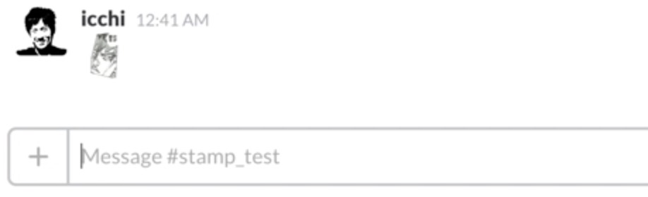

**ジャンボ**にしては小さい...

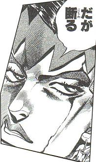

例えばこのような元画像が400px程度のスタンプ用画像をカスタム絵文字にしようもんなら、ほぼほぼ見えません。

やはりLINEで慣れてしまうともう少し大きいサイズがしっくりきます。皆同じことを思うようでTwitter上では「もっとサイズを大きく出来ないの?」との質問が多数。

> [@SlackHQ](https://twitter.com/SlackHQ) we have to go bigger。Can it be a setting? Max emoji size? We want full 128px if possible。:) [pic.twitter.com/6q6FIn9iW7](https://t.co/6q6FIn9iW7)
>
> — Alex3 (@Alex3omg) [2016年4月18日](https://twitter.com/Alex3omg/status/722104950054989824)

> [@Alex3omg](https://twitter.com/Alex3omg) No plans to go any bigger just yet、but thanks for the feedback!
>
> — Slack (@SlackHQ) [2016年4月18日](https://twitter.com/SlackHQ/status/722163156622176256)

それに対して公式の回答は**「絵文字サイズを大きくする予定はない」**

なぜなんだSlack!

公式がこう言っている以上自分たちで解決するしか無い。

調べてみるといくつか方法があるようでした。こちらの記事ではブラウザ拡張機能を使ったりSlackのデスクトップアプリを拡張して絵文字を拡大表示させています。

* [SlackでLINEみたいにスタンプを使いたいと言われたので](http://qiita.com/kyusyukeigo/items/f4192f6cf210cf6c5e33)

しかし、これらのやり方だと**設定した以外の端末からは大きくなりません**. やはりSlackが使える全ての端末から、PCやスマホ関係なく同じようにスタンプを送信・表示できることが望ましい。

## SlackでLINEみたいにスタンプを表示させるために

Slackでは画像のリンクが投稿されると、その画像を展開して表示してくれます。今回はその機能を利用してスタンプを表示できるようにします。

そこで、こんなシステムを考えてみました。

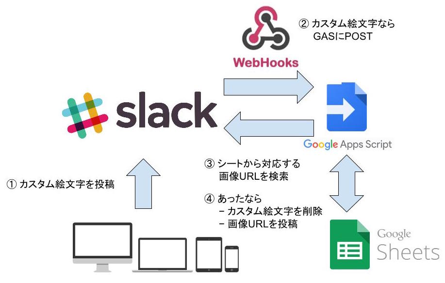

具体的には,&nbsp;Outgoing WegHooksでカスタム絵文字の投稿を検出し、それに対応するスタンプの画像URLがあるならそれを投稿する処理をGASで実装しました。

GASを使って外部から処理しているため、**プラットフォームに関係なくSlackが利用できる全ての端末でシステムを利用**することが出来ます。

またカスタム絵文字とそれに対応する画像URL(直接リンク)の管理はGoogleスプレッドシートで行います。そのためス**プレッドシートを共有すればチームみんなでスタンプを増やすことが可能。**

### 実際の動作

このシステムを使ってスタンプを表示するとこんな感じになります。

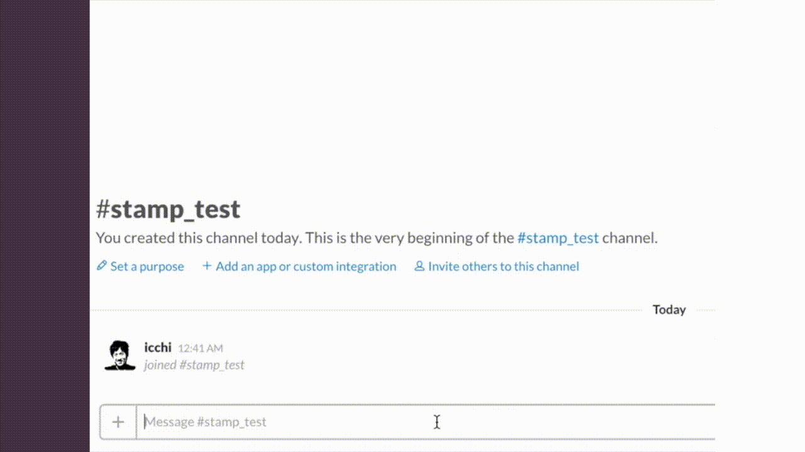

## スタンプシステムの構築方法

これからシステムの作り方を説明します。

### 1. スタンプの準備と画像URLの取得

まずスタンプとして使いたい画像を用意する。

サイズが大きすぎるとSlackの容量を圧迫したりスタンプが大きく表示されすぎてしまうため、240~320px程度にリサイズすることをオススメします.

無料のオンラインストレージを利用すると手軽に画像の直接リンクを取得できます。Dropboxだとファイルの右クリックから.Google Driveを利用する場合は以下のサイトが参考になります.

* <http://ameblo.jp/wantan-52/entry-12120519832.html>

### 2. Slack側の準備

Slack側ではカスタム絵文字の登録とGASにスタンプの通知を知らせるWebHookの設定を行う.

#### 2.1. カスタム絵文字の登録

カスタム絵文字の登録せずともシステムは動作しますが、スタンプ投稿時に小さいながら確認できるので便利です。

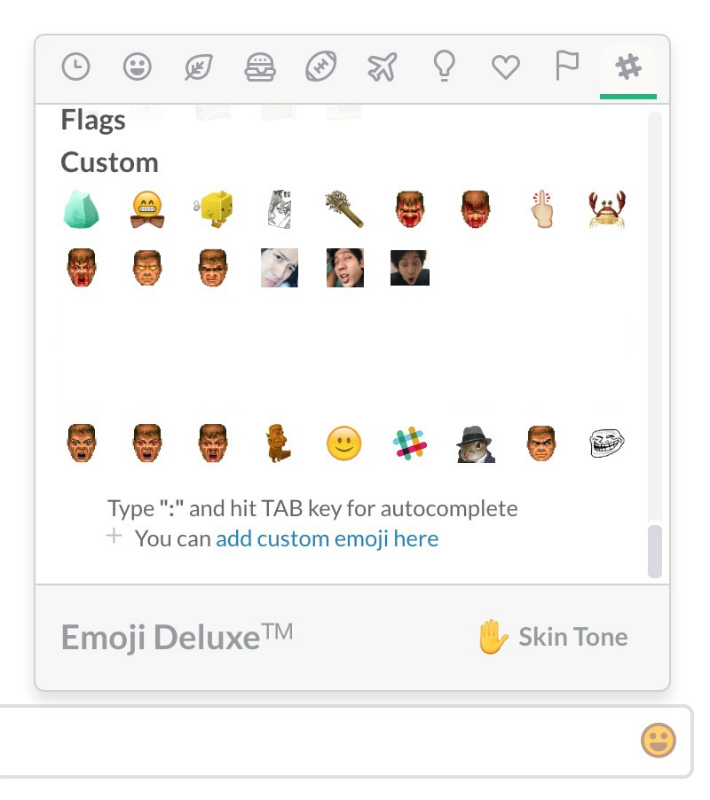

1.1で用意した画像をカスタム絵文字として登録する場合は手順が本家のサイトに載っています.

<https://get.slack.help/hc/en-us/articles/206870177-Creating-custom-emoji>

絵文字として登録するには画像を128px以下にする必要あるので(2016/12/21時点) 以下のようなサービスを利用して画像を縮小します。

* <http://labo.i-section.net/shukusen-air>
* <http://resizer.myct.jp>

#### 2.2. Outgoing WebHooksの設定

カスタム絵文字を投稿した際のトリガーとなるOutgoing WebHooksとあなたのSlackチームを統合。まだ統合していない方は以下のサイトがわかりやすいです。

[SlackのOutgoing Webhooksを使って投稿](http://qiita.com/chike0905/items/58222a99be460f325ab8)

統合したら以下のように設定。

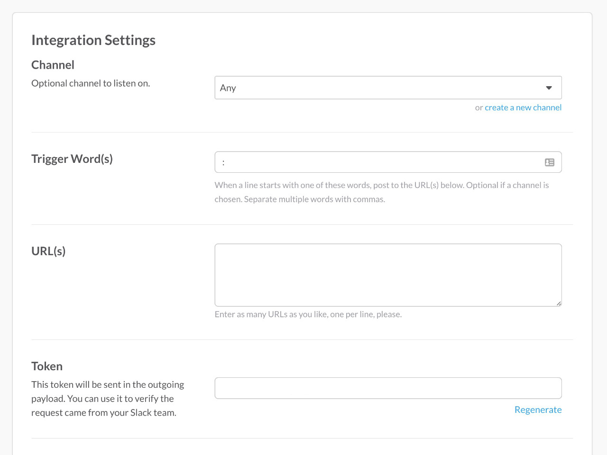

* Channel: あなたがこのシステムを利用したいチャンネル（基本はAnyでOK）
* Trigger Words: `:`
* URL: **3.2で作成するGASの公開アドレスを貼り付ける**
* Token: デフォルトで値が入っているがこれは使わない

正確に言うと`:`コロンが含まれている投稿全てに対してPOSTを投げている。その文字列が絵文字がどうかの判定はGAS側のプログラムで行ってます。

### 3. GAS側の準備

Google Drive上の好きな場所に適当なディレクトリを作成.

#### 3.1. Googleスプレッドシートの用意

先ほどのディレクトリ内にスプレッドシートを作成。ファイル名は何でもOK。

シート1に対して以下のように入力。

* A列: 2.1で登録したEmoji名
* B列: カスタム絵文字に対応する1.2で取得したスタンプ画像のURL(直接リンク)

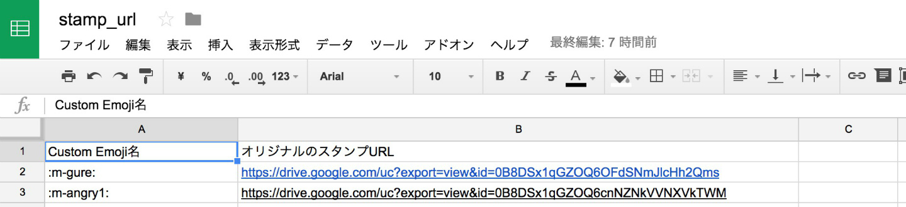

次に、シート2を作成し以下のように入力.

* A列: システムを利用するスラックユーザー名
* B列: ユーザのtoken

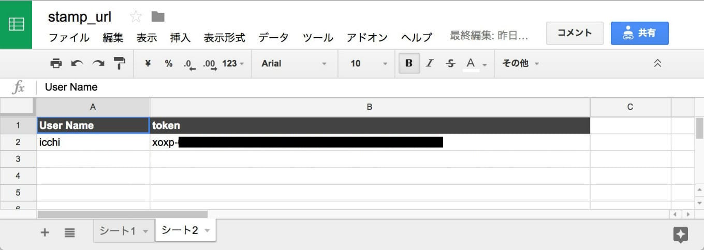

tokenはslackにログインした状態で以下のURLにアクセスすると生成可能。

https://api.slack.com/web

次にこのスプレッドシートを公開する。公開したURLはGASのプログラム内で使うためコピーしておく。

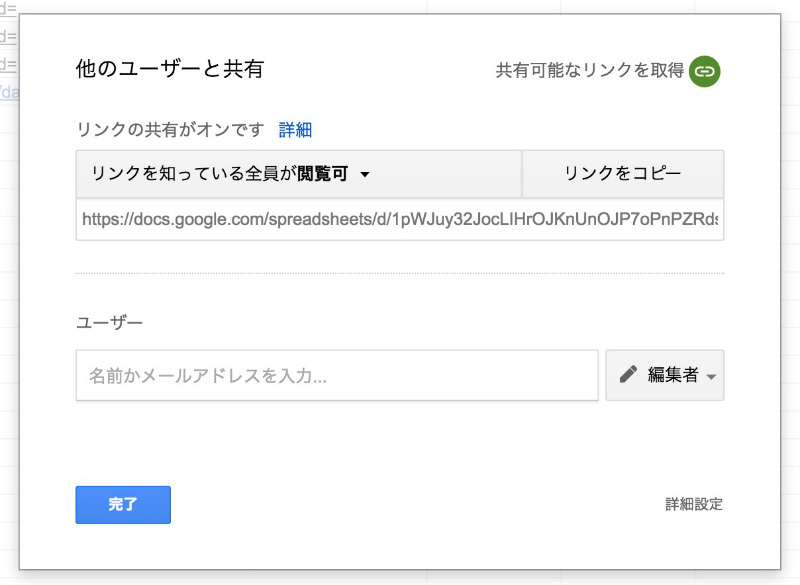

#### 3.2. GASの用意

先ほどのディレクトリ内にGASファイルを作成。これもファイル名は何でもOK。

以下のサイトに従って、GASへのSlackライブラリの導入。

<http://qiita.com/soundTricker/items/43267609a870fc9c7453>

以下のリポジトリのコードをGASファイルに貼り付け。

<https://github.com/icchi-h/Stamp_on_Slack/blob/master/main.js>

コード内のtokenとsheet_urlに先ほど取得して値をいれる.&nbsp;こんな感じになっているはず。

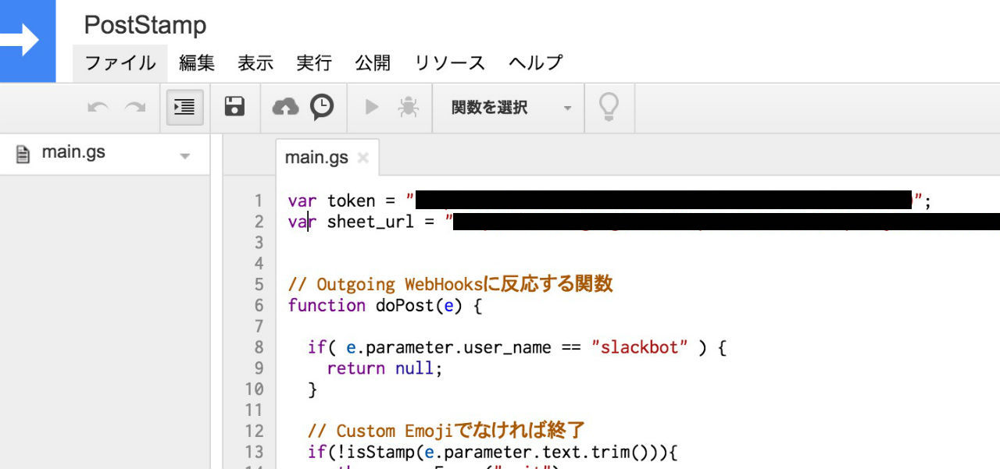

最後に、GASでPOSTを受け取るためのリンクを取得して、2.2で設定したOutgoing WebHoolsのURLにセット。

その流れは以下のサイトで詳しく解説されています。

<http://qiita.com/kyo_nanba/items/83b646357d592eb9a87b#gas%E3%81%A7post%E3%83%AA%E3%82%AF%E3%82%A8%E3%82%B9%E3%83%88%E3%82%92%E5%8F%97%E3%81%91%E5%8F%96%E3%82%8B>

## Let's try

あとはSlackでスタンプを楽しむ!

## システム構築後にスタンプを追加していくには

* 1。(カスタム絵文字の登録と画像の直接リンクの取得)
* 3.1で作成したスプレッドシートの追記

これの繰り返し。

## 付録. 同じ画像リンクは連続で使えない問題への対処

Slackの仕様上、1時間以内に同じ画像URLを連続で投稿しても1回目以降は展開して表示されない。

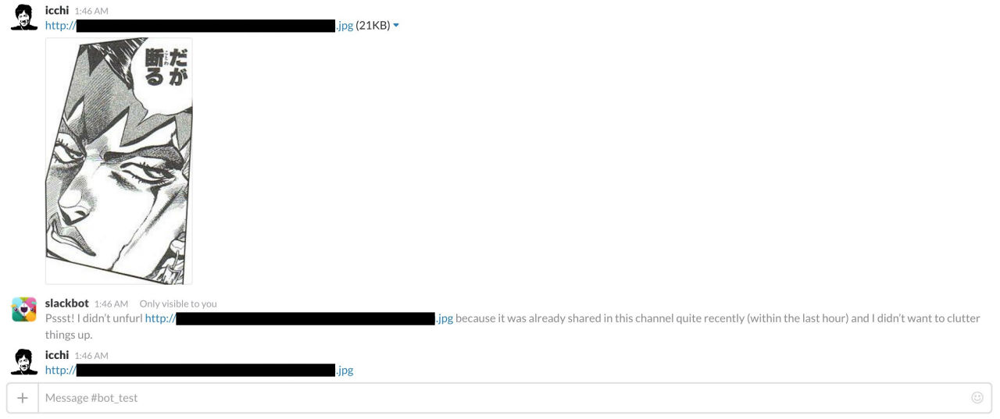

スタンプの使い方を考えるとこれはまずい。

そこで、画像URLにUnixTimeをGETのパラメータとして追記して対処しました。こうすることで一応は異なるURLとして認識している。

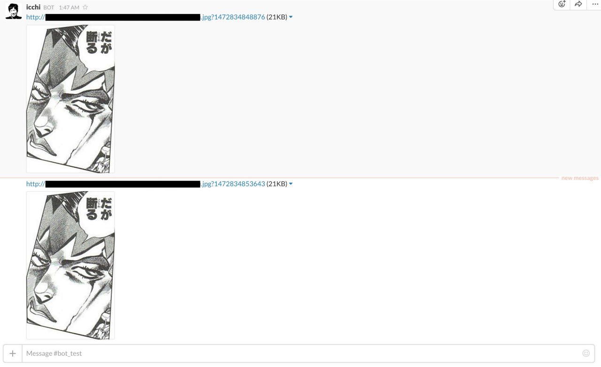

## 追記. スタンプがBOTととして投稿される問題を改善 (反映済み)

以前のものではtokenを1つしか利用していなかったため、**スタンプがBOTとして投稿**されていました。そのため本システムによってスタンプが投稿されると、**新規メッセージとして扱われ通知が煩わしい**問題がありました。

そこで、ユーザ毎のtokenもスプレッドシートで管理・利用することで、ユーザーの投稿になるようにしました。

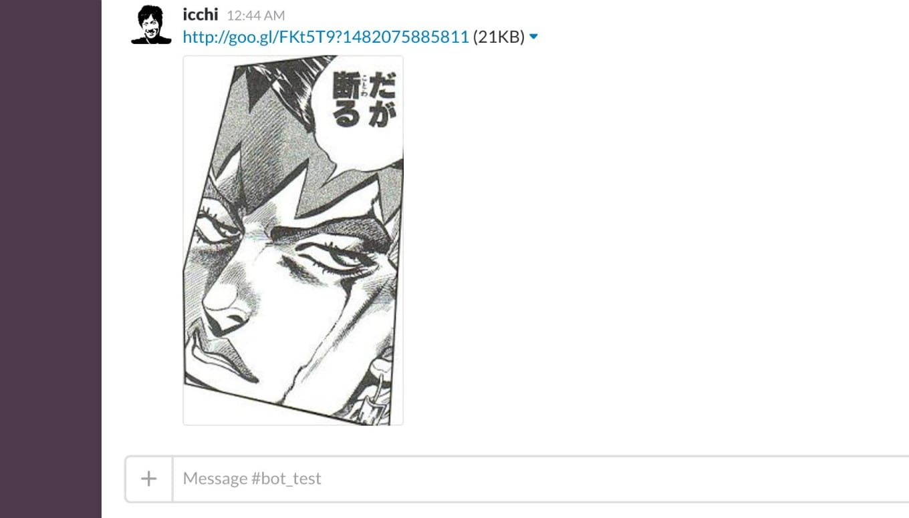
