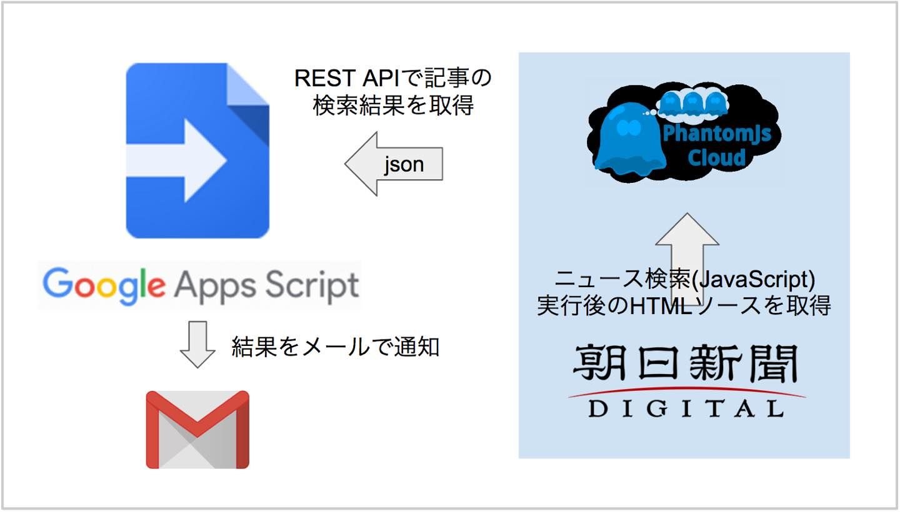
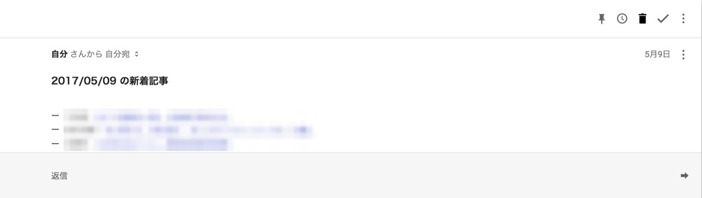

## はじめに

最近、特定の記者の方々が書いた記事をニュースサイトから読むようになりました。検索対象が少なければ手動で検索しても問題ないのですが、多くなると結構な手間になります。それに、検索しても新規の記事が出稿されているとは限りません。

ニュースサイトが何かしらの機能や API を提供してれればいいのですが、今のところそのようなものはありません。

そこで、Google Apps Script(GAS)を使い、特定の検索キーワードにヒットした新着記事をメールで通知してくれるシステムを作ってみました。

## システム構成

検索結果は JavaScript によって取得&表示されますが、GAS に準備されている通常の HTML 取得関数では JavaScript 実行後の HTML を取得できません。そのため、PhantomJs Cloud というスクレイピングサービスを用いることにしました。

<http://qiita.com/icchi_h/items/4d560d9b451fc483a25e>

HTML ソースが取得できれば、適当にパースして必要な記事情報を取り出します。記事情報の中には日付も含まれているため、それを元に新着記事の判定を行います。

あとは、この流れをすべての検索キーワードで行い、1 つ以上、新着判定された記事があれば、その結果をまとめてメールで送信する仕様にしました。サーバへの負荷対策としてループ毎に Sleep 関数を呼び出しています。GAS だと Gmail との連携も簡単にできますし、HTML 形式で本文に装飾を加えることもできます。

## 実際の動作

実装した GAS スクリプトを定期的に実行するように設定しています。実際の通知はこんな感じ。

