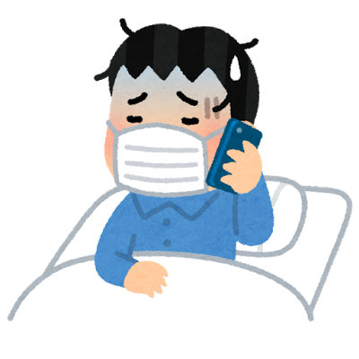

先週末からずっと体調を崩し、最近ようやく調子が戻ってきました。40℃ 近い高熱と特に頭痛がキツかった。こんなにも長く体調が悪くなったのはほんとに久々です。

## 地獄のような夜行バス

ことの始まりは先週の土曜日。この日、社内バレー部の活動で大阪へ。確かにいつもに比べ調子は悪かったものの、普通にプレーできるほどでした。懇親会が終わり、夜行バスに乗ったころから体調が急変。寒気と吐き気で気分は最悪です。この日ほど、夜行バスにしたことを後悔したことはありません。(大変申し訳無いことですが、人生で初めて、運転手の方に予定よりも早く SA に寄ってもらうようお願いしてしまいました。) その後も寝れないは、吐き気は止まらないはで地獄のような一晩でした。次の日の朝、東京に着いたももの、まっすぐ歩けない。明らかに頭も重たい。いつの間にかカバンがやけに重たく感じる。何とか電車に乗って、家まで死ぬ気で歩きました。家までの 1km がハーフマラソン並に遠く感じました。

## インフルエンザ？

帰宅後、熱を測ると 39℃。昨晩寝れてないこともあってすぐに寝ました。お昼過ぎになって起きると、体温は 39.6℃。ただ、喉、鼻はまったく炎症を起こしてなく、あるのは発熱と関節痛ぐらい。ググってみると、完全にインフルエンザの症状。この日は日曜で病院が休みだったため、翌日検査を受けに行くことに。とりあえず、総合風邪薬を飲むと少し熱は下がり 38 度後半に。

次の日、会社を休んで病院へ。病状を説明すると医者の先生も「インフルエンザでしょう」と検査を受けました。あの鼻の奥まで綿棒を突っ込む痛い奴です。10 分ほど待つと、結果はなんんと陰性。先生も不思議がっていましたが、恐らく風邪だろうとのこと。検査も完全ではないらしく、一応インフルに効く漢方と解熱剤をいただきました。

インフルエンザでなくて安心すると同時に、発熱の原因が気になりました。これまで、喉を痛めて、扁桃腺の炎症から高熱がでることはありましたが、今回は喉の炎症は全くありません。ただの風邪なら熱が出てもせいぜい 38℃ 弱程度です。先生によると、ウイルス性で腎臓が炎症を起こすとインフルエンザのような症状が出る場合があるとのことでしたが、今回は腎臓は特に痛くありません。先生は疲労だろうといっていましたが、正直、ここ最近は特に疲労を感じていませんでした。一体何が原因なのか…

ただ、熱はあるけど、歩いて病院まで行けるし、何よりご飯は普通に食べれたので、わりとすぐに治るだろうと思っていました。早く治すためご飯以外はほとんど寝ている生活が続きました。

## 熱が下がらず、頭痛が始まる

それから 2 日経過して水曜日。発熱し始めてから 4 日目。薬を飲んでも 37℃ 後半、薬が切れると 38° 半ば。ずっとこんな体温が続いていました。ご飯は食べれているのに、熱が下がりません。インフルエンザでもっと衰弱していた時も、2,3 日で熱は引いていたので、今回は長過ぎます。そして、水曜日あたりからひどい頭痛に悩まされました。目の奥がズキズキする感覚で、テレビやスマホを少し見るだけでも痛みが走ります。きっとそんなことは無いと思いますが、眼圧がすごく高くなっている感じでした。食後にスマホ見たり、テレビ見たりもできません。

明らかに、体調がおかしいので、もう一度病院へ。ただし、初回の病院が休みだったので別のところへ行きました。診察してもらうと、先生からは「風邪です」の一言。いろいろ症状を説明しましたが、全て風邪と一致するそうです。これまで、風邪で同じ症状が出たことはないので、スッキリはしませんでしたが…どちらにせよ療養するしか無いとのこと。

## 回復の兆し

そんなこんなで、PC もスマホもほとんと触れず、ひたすら横に。頭痛がやけに酷いのであまり眠れなかったのがキツかった。その後、金曜日から頭痛が引き始め、それと一緒に熱も薬無しで 36℃ 台に。発熱から 6 日目にしてやっと体が元に戻り始めました。

## 今は

今もまだ、少し頭が重かったり、目の奥に疲れが溜まっている感じがありますが、だいぶ良くなりました。ただ、結局のところ病気の原因がわからなかったのでスッキリしません。次に同じことが起きないように対策できないのが辛いところ。風邪だとするなら、体調を崩さないよう気をつけます。今回も別に弱っていたわけではないんですが。何にせよあの視神経にズキズキくる感じの頭痛は二度と経験したくないな。
