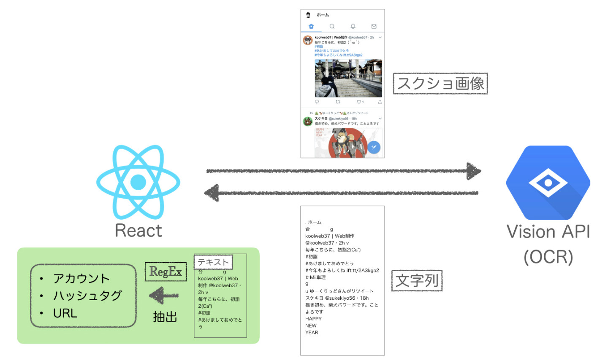

## はじめに

「SNS のスクショ画像に映っている SNS のアカウント名やハッシュタグ、短縮リンクなどを手軽に取り出せれば...」知人の要望をきっかけに簡単に Web アプリを作ってみました。

## システムの構成

フロントは React で実装。アップロードされたスクショ画像を OCR にかけて、結果であるテキストから必要な要素を正規表現で検出&表示する流れになっています。

### React と OCR について

最近は仕事でフロントエンドを触ることが多いので、React を始め Angular や vue.js を簡単に触ったりもしました。個人的には React が好みです。やはり人気どころの UI フレームワークなので、

- 多種多様な Component が用意されている
- 関連するライブラリの開発が速い

などのメリットがいいですね。

あと、OCR は [Cloud Vision API](https://cloud.google.com/vision/?hl=ja) を利用。他にも無料枠がある [Free OCR API](https://ocr.space/) なるものもあったりします。割りと使える印象ですが、さすが Google と比べると精度が落ちる印象。

## 文字列からメタ要素を取り出し

正規表現を使って、文字列から要素を取り出します。そのことについては次の記事にまとめました。

## DEMO

公開はしていないので動作動画だけ。はたして一般的に需要があるかどうか...

<blockquote class="twitter-tweet">
スクリーンショットに表示されているアカウント・タグ・リンクを検出するWebアプリを作ってみた。フォームからリアルタイムで修正&amp;再検出可能。 <a href="https://t.co/t4s795zoHK">pic.twitter.com/t4s795zoHK</a>
&mdash; i̲c̲c̲h̲i̲ (@icchi_h) <a href="https://twitter.com/icchi_h/status/948287269193961472?ref_src=twsrc%5Etfw">January 2, 2018</a></blockquote> 

せっかく React を使っているので、OCR の結果を編集してリアルタイムで要素の再検出ができるようにしてあります。
