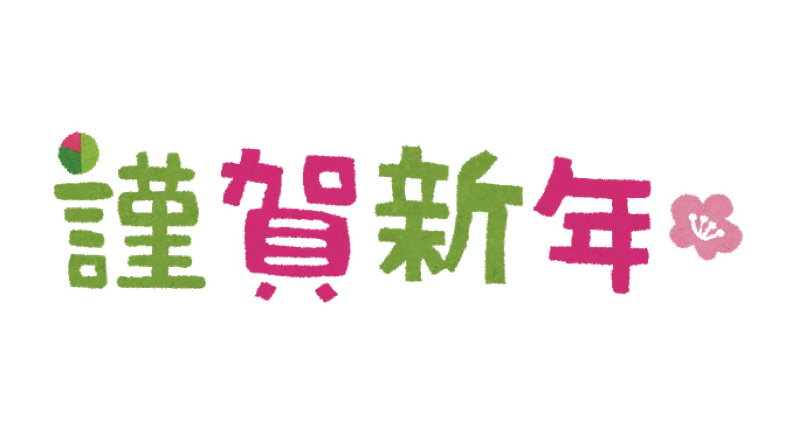

あけましておめでとうございます。

今年は実家に帰省していないため、少し寂しい年末年始を過ごしています。

今年もあっという間に終わってしまいました。2017 年は特にバタバタした年だったように思います。せっかくの年末年始なので少しまとめてみます。

## 2017 年のまとめ

- 1 月: 修論に命を費やす
- 2 月: 修論発表 (反動から発表終了後 3 分で MacBook Pro を購入)
- 3 月: 大学院卒業&引越し
- 4 月: 入社 (引越し先が未完成だったためしばらくホテル暮らし)
- 5 月: 研修
- 6 月: 研修
- 7 月: 研修終了。研究開発チームに配属
- 8 月: 深層学習で顔認識に従事
- 9 月: 上と同じ
- 10 月: 主に Web 系フロントの開発に従事 (React、Angular)
- 11 月: なぞの発熱で 1 週間寝込む
- 12 月: 色々

2017 年の最も大きな出来事は、やはり長年の学生生活が終わり、社会人生活が始まったこと。社会人生活については去年の 5 月にまとめたものがあります。

http://wp.blog.icchi.me/post-2053/

当時は社会人結構良いという感想でした。入社後 8 カ月、研修後 5 が月ほどたった今も変わりありません。社会人生活、割といいです。仕事も上司が私が興味のある内容を降ってくれるお陰で楽しみながらやれています。

## 今年の抱負

今年の主な抱負は以下の 3 つ。

- 体調を崩さない体づくり
- サウナに月 1 程度通う
- 勉強会に月 1 程度参加

まず 1 つめについて。社会人になってからは割りと時間も確保していたので、大きく体調を崩すことはないと調子に乗っていました。しかし、11 月に謎の体調不良もあって、もっと危機感を持ったほうが良いと思ったわけです。これまでも「健全な精神は健全な肉体に宿る」を心がけて、運動は定期的にしていました。ただ、忙しくなるとなかなか時間もとれなかったり。そのあたりを改善して、もっと有酸素運動を取り入れようかと思っています。12 月から、今月に会社で参加する大阪実業団マラソンに向けて、会社まで走って行っているんですが、これが割りと気持ちいい。朝からスッキリするし、慣れれば昼過ぎに睡魔に襲われることもなくなりました。通勤で走っていれば、マラソン対策と言わず、定期的に生活に取り入れても良いかと。あと、自分はかなり体が硬いので、怪我対策も含めもう少し体を柔らかくしたい。

次に 2 つ目。これは 1 つ目と似たような理由です。あと、昨年、仕事の関係でよっぴーさんにお会いした際にサウナの良さについて教えていただけました。大きな変化があったそうなので、自分もトライしてみようかと思います。サウナの効果については色々記事が出ているとおりです。

- https://travel.spot-app.jp/tokyo_sento_yoppy/
- https://withnews.jp/article/f0180101002qq000000000000000W03j10101qq000016523A

家でも時々簡易的な交互浴をするときがありますが、たしかにスーッと精神が研ぎ澄まれれる瞬間があります。家でもやりつつ、もっと広い銭湯に行く習慣を生活に取り入れたい。

最後に 3 つ目。仕事が楽しかったり捗ったりすると、ついつい会社に篭りがちになる時があります。健康上も良くないし、何より生活における変化が少なくなってしまいます。その改善のために、せめて月 1 位でも勉強会に参加しようかと 。昨年も気になる言語やライブラリの勉強会に何回か参加しました。他の会社の方とも繋がりができたり、技術的に気になる話を聞けたり。非常に良かったという思いしかなかったので、これも時間を確保して習慣化したい。

ぐだぐだと書いてしまいましたが、今年もどうぞよろしくお願いします。
