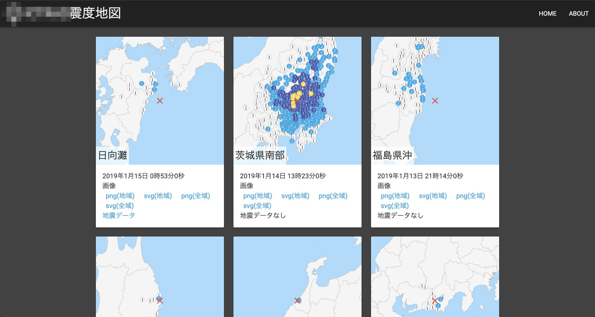
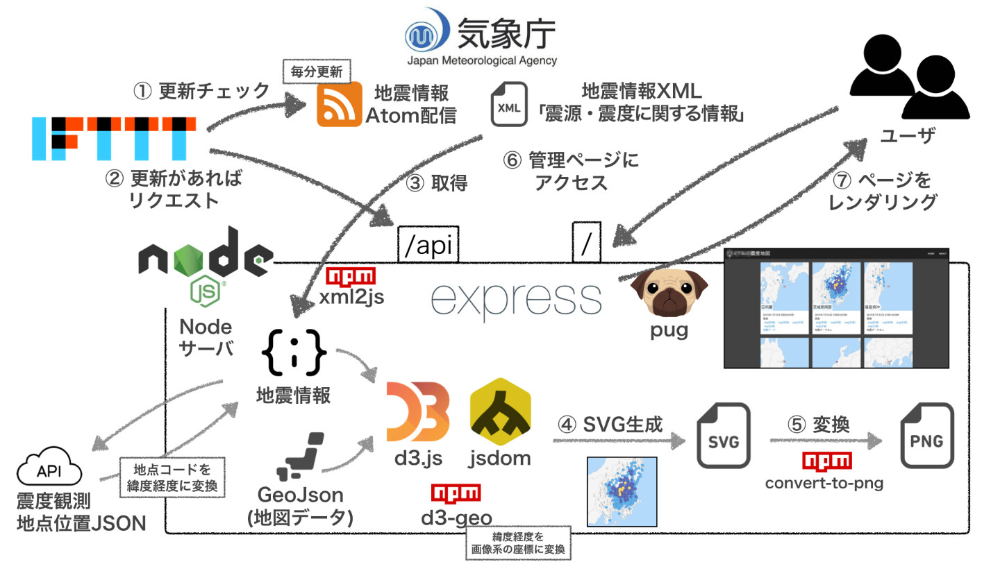

## はじめに

ちょっとした要望から、地震の震度分布図を自動的に作れるようにしてみました。

地震情報から SVG 画像を生成する部分は以下の記事にまとめてあります。

今回作ったシステムは上記の記事内容から、主に以下の要素が加わっています。

- 新規の地震情報の検知
- フロントページの作成

## 構成

### キーワード

- 気象庁防災情報 XML フォーマット形式電文
- IFTTT
- 震度観測地点位置 JSON
- GeoJson
- D3.js
- d3-geo
- jsdom
- convert-svg-to-png
- express

## 解説

### 新規地震情報追加の検知

気象庁からは、新規の地震情報を検知するために Pubsubhubbub の仕組みが提供されています。配信受信用の環境を作れば、リアルタイムに更新を検知することができます。ただ、環境構築以外にも利用申請が必要だったりと、多少利用ハードルがあります。

今回は更新検知のリアルタイム性もあまり必要としていなかったこともあり、Atom フィードの更新を定期的に検知するやり方をとることに。

IFTTT では RSS フィートの更新検知トリガーが利用できるため、そのトリガーが発火した際に画像生成サーバにリクエストを投げるようにレシピを作成しました。

### png 画像の用意

生成される SVG 画像はベクター形式ということもあり、容量がひとつあたり数 MB もありますプロントページでリスト表示する際のサムネイル画像ようには少し大きすぎるため、png 画像を用意しておきました。

変換には以下の node package を利用。

https://github.com/neocotic/convert-svg/tree/master/packages/convert-svg-to-png

## 感想

### IFTTT のフィード更新検知が若干遅い

IFTTT の RSS フィードトリガーを使ってみて、実際に地震が発生してから更新検知イベントが発火するまでの時間が把握できてきました。ばらつきがあるもののだいたい 5〜30 分。恐らく IFTTT サーバから定期的に 30 分周期？でチェックしているからだと思います。

理想を言えば、Atom フィードの更新と同時にイベントが発火してほしいところです。気象庁の Pubsubhubbub 以外にも IIJ の Eq-Care サービス内に WebSocket API があります。それを使えば手間はかかるものの、現状より検知タイミングを早められるのでは期待しています。

またタイミングがあれば手を加えてみようかな。

### svg→png の変換がお手軽

svg→png の変換がひとつの Node package で完結できたのは非常に楽でした。

これまで svg 変換の機能をサーバに持たせようとする場合、

- パッケージ内で利用するブラウザの関係で日本語が文字化け
- 依存関係を満たすのに別途 make install する必要

などなど手間取ることがありました。

その点今回利用している`[convert-svg-to-png](https://github.com/neocotic/convert-svg/tree/master/packages/convert-svg-to-png)`では headless chrome を使っているらしく、導入も`npm install`だけで済みました。headless chrome は各種ディストリビューションにおいても導入もパッケージマネージャからできることが多いため、手軽でありがたいです。
