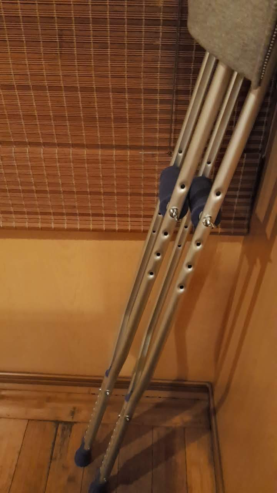

あけましておめでとうございます。

若干出遅れましたが、年末年始エントリーを書いていきます。

## 2018 年のまとめ

- 1 月: グラフ生成ツールの開発に没頭 (react, d3, plotly)
- 2 月: 上に同じ
- 3 月: 上に同じ
- 4 月
  - Web アプリ開発に没頭 (nuxt, kubernetes(+ docker), GCP, firebase(auth, RDB))
  - SNS 系システム開発 4 月
- 5 月: 上の「2」の作業が自分の中で停滞
- 6 月: 4 月「1」に同じ
- 7 月: 余韻浸る
- 8 月: 画像処理をかじる
- 9 月: 特になし
- 10 月: 地図分野の周辺技術 (geo/topo json, osm, raster/vector tile, mbtiles, d3)
- 11 月
  - 4 月の Web アプリにおけるインフラとフロントの改修に没頭 (GCP)
  - 部活動で足首を剥離骨折
- 12 月: 足が治る

### 所感

インフラ・フロントの双方に主体的に関わることができたので、総合的に知見が広まったように思う。その過程で AWS や GCP などのクラウド系インフラも触る機会があり、システム開発の全体像が少しずつ見えてきたような気がして満足している。

特に React や Vue(Nuxt)をがっつり触れたのは良かった。これまで簡単なデモを作る機会はあったが、深い部分まで理解はできていなかった。今年はシステム案件としてより深く SPA フレームワークを扱うことで、既存のシステムとの統合やライフサイクルの扱いなど、細かいところも経験したことでそれなりに慣れてきた。自信や感覚を掴めた気がしている。

AWS や GCP を自由に触れたことも良かった。取り扱うシステムを Docker ベースで構築したり、勉強会で良さげだと思った技術をすぐにテストして扱っているシステムに反映できたことは非常に楽しかったし、勉強になった。来年はビルド&デプロイ系をのタスクをクラウドサービス側で自動的に実行するなど、サービス側が提供している機能フルに活用していきたい。

あと地図系の技術を調べる機会があった。この分野に関してはまったくの素人で、当初は普段利用している Google マップを始めとする地図サービスがどのように動いているのかわかっていなかった。勉強の過程で地図系技術の進化を知っていくと感心することも多かった。mapnik を利用したラスター形式の地図画像から、geo/topo json のベクター形式、より軽量化した mbtiles 形式など。mbtiles が protocol buffer を利用したように、最適な技術が思い浮かび利用できるようになりたい。

4 月「2」に関しては心残りになっている。もとは友人が企画、取りまとめていた開発プロジェクト。最初は時間が取れていたものの、忙しい時期と被ったあたりから参加できなくなっていった。企画内容自体は非常に面白いので形にしてみたかった。pending 案件。

### 剥離骨折

11 月末に足首の靭帯損傷と剥離骨折をしてしまった。冬場の試合中で体が温まりきっていないときに無理に動こうとしたら捻ってしまった。

で、そのあとがまた辛かった。松葉杖での出社は恥ずかしすぎたし、通勤とか打ち合わせへの移動とか面倒だった。たった 20m 先の打ち合わせコーナーに行くだけで一苦労。昼ごはんは Uber Eats や蘭州で出前を自席まで届けてもらった。(Uber Eats は初めて使ったけど支払いも楽だし、商品も多くていい感じだった) 忘年会のときは、他の人よりも 30 分早めに会社に出て、夜の銀座を松葉杖で歩いた。いろいろシュールだったと思う。

社会人になってから大きめの怪我をすると辛い、当たり前の話だが良い教訓になった。

### 反省

アウトプットが少ない。これに尽きる。

業務やプライベート問わず、テック的にいい経験やノウハウが獲得できたにも関わらず、全然外にその情報を出せていなかった。エンジニアにとってアウトプットが大切だということは言わずもがな。ここでは述べないでおこう。

Qiita やブログなど場所はあるので、積極的にアウトプットして記憶の整理や記録を蓄積していきたい。

### 2018 年目標のファクトチェック

あと年始に定めた目標のファクトチェック。

昨年の目標と結果は以下の通り。

1. 体調を崩さない体づくり = △
2. サウナに月 1 程度通う = ☓
3. 勉強会に月 1 程度参加 = ☓

<https://blog.icchi.me/sammary2017>

1 番の体作り以外全然達成できていなかった。反省反省。

趣味のランニングやジムで体を動かすことはサボらずできていた。おかげて 1 年通して、体の健康状態は良好だったと思う。健康診断で 1 年目のはじめに肝臓で要受診をくらったが、今年はすべて問題なしだった。

ただ、昨年の 5 月に 1 週間ほどなぞの熱で寝込むことがあった。定期的(半年ごと？)に同じ病状で倒れるので、11 月は意識して過ごしていた。結果、11 月以降は寝込むことはなかった。5 月に倒れてしまったので、ここはマイナス点。

2,3 の目標は月 1 実行はできず。社会人をやっていると忙しい時期はできてしまう。ただその時期が終わったあとに習慣化できておらず結局行かないことが多々あった。良いとわかっていても、「まぁいっか」とうの気持ちでノーアクションだった。

## 2019 年の抱負

これらを踏まえて、今年の目標は以下の 3 つにした。

- 月 1 でアウトプット (ブログ等)
- 月 1 で勉強会に行く
- 個人開発のツール等を 3 つ

1,2 は去年の引き継ぎと昨年度の反省から。3 はプライベートの時間も確保する(メリハリをつける)意味で。会社の業務に熱中することもいいが、ちゃんとそれ以外の内容も吸収したり、何か開発して形にしたい。

以上、長くなりましたが、今年も楽しく健康な 1 年になりますように。
