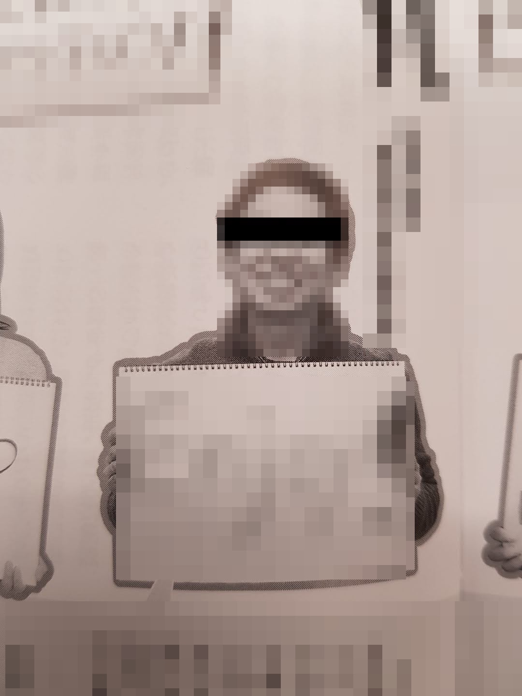
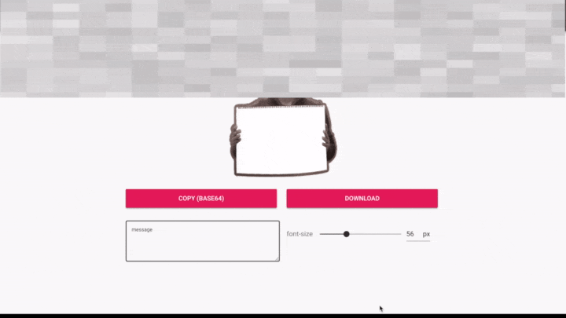

## はじめに

先日、勤め先の社内報にこのような画像が掲載されていました。

同じチームのリスペクトして止まない先輩だったわけですが、これを見て思いました。

これは素材として使える！...と。

そんな経緯からこの画像を有効活用すべく、私の中で**先輩画像ジェネレータープロジェクト**が始まりました。

## 1. 画像の切り出し&修正

使ったツールは以下 2 つ。

- MAC 純正 プレビューアプリ
- [photopea](https://www.photopea.com/)

ご存知の通り、MAC 純正のプレビューアプリは強力な編集機能を備えています。背景の切り抜き&透明化程度なら 1 分無いうちにできてしまいます。

photopea は無料 PhotoShop 風 Web アプリです。無料の割にかなり高度な画像編集が可能で、今回の画像に対しては特定エリアの切り出しなどもささっとできてしまいました。ただ、日本語には対応しているもののドキュメントが少ないのが惜しいです。

最終的に出来上がったのがこちら

いい感じに背景とスケッチブック内の描画を切り抜くことができました。

## 2. 画像ジェネレーター(Web アプリ)の実装

よくある画像ジェネレーター Web アプリを用意しました。

利用した主要技術(フレームワーク)は以下 3 つ。

- canvas
- vue
- vuetify

実装方法などの詳細はこちらのページにまとめてあります。

## 実際の動き

## おわりに

画像ジェネレーターは案外簡単に作れた。

Vue や React なんかの SPA フレームワークのおかげで、この手のリアルてタイム描画系(バインディング)の処理実装が本当に楽になったと感じます。
