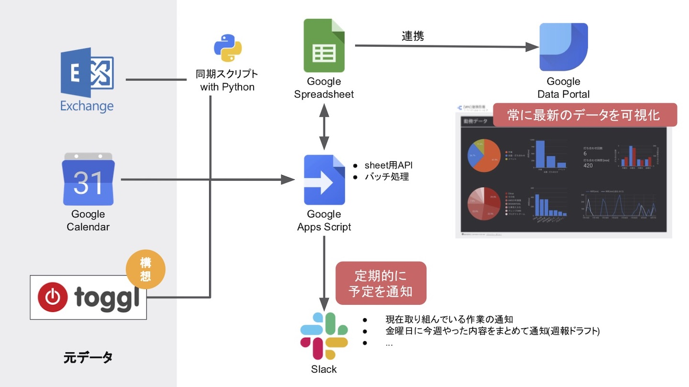
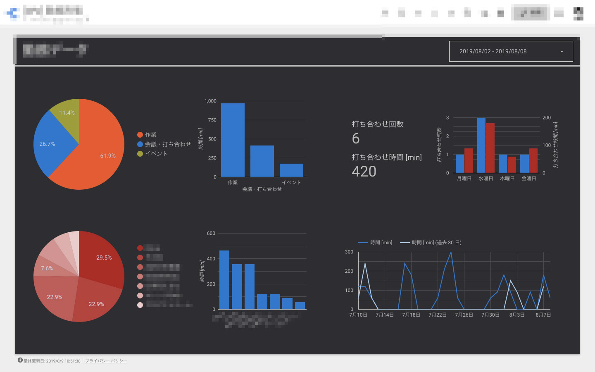

## はじめに

入社して3年目になり、最近、初めての部署異動を経験しました。

研究開発チームからビジネス系部門内の開発チームに異動し、周囲の人の雰囲気や職場の環境が大きく変わりました。正直、転職したのかなと、思ってしまうぐらいの変化で当初は戸惑いもありました。

* 並列して担当するプロジェクト数
* 打ち合わせの時間の増加
* 週報など文化

これらの変化に対応するため、個人的に仕事見える化プロジェクトを開始しました。

## ミッション

本プロジェクトでは以下の項目をミッションとして定めました。

* 仕事の可視化
  * 各プロジェクトごとの消費時間の可視化全体の稼働時間のうちの打ち合わせの割合
* リアルタイム性
  * 随時最新のデータを可視化 (例: 先週の状況)
* 一部タスクの抹殺
  * 週報や現在取り組んでいる作業の報告などの作業を軽減or消す

## システム構成

上記ミッションを解決するために、悩んだ末、以下の構成にしました。

肝となるBIツールにはGoogleデータポータルを採用。AWSでもQuicksightといった類似サービスはありますが、見た目のカスタマイズ性に優れる前者にしました。

裏側の連携するDBにはSpreadSheetを使いましたが、これは特に理由はありません。 このDB部分に管理したいスケジュールデータを集中される構成です。ここのデータが更新されていけば、連携しているデータポータルでも随時最新のデータで可視化されます。

SpreadSheetへのデータの取り出しや挿入のためにGASでAPI機能を実装しました。詳しくは述べませんが、GASの実装も昔に比べ非常にDXが改善されています。今ではClaspといったGoogle公式のCLIでローカル開発ができることに加えて、若干癖はあるもののTypeScriptまで対応しています。

元データとして、最も手を加えずに情報を抱えている(プロジェクトや作業など)ExchangeサーバとGoogleカレンダーからデータを取得しています。Exchangeサーバからデータを取得するためにPythonでそれ用のスクリプトを別途実装しました。Exchange用のライブラリがあるので意外と簡単に実装できます。

あと必要に応じてGASを中心にSlack等へ通知する仕組みも用意しました。

## 成果物

実際に作成したデータポータルのダッシュボードです。

日付の範囲を指定して、手軽にデータ範囲を編集しながら勤務形態を可視化することができました。

## まとめ

ミッションクリア。
今回のシステムは実用的で意外と使えます。

最初は自己満足的な気持ちが大きかったですが、具体的に全体の3割以上が打ち合わせに消費されている事実(1日7時間勤務として、1週間で35時間、そのうちの10時間以上)が数値で具体的に可視化されるとインパクトがあります。上司に打ち合わせ改善の打診をするときにも説得力は増します。

また、今回の副産物としてありがたかったのは、定期タスクの軽減、効率化です。スケジュールに関する情報を一括で管理しているため、今週取り組んだタスクのプロジェクト別の一覧を金曜日に自動的にSlackに自分宛てに送り、週報の作成負担の軽減に繋がりました。また今取り組んでいるタスクをSlackの一部チャンネルに投稿するといった、タスク可視化のための運用ルールもあったのですが、これも本システムで消すことができました。

意外と恩恵もあったし、そもそも可視化は楽しいので今後とも取り組んでいきたい。何なら可視化が仕事としてできるようになりたい。
