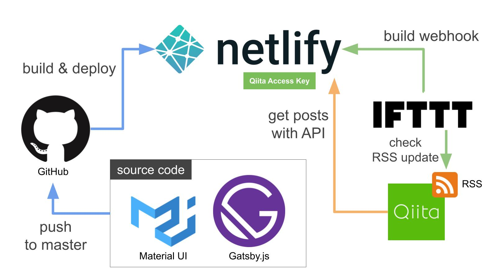

## はじめに

以前から興味があった静的サイトジェネレーター「[**Gatsby.js**](https://www.gatsbyjs.org/)」でお試し的にブログを作ってみました。

 

## 高品質なGatsby製サイトとの出会い

これまでも巷で静的サイトジェネレータが話題になることがありました。その度に手を出してみようと思ったものの、すでにWordPress製のブログがあることから実行には移りませんでした。ブログというアウトプット手段に時間をかけるなら、アウトプット自体に時間をかけたほうがいいのでは、という理屈です。

少し前に非常に品質の高いGatsby製サイトと出会いました。
[takumonさん](https://twitter.com/inouetakumon)が開発されたものです。

 

まずサイトの品質に驚きました。
どうしても静的サイトジェネレーター製のサイトは使えるテーマの成熟度からWordPress製と同等のレベルに持っていくのは大変かと思います。上のブログは全体的なデザインはもちろんSNSの共有機能、Qiitaとの連携など、見た目も機能も非常に高いレベルでした。

加えて特に惹かれたのは、ブログの[ソースコード](https://github.com/Takumon/blog)がGitHubで**MITライセンスで公開**されていることです。コードを自分用にカスタマイズして公開することが可能です。このレベルのコードを利用させてもらえるのは大変ありがたかったです。

## 構成

オリジナルから見た目少しとホスティングサービスを変更したことに加え、インフラ面も多少改良しました。

### Qiitaとの連携

Qiitaにも多少記事を投稿しているため、ブログとQiitaとの連携機能は個人的にマストでした。一番気にしていた点でしたが、Takumonさんが開発しているGatsbyプラグインを使えば簡単に実現できます。

 

公式ドキュメントやTakumonさんのブログのコードが参考になります。

### Netlifyでの公開

ブログのホスティングサービスはオリジナルはGitHub Pagesを利用しているようでした。こちらも手軽にデプロイできるいいサービスですが以下の点からNetlifyを利用しました

* 読み込み速度 ([参考情報:比較記事](https://qiita.com/NaokiIshimura/items/0b6c4ff5da437081866b))
* [Build hooks](https://www.netlify.com/docs/webhooks/)
  * HTTPリクエストを投げるとGitHubの最新コードでビルド&デプロイが可能
* ビルド環境の統一

### Qiita更新時の自動反映

Qiitaと連携しQiita記事をブログで表示するのであれば、常に最新の記事を取得、反映したいというもの。そこでIFTTTを使い対応しました。IFTTTのFeedトリガーを用いてQiitaのRSS(Atom)を監視し、新しい投稿が検出された際にはNetlifyのBuild Hooksにリクエストを投げる仕様です。

## 感想

comming soon...

### パフォーマン氏

* 読み込み速度
* lighthouseスコア

### カスタマイズ性

* ブログの全体像がコードレベルで把握できる
* Nodeによるパッケージ導入の容易さ
* ローカル環境でのコーディング、デバッグ

### 拡張性

* Gatsbyのプラグインやテーマが豊富

## Reference

* [Reactベース静的サイトジェネレータGatsbyの真の力をお見せします](https://qiita.com/uehaj/items/1b7f0a86596353587466)
* [静的サイトジェネレータの世界 (2) : 種類と解説](https://yoshinorin.net/2018/10/18/world-of-ssg2/)
* [StaticGen](https://www.staticgen.com/)
* [静的G製高品質サイト / Takumon Blog](https://takumon.com/)
* [静的G製高品質サイト / おちゃカメラ。](https://photo-tea.com/)
