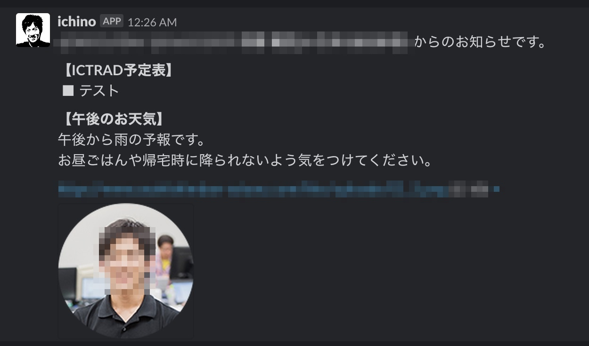

## はじめに

「最近、XXX(私の名前)に会ってないから名前が出てこないわー」。

開発のきっかけは 7 月の異動前に所属していたチームのリーダーからの一言でした。この煽り発言に対抗するためにはどうすればいいのか...考えました。考えた結果、**定期的に(鬱陶しいぐらい)名前と顔写真を送ればいいのでは？**というソリューションが頭を過りました。ただし、それだけじゃただの迷惑行為。そのため**日常生活に便利な情報を付随**すれば、相手も便利に感じてもらいながら本来のミッションをクリアできる(はず)という考えに至りました。

## 毎朝？日常的に得たい情報とは

どんな情報を通知すればいいのか...個人差もあるかと思いますが、すぐに思い当たったのか以下の項目。

1. 天気予報
2. ターゲット(チームリーダー)の当日スケジュール
3. チーム用スケジュール
4. ...

2 に関してはデータの取得がセキュリティ的に困難なのと、すでに確認作業がルーチン化されているため、あまり効果がないかもしれません。そこでひとまず 1,3 を実装することにしました。あと 1 の天気予報に関して、晴れ予想を通知しても恩恵があまりないので、雨天予報のときのみ通知する仕様にします。

## 構成

以下のような構成にしました。

### 通知スクリプト

毎度同じみ GAS を中心に構成。通知のための定期処理はマイトリガー機能で平日毎朝 9 時に通知関数が実行されるようにしている。

### カレンダー

今回のシステムのために、新たに 1 つ API を開発した。こちらもリクエストとメインの処理は GAS で担当。スケジュールの管理は皆で編集できるように Google SpreadSheet を利用した。

(開発したあとで気付いたが、スケジュール管理なら SpreadSheet ではなく Google カレンダーで良かったのでは...笑)

### 天気予報 API

プログラムから天気予報を取得する問い合わせ先(無料)候補。

- Open Weather Map
- YOLP (Yahoo Open Local Platform)
- livedoor Weather Hacks
- 気象庁 (要スクレイピング)
- ...などなど

それぞれ、取得できる期間や精度などに違いがあります。

今回の目的は午後の天気が取得することで、その点 livedoor の天気予報 API は求めている情報を加工する必要なく返却してくたので、こちらを利用。

(意外と YOLP に関する参考記事が少なかった)

## 結果

## 感想

やっぱりこういったちょっとした開発案件には GAS は最適だと思う。特に Clasp と Typescript 対応で更に DX が改善されたように思う。これが無料で使えるんだから素晴らしい。

ただし、自分の環境では doPost 関数実行時(POST リクエストを受け取った時)に、なぜか Stackdriver(ログサービス)が稼働しないようでログが残らない。そのため、実行ログやデバッグの際に少し手間取ることがあった。

加えて、Clasp で push した後のコードはスクリプトファイル(`.gs`)が別でもスコープ共通化されている。各々のスクリプトファイルで同名の変数が定義されていても、エラーは起きず実行タイミングによって内容が上書きされてしまう。自分は変数名のルール化や不要なコードのコメント化で対応したが、このあたりが typescript→gs へのコンバート時に考慮してもらえると、より DX が向上すると思う。

肝心の開発リーダーからの反応は今のところない。
