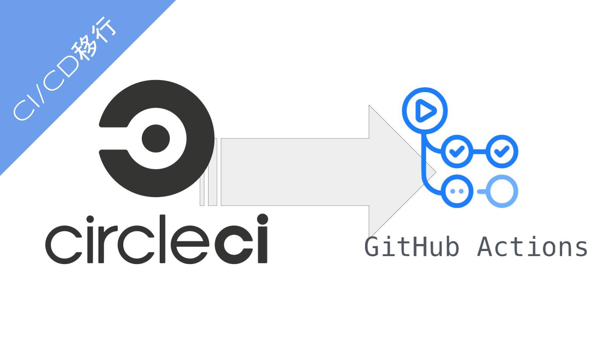
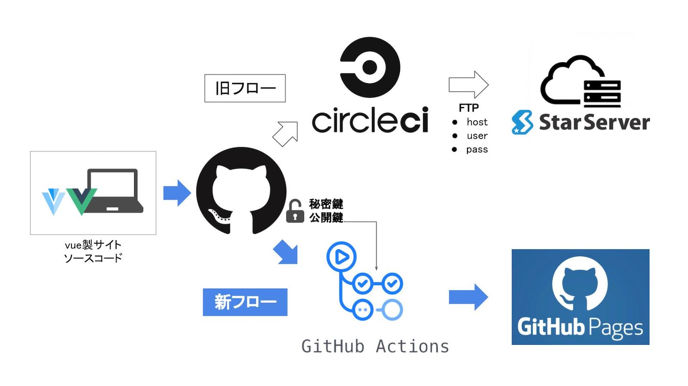
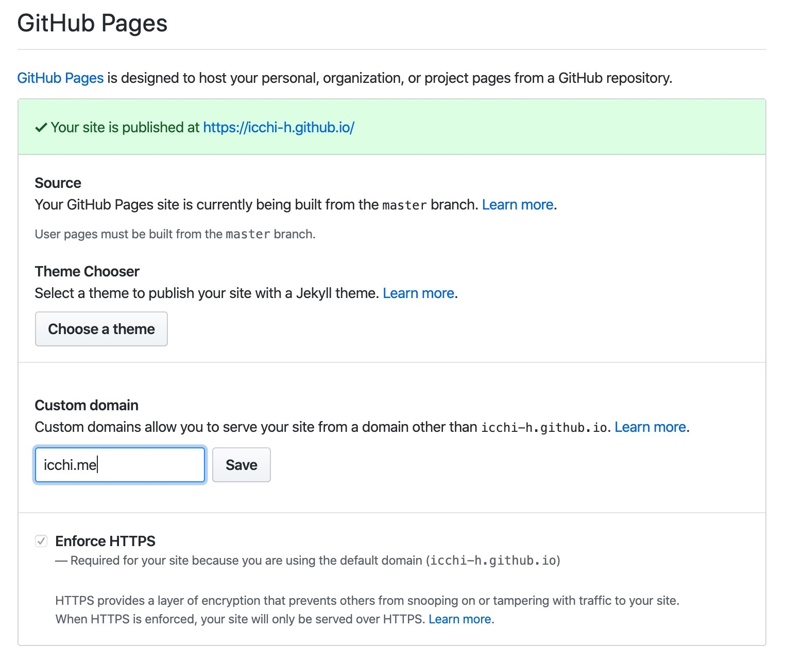
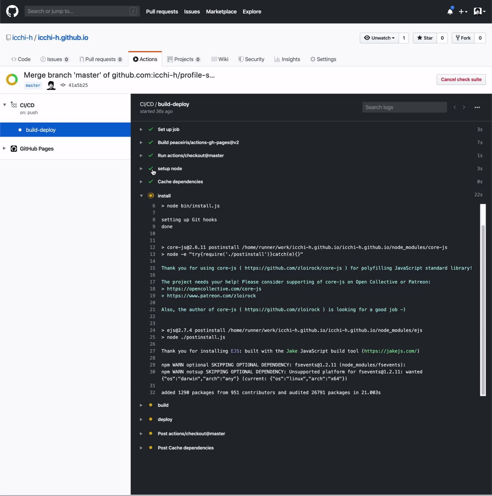

## はじめに

最近仕事で GitHub Actions を使い始めました。料金体系は従量課金制で、CircleCI を意識してか基本的に GitHub Actions のほうが安くなるような価格設定です。

プロフィールサイトを改修する機会があったので、ついでに CI/CD を CircleCI から GitHub Actions に移行してみました。

## モチベーション

- GitHub Actions を個人プロジェクト(無料枠)でも試してみたかった
- 無料枠での実行時間が CircleCI よりも長い
- コード管理、CI/CD、サイト配信を GitHub で一元化
  - GitHub Actions → GitHub Pages
  - GitHub Actions と Issue、Pull Request との連携

## 移行作業

今回の移行作業を図でまとめるとこんな感じです。



### サイト配信を GitHub Pages に変更

これまでサイトの配信はドメインの契約時に付随してきたサーバを利用してきました。CircleCI を利用して、Vue で静的サイトを生成(ビルド)した後、FTP でそのサーバに送信する流れです。

今回 CI/CD を GitHub Actions に移行するにあたり、配信も GitHub Pages を用いることにしました。以下の GitHub Actions の公開アクションを使って簡単にサイトを GitHub Pages で公開可能です。

<div class="iframely-embed"><div class="iframely-responsive" style="height: 140px; padding-bottom: 0;"><a href="https://github.com/peaceiris/actions-gh-pages" data-iframely-url="//cdn.iframe.ly/h8rfd8n?iframe=card-small"></a></div></div><script async src="//cdn.iframe.ly/embed.js" charset="utf-8"></script><br/>

また、これまで必要だった FTP の管理からも開放されるのもありがたいところ。一応 FTP を扱いたい場合も、[FTP Deploy](https://github.com/marketplace/actions/ftp-deploy)という公開アクションもあるので割と簡単にはできそうです。

#### プロフィールサイトのリポジトリ名を変更

> GitHub Pages サイトには、3 つの種類があります。プロジェクト、ユーザ、そして Organization です。 プロジェクトサイトは、JavaScript ライブラリやレシピ集など、GitHub の特定のプロジェクトに関するものです。 ユーザおよび Organization サイトは、特定の GitHub に関するものです。
>
> <https://help.github.com/ja/github/working-with-github-pages/about-github-pages>

上のように、ユーザタイプの GitHub Pages を使うためにはリポジトリ名の制約があります。既存のプロフィールサイトリポジトリ名を`profile-site`から`icchi-h.github.io`に変更しました。

必要に応じてローカルのリポジトリ内に含まれるリモート URL も変更。(`<repositoty path>/.git/config`)

#### カスタムドメイン対応

[公式のドキュメント](https://help.github.com/ja/github/working-with-github-pages/managing-a-custom-domain-for-your-github-pages-site#configuring-a-subdomain)には A レコード指定方式、IP 指定方式について記載されています。

今回は CNAME 方式を採用しました。`icchi.me`ドメインにアクセスがあった際に`icchi-h.github.io`ドメインを参照するようになります。

あとリポジトリの設定画面から使用するドメイン情報を保存しておきます。Setting → Overview → GitHub Pages。`icchi-h.github.io`へのアクセスは`icchi.me`にリダイレクトしてくれます。



### ソースコードのプッシュブランチを変更

GitHub Pages の仕様でユーザタイプのページは master ブランチから配信する必要があります (2020/01/26 時点)。プロジェクトタイプは自由に配信用ブランチを選択できるので、同様にしてほしかった。

仕方ないのでサイトのソースコードを`production`、配信を`master`ブランチで管理することにしました。デフォルトブランチは、Code → branches → Change Default Branch から変更可能です。

### CI/CD 移行

#### CircleCI の停止

##### WorkFlow の停止

CircleCI コンソール → WORKFLOWS → 今回の WorkFlow の設定 → OverView → Stop Building

##### WorkFlow の設定ファイルを削除

プロフィールサイトのリポジトリ内に含まれている CircleCI 用ディレクトリ`.circleci`を削除します。

#### GitHub Action 用 Deploy Key を作成

<https://github.com/peaceiris/actions-gh-pages#1-add-ssh-deploy-key>

#### GitHub Actions の設定ファイルを追加

リポジトリのルートに`.github/workflows/main.yml`を作成しました。

```yaml:title=.github/workflows/main.yml
name: CI/CD

on:
  push:
    branches:
      - production

jobs:
  build-deploy:
    runs-on: ubuntu-18.04
    steps:
      - uses: actions/checkout@master

      - name: setup node
        uses: actions/setup-node@v1
        with:
          node-version: '12.x'

      - name: Cache dependencies
        uses: actions/cache@v1
        with:
          path: ~/.npm
          key: ${{ runner.os }}-node-${{ hashFiles('**/package-lock.json') }}
          restore-keys: |
            ${{ runner.os }}-node-
            ${{ runner.os }}-build-${{ env.cache-name }}-
            ${{ runner.os }}-build-
            ${{ runner.os }}-

      - name: install
        run: npm install

      - name: build
        run: npm run build

      - name: deploy
        uses: peaceiris/actions-gh-pages@v2
        env:
          ACTIONS_DEPLOY_KEY: ${{ secrets.ACTIONS_DEPLOY_KEY }}
          PUBLISH_BRANCH: master
          PUBLISH_DIR: ./dist
```

### README.md 内のバッジ更新

`README.md`内に記載されている CI/CD のステータスバッジを CitcleCI から GitHub Actions のものに変更しました。

```
<!-- CircleCI -->
[](https://circleci.com/gh/icchi-h/profile-site)
↓
<!-- GitHub Actions -->
[](https://github.com/icchi-h/icchi-h.github.io/actions)
```

## デモ

GitHub リポジトリの Action タブから設定したアクションの状態が確認できます。



## 感想

### 簡単

- 既存のリポジトリに`.github/workflows/XXX.yml`を作るだけで CI/CD 環境を構築
- [日本語の公式ドキュメント](https://help.github.com/ja/actions/automating-your-workflow-with-github-actions)も充実
- 今回の移行規模であれば 1,2 時間で完了

### 便利

- コード管理、CI/CD、サイト配信すべてを GitHub で完結
  - 各サービス用のアカウント、決済、システム連携、などの複数管理から開放
  - CI/CD の状態が issue や Pull Request 上に表示
    - ブラウザのタブ間を行き来不要
    - Lint を設定していれば PR 上のコードにインラインで結果を表示
      - 機能は CircleCI にはなかったような...?
- 公開されているアクションを利用可能

### 安い

- 無料枠においても 1 ヶ月あたりの実行時間が CircleCI よりも長くなった
- 有料でも従量課金制+単位時間あたりの金額が CircleCI よりも安い

## おわりに

すでに GitHub をコード管理やサイト公開使っている開発者にはおすすめできるサービスだと感じました。CircleCI や Travis などにとっては頭が痛いそうだ。

## Reference

1. [GitHub Actions](https://github.co.jp/features/actions)
2. [Github Actions が使えるようになったので使ってみる](https://qiita.com/1915keke/items/8b18097d2981e88eca93)
3. [GitHub Actions の Private リポジトリの料金概算](https://qiita.com/euxn23/items/8cec3a3b8de9e3213424)
4. [GitHub Actions による GitHub Pages への自動デプロイ](https://qiita.com/peaceiris/items/d401f2e5724fdcb0759d)
5. [GitHub Pages について](https://help.github.com/ja/github/working-with-github-pages/about-github-pages)
6. [依存関係をキャッシュしてワークフローのスピードを上げる](https://help.github.com/ja/actions/automating-your-workflow-with-github-actions/caching-dependencies-to-speed-up-workflows)
7. [カスタムドメインと GitHub Pages について](https://help.github.com/ja/github/working-with-github-pages/about-custom-domains-and-github-pages)
8. [GitHub Pages サイトのカスタムドメインを管理する](https://help.github.com/ja/github/working-with-github-pages/managing-a-custom-domain-for-your-github-pages-site#configuring-a-subdomain)
9. [ワークフローのステータスバッジをリポジトリに追加する](https://help.github.com/ja/actions/automating-your-workflow-with-github-actions/configuring-a-workflow#adding-a-workflow-status-badge-to-your-repository)
